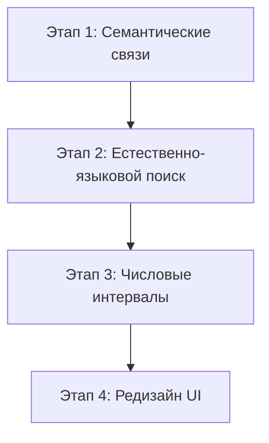

# Техническая спецификация: HyperGraph Research Memory Engine (HSME)

Данный документ содержит техническое описание архитектуры, текущего состояния реализации, выявленных разрывов с техническим заданием (ТЗ) и плана дальнейшего развития проекта.

---

## 1. Концепция и архитектурный стек

HSME (HyperGraph Research Memory Engine) проектировался как специализированная база R&D-знаний для горно-металлургической отрасли. В отличие от стандартных GraphRAG-систем на базе триплетов `Сущность -> Связь -> Сущность`, в HSME используется концепция **эксперимента как гиперребра**. Эксперимент сохраняется как единое причинно-следственное событие, объединяющее входные параметры, оборудование, процессы и результаты.

### Технологический стек:
*   **Математическое ядро VSA**: Векторно-символическая архитектура (Vector Symbolic Architecture) на базе MAP-модели (Multiply, Add, Permute) с биполярными векторами ($D = 10\,000$, значения $\{-1, 1\}$). Реализовано полностью на `NumPy`.
*   **NLP Extraction**: Извлечение сущностей и связей с помощью YandexGPT 120B (`gpt-oss-120b`) через совместимый с OpenAI API клиент. Дополнительное регулярное обогащение для числовых параметров.
*   **Бэкенд**: `FastAPI` + `Uvicorn` + `Pydantic`.
*   **База данных**: Локальная in-memory БД с дисковой персистентностью через сериализацию `pickle` (`db_state.pkl`).
*   **Фронтенд**: Vanilla HTML5, CSS и JavaScript. Визуализация топологии графа выполнена на библиотеке `Vis.js`.

---

## 2. Текущая реализация (Что реализовано)

### 2.1. Векторно-символическое ядро (VSA)
Компонент [BipolarVSA](file:///home/himera/projects/HSME/backend/vsa.py#L3) реализует математические операции над векторами высокой размерности:
*   `generate_vector()`: Генерация случайных биполярных векторов.
*   `bind(v1, v2)`: Операция связывания (поэлементное умножение). Позволяет кодировать пары `Роль:Значение` (например, `Role:Material` $\otimes$ `Material:Никель`).
*   `bundle(vectors)`: Операция объединения (поэлементное сложение с извлечением знака и случайным разрешением ничьих). Позволяет объединить множество связей в единый вектор эксперимента.
*   `similarity(v1, v2)`: Расчет косинусного сходства (нормированное скалярное произведение) для поиска похожих экспериментов.

### 2.2. Извлечение и нормализация знаний (NLP-пайплайн)
*   Парсинг документов `.docx` и `.pdf` реализован в [DocumentParser](file:///home/himera/projects/HSME/backend/document_parser.py#L21). Документы разбиваются на чанки (около 1800 символов), извлекаются метаданные (год, авторы, шифр документа, например `ОИП-09-2023`).
*   Компонент [NLPExtractor](file:///home/himera/projects/HSME/backend/nlp_extractor.py#L10) обращается к YandexGPT для извлечения сущностей типов: `Material`, `Process`, `Equipment`, `Property`, `Expert`, `Facility`, `Publication`.
*   Метод [_enrich_numeric_properties](file:///home/himera/projects/HSME/backend/nlp_extractor.py#L87) использует регулярные выражения для повышения точности распознавания температур (например, `60°C`), pH (`pH: 2.5`), плотности тока (`300 А/м2`).
*   [IngestionPipeline](file:///home/himera/projects/HSME/backend/ingestion_pipeline.py#L9) распределяет сущности по ролям (входные параметры, технологический процесс, выходные свойства) и сохраняет их в базу. Определение географического контекста (`RU` или `Global`) реализовано эвристически по ключевым словам.

### 2.3. Хранение и Поиск
*   Локальная база данных [HSMEVectorDatabase](file:///home/himera/projects/HSME/backend/database.py#L7) хранит кодовую книгу сущностей (`codebook`), структуру экспериментов и их VSA-эмбеддинги.
*   Реализован VSA-поиск по набору сущностей с поддержкой фильтров по году, географии и типу документа в методе [search](file:///home/himera/projects/HSME/backend/database.py#L82).

### 2.4. Аналитические инструменты
*   **Контрфактический анализ**: Метод [get_counterfactuals](file:///home/himera/projects/HSME/backend/database.py#L124) находит пары экспериментов, отличающиеся ровно на один входной параметр (например, только pH), и вычисляет дельту изменения выходных свойств.
*   **Синтез причинно-следственных связей (Causal Inference)**: Эндпоинт `/api/reason/{experiment_id}` использует YandexGPT для объяснения физико-химических причин наблюдаемых эффектов на основе найденных контрфактов (с локальным фоллбэком при сбое сети).
*   **Анализ пробелов (Gap Discovery)**: Метод [analyze_gaps](file:///home/himera/projects/HSME/backend/database.py#L187) строит декартову сетку параметров и находит неисследованные комбинации (пробелы).
*   **Экстраполяция свойств**: Для найденных пробелов на основе VSA-близости вычисляется прогнозируемое значение числовых свойств (взвешенное среднее по топологическим соседям), а эндпоинт `/api/enrich-gap` генерирует научную гипотезу с помощью LLM.

### 2.5. Веб-интерфейс
*   Интерактивная карта знаний на базе `Vis.js` (связи экспериментов с сущностями).
*   Формы для семантического поиска, анализа пробелов, отображения результатов AI-аналитики и ручного добавления новых экспериментов.

---

## 3. Выявленные разрывы с ТЗ (Что НЕ реализовано)

### 3.1. Утеря семантических связей (Relations)
*   **Проблема**: Хотя [NLPExtractor](file:///home/himera/projects/HSME/backend/nlp_extractor.py#L10) запрашивает у LLM связи (например, `uses_material`, `operates_at_condition`), в пайплайне [IngestionPipeline.process_chunk](file:///home/himera/projects/HSME/backend/ingestion_pipeline.py#L65) эти связи никак не сохраняются в объекте [Experiment](file:///home/himera/projects/HSME/backend/models.py#L12).
*   **Следствие**: Вся топология графа в визуализации [app.js](file:///home/himera/projects/HSME/frontend/app.js) использует одну общую связь `"связан"`. Система не может ответить на структурные запросы обхода графа.

### 3.2. Отсутствие поддержки числовых диапазонов в VSA-поиске
*   **Проблема**: В VSA-кодировании каждое строковое значение свойства (например, `pH: 1.0`, `pH: 2.0`, `pH: 2.5`) имеет независимый, ортогональный вектор.
*   **Следствие**: Поиск не поддерживает неравенства и интервалы (например, запрос «найти решения для pH < 2.0» выдаст нулевое сходство с экспериментом, где `pH: 1.0` или `pH: 1.5`).

### 3.3. Неудобный поисковый запрос (Отсутствие NLP-парсинга запроса)
*   **Проблема**: Система ожидает, что пользователь введет запрос в строгом формате сущностей (например, `Material: никель, Process: Электроэкстракция`).
*   **Следствие**: Требование ТЗ об интуитивном поиске на естественном языке (например, *"Какие методы обессоливания воды подходят для обогатительной фабрики..."*) не выполняется напрямую.

### 3.4. Отсутствие графовой базы данных
*   **Проблема**: ТЗ рекомендует использование промышленных графовых БД (Neo4j, Amazon Neptune, JanusGraph) с поддержкой запросов Cypher/Gremlin.
*   **Следствие**: Текущее in-memory хранилище на `pickle` не подходит для промышленной эксплуатации с высокой нагрузкой и сложным распределенным доступом.

### 3.5. Безопасность и ролевая модель
*   ❌ Полностью отсутствуют авторизация, аутентификация и роли пользователей (исследователь, аналитик, администратор).
*   ❌ Нет аудита действий (логирование просмотров, запросов и выгрузок).

### 3.6. Другие ограничения
*   ❌ **Сопоставление синонимов**: Термины на русском и английском языках не маппятся автоматически.
*   ❌ **Сравнительный анализ**: Нет автоматических сценариев сравнения технологий.
*   ❌ **Экспорт и оповещения**: Отсутствует выгрузка в PDF/Markdown/JSON-LD и рассылка уведомлений о новых публикациях.
*   ⚠️ **UI-дизайн**: Визуальное оформление выполнено в аскетичном моноширинном стиле, что не соответствует требованиям премиальной эстетики (Glassmorphism, плавная анимация, современные шрифты).

---

## 4. План реализации по устранению разрывов

### Этап 1: Интеграция семантических связей в граф и VSA
1.  **Модернизация модели данных**: Добавить поле `relations: List[Relation]` в Pydantic-модель [Experiment](file:///home/himera/projects/HSME/backend/models.py#L12).
2.  **VSA-кодирование отношений**: Реализовать биндинг тройки `(Источник, ТипСвязи, Приемник)` в [HSMEVectorDatabase.encode_experiment](file:///home/himera/projects/HSME/backend/database.py#L29) через циклическую перестановку (Permutation) для сохранения направленности связи:
    $$V_{relation} = \text{Permute}(V_{source}) \otimes V_{relation\_type} \otimes V_{target}$$
3.  **Визуализация на фронтенде**: Отображать типы связей на ребрах Vis.js графа в [app.js](file:///home/himera/projects/HSME/frontend/app.js) вместо обобщенного `"связан"`.

### Этап 2: Естественно-языковой поиск (Natural Language Search)
1.  Создать легковесный парсер запроса: при поступлении текстового поискового запроса на бэкенд пропускать его через [NLPExtractor](file:///home/himera/projects/HSME/backend/nlp_extractor.py#L10) для автоматического выделения сущностей и формирования вектора запроса.
2.  Интегрировать гибридный поиск: если VSA-поиск дает низкое сходство, делать фоллбэк на семантический эмбеддинг всего предложения.

### Этап 3: Поддержка числовых интервалов в VSA
1.  Реализовать упорядоченное интервальное кодирование в VSA: генерировать базовые векторы для крайних точек диапазона параметров (например, $V_{min}$ и $V_{max}$) и кодировать промежуточные значения интерполяцией между ними. Близкие числовые значения получат схожие векторы (косинусное сходство $> 0$).
2.  Добавить парсер неравенств (регулярные выражения для символов `<`, `>`, `≤`, `≥`) в обработчик поисковых запросов.

### Этап 4: Редизайн интерфейса (Premium Aesthetics)
1.  Заменить аскетичный моноширинный дизайн на современный Glassmorphism:
    *   Градиентный темный фон с размытием панелей (`backdrop-filter: blur()`).
    *   Современная типографика (шрифт `Outfit` или `Inter`).
    *   Плавные переходы и анимация появления элементов.
2.  Улучшить физику графа Vis.js для предотвращения перекрытия узлов.
