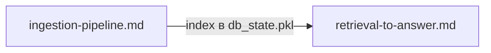

# Пайплайны HSME

Пошаговая документация ключевых потоков данных.

| Файл | Содержание |
|------|------------|
| [retrieval-to-answer.md](./retrieval-to-answer.md) | От NL-запроса в чате до финального ответа (L0–L4) |
| [ingestion-pipeline.md](./ingestion-pipeline.md) | Загрузка корпуса → Experiment → VSA + Neo4j |

## Связи

- **Ingestion** наполняет VSA-базу экспериментами; без него retrieval возвращает пустые результаты.
- **Retrieval** использует LLM на этапах L0 (парсинг) и L4 (синтез).

## Смежная документация

- [../README.md](../README.md) — публичный index документации
- [../reference/HSME_OVERVIEW.md](../reference/HSME_OVERVIEW.md) — обзор системы
- [INGESTION_LOADER.md](../../INGESTION_LOADER.md) — CLI-инструкции ingestion / relabel
