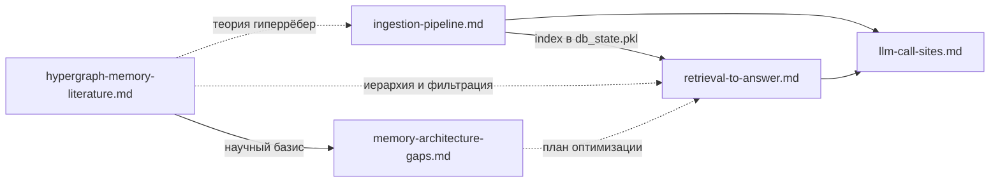

# Пайплайны HSME

Пошаговая документация ключевых потоков данных в HyperGraph Research Memory Engine.

| Файл | Содержание |
|------|------------|
| [retrieval-to-answer.md](./retrieval-to-answer.md) | От NL-запроса в чате до финального ответа (L0–L4 + frontend) |
| [ingestion-pipeline.md](./ingestion-pipeline.md) | Загрузка корпуса → Experiment → VSA + Neo4j |
| [llm-call-sites.md](./llm-call-sites.md) | Все точки вызова LLM: код, стек, промпты, примеры ответов |
| [hypergraph-memory-literature.md](./hypergraph-memory-literature.md) | Анализ иерархической и гиперграфовой памяти (HGMem, HiGMem) |
| [memory-architecture-gaps.md](./memory-architecture-gaps.md) | Gap-анализ и дорожная карта устранения технологических разрывов |

## Связи между документами

- **Ingestion** наполняет VSA-базу экспериментами; без него retrieval возвращает пустые результаты.
- **Retrieval** использует LLM на этапах L0 (парсинг) и L4 (синтез); подробности — в **llm-call-sites**.
- **Ingestion** вызывает LLM на этапе NLP extraction; тот же клиент `NLPExtractor`.
- **Literature** содержит концептуальное обоснование выбранных подходов (иерархическая память, гиперрёбра) и их маппинг на Ingestion и Retrieval.
- **Gap Analysis (memory-architecture-gaps.md)** сопоставляет теоретический базис с текущим решением и формулирует пошаговый план устранения технологических разрывов для требований хакатона.

## Смежная документация

- [AGENTS.md](../AGENTS.md) — карта проекта и быстрый старт
- [navigations/backend.md](../navigations/backend.md) — модули backend
- [topics/ingestion/data_ingestion_overview.md](../topics/ingestion/data_ingestion_overview.md) — операторский обзор ingestion
- [INGESTION_LOADER.md](../../INGESTION_LOADER.md) — CLI-инструкции
- [topics/retrieval/deep_research_precision_l4_solution.md](../topics/retrieval/deep_research_precision_l4_solution.md) — backlog L4 precision
