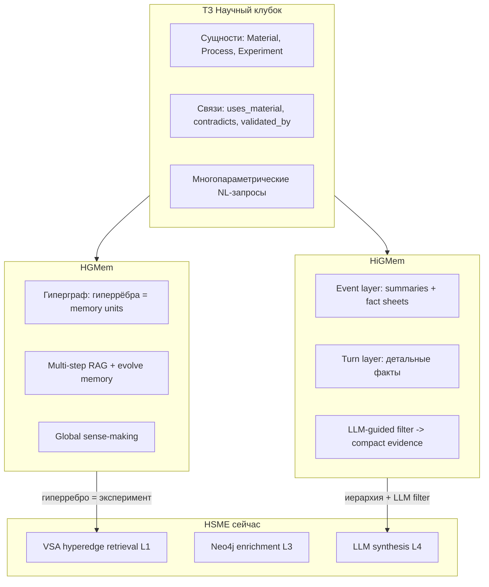

# Иерархическая память и гиперграфовые структуры в RAG-системах (Обзор литературы и маппинг на архитектуру HSME)

> Анализ передовых методов моделирования сложной памяти (HGMem, HiGMem, H-Mem) и их интеграция с концепцией HyperGraph Research Memory Engine (HSME).

**Актуальность:** 2026-07-07  
**Связанные модули:** `[backend/core/vsa.py](backend/core/vsa.py)`, `[backend/repository/database.py](backend/repository/database.py)`, `[backend/repository/neo4j_graph.py](backend/repository/neo4j_graph.py)`, `[backend/routers/search.py](backend/routers/search.py)`.

---

## Введение

Для решения задач R&D в горно-металлургической отрасли (кейс хакатона «Научный клубок», задача 2) требуется RAG-система нового поколения. Обычный текстовый поиск по чанкам (Chunk-RAG) неспособен связать воедино параметры проведения физико-химических опытов, условия эксплуатации оборудования, свойства материалов и междисциплинарные противоречия в научных публикациях. 

Для преодоления ограничений плоского поиска в HSME используется концепция **структурированной памяти**, где отдельный физический эксперимент или научный вывод кодируется целиком как связная сущность.

В данном документе проведён глубокий анализ современной научной литературы (за 2025–2026 гг.) в области систем памяти LLM-агентов. Из восьми предложенных источников выбраны два ключевых технологических столпа, концепции которых наиболее органично маппятся на архитектуру HSME:

1. **HGMem (Zhou et al., ICML 2026):** Память на основе гиперграфа для моделирования сложных многомерных отношений в длинном контексте.
2. **HiGMem (Cao et al., ACL 2026 Findings):** Двухуровневая иерархическая память с управляемой LLM фильтрацией и компактным набором доказательств (evidence).

### Карта источников исследования

| Источник / Публикация | Роль в HSME | Ключевая ценность |
|-----------------------|-------------|-------------------|
| **HGMem** (Zhou et al., [arXiv:2512.23959](https://arxiv.org/abs/2512.23959)) | **Основной** | Концепция гиперрёбер как целостных единиц памяти (экспериментов), заменяющих изолированные триплеты графа знаний. |
| **HiGMem** (Cao et al., [arXiv:2604.18349](https://arxiv.org/abs/2604.18349)) | **Основной** | Концепция иерархического сжатия контекста (Event Summary -> Turn Details), решающая проблему избыточности контекста. |
| **H-Mem** (Ye et al., [EACL 2026 / 363](https://aclanthology.org/2026.eacl-long.363.pdf)) | Вторичный | Двухдеревная структура (временная + семантическая). Полезна как идея гибридного контроллера режимов поиска. |
| **H-MEM** (Sun et al., [EACL 2026 / 15](https://aclanthology.org/2026.eacl-long.15.pdf)) | Вторичный | Иерархическая маршрутизация на основе индексов. Полезна для оптимизации обхода графовых сущностей. |
| Обзоры Moonlight, Liner, X (Rohan Paul) | Вторичный | Аналитические выжимки, эмпирические сравнения и сводные метрики эффективности моделей на бенчмарках. |



---

## 1. HGMem — гиперграфовая рабочая память

### Проблематика и идея
Классические многошаговые RAG-системы используют плоские текстовые хранилища или простые базы знаний в качестве пассивного буфера обмена (scratchpad), где накапливаются разрозненные факты. Это приводит к двум фундаментальным проблемам:
* **Фрагментация логики:** Модель теряет высокоуровневые взаимосвязи между собранными фактами.
* **Статичность знаний:** Накопленные факты не эволюционируют по мере углубления в контекст исследования.

Авторы **HGMem** предлагают представлять рабочую память в виде **динамического гиперграфа**, где гиперрёбра связывают произвольные группы сущностей в единые смысловые кластеры (события, процессы, эксперименты). Память эволюционирует итеративно, объединяя разрозненную информацию в единую картину.

### Методология и архитектура
На каждом шаге $t$ взаимодействия с моделью происходят следующие процессы:
1. **Генерация подзапросов $Q^{(t)}$:** LLM адаптивно порождает набор поисковых запросов для локального анализа или глобального расширения охвата.
2. **Адаптивный поиск (Adaptive Evidence Retrieval):**
   * *Локальное исследование (Local Investigation):* Точечный сбор информации вокруг существующих узлов памяти.
   * *Глобальное исследование (Global Exploration):* Поиск по смежным предметным областям, не задействованным на предыдущих итерациях.
3. **Эволюция памяти (Memory Evolving):**
   * *Вставка (Insertion):* Добавление новых сущностей и связей.
   * *Обновление (Update):* Модификация параметров и свойств существующих рёбер при поступлении уточняющих фактов.
   * *Слияние (Merging):* Объединение нескольких связанных рёбер в новые обобщённые гиперрёбра более высокого порядка (абстракции).

### Результаты на бенчмарках
HGMem показывает существенное превосходство над GraphRAG, LightRAG, HippoRAG v2 и NaiveRAG на сложных задачах глобального синтеза (LongBench V2, NarrativeQA, NoCha, Prelude). 

Особо примечателен факт: RAG-пайплайн HGMem на базе относительно небольшой опенсорсной модели **Qwen2.5-32B-Instruct** превосходит по показателям Comprehensiveness и Diversity систему NaiveRAG, работающую на **GPT-4o**. Это доказывает высочайшую эффективность архитектурного структурирования памяти над простым увеличением масштаба LLM.

### Маппинг на HSME
HSME изначально построена на принципе: **«эксперимент — это гиперребро»**. 

Вместо сохранения отдельно сущности «Никель» и действия «Электроэкстракция» без контекста, мы кодируем их взаимосвязь с помощью векторно-символической архитектуры (VSA).

```102:135:backend/repository/database.py
    def encode_experiment(self, experiment: Experiment) -> np.ndarray:
        """Encodes an experiment into a single VSA hypervector using the Role-Filler binding model and relation Permutation."""
        bindings = []
        
        # Ingest all input, process, and output entities
        for entity in experiment.get_all_entities():
            role_vector = self.get_or_create_vector(f"Role:{entity.type}")
            filler_vector = self.get_entity_vector(entity)
            
            # Bind role and filler
            bound = self.vsa.bind(role_vector, filler_vector)
            bindings.append(bound)
            
        # Ingest all relations
        for relation in getattr(experiment, "relations", []):
            source_ent = self.get_entity_by_value(experiment, relation.source)
            target_ent = self.get_entity_by_value(experiment, relation.target)
            
            if source_ent and target_ent:
                v_source = self.get_entity_vector(source_ent)
                v_target = self.get_entity_vector(target_ent)
                v_relation_type = self.get_or_create_vector(f"RelationType:{relation.type}")
                
                # V_relation = Permute(V_source) * V_relation_type * V_target
                bound_rel = self.vsa.bind(
                    self.vsa.bind(self.vsa.permute(v_source, 1), v_relation_type),
                    v_target
                )
                bindings.append(bound_rel)

        if not bindings:
            return self.vsa.generate_vector()
            
        return self.vsa.bundle(bindings)
```

Математически это реализуется через связывание (binding) ролей и филлеров в единый гипервектор с использованием bipolar-операций:

```13:22:backend/core/vsa.py
    def bind(self, v1: np.ndarray, v2: np.ndarray) -> np.ndarray:
        """Binds two bipolar vectors using element-wise multiplication.
        
        Binding is reversible: bind(bind(a, b), b) approximates a.
        """
        return (v1 * v2).astype(np.int8)

    def permute(self, v: np.ndarray, shifts: int = 1) -> np.ndarray:
        """Permutes a bipolar vector using cyclic shift (np.roll)."""
        return np.roll(v, shifts)
```

**Различия (Gap) между HGMem и HSME:**
В текущем HSME гиперграф статический — он строится на этапе инжеста (Ingestion Pipeline) в векторную базу и дублируется в Neo4j для визуализации и multi-hop обхода. Слияние (Merge) и адаптивное обновление (Update) памяти происходят на этапе оффлайн-импорта. HGMem же делает эволюцию рабочей памяти динамической, непосредственно во время генерации ответа на вопрос пользователя в несколько итерационных шагов.

---

## 2. HiGMem — иерархическая LLM-guided память

### Проблематика и идея
Поиск доказательств (evidence) в сверхдлинных документах или логах многодневных диалогов с помощью традиционных векторных баз приводит к раздуванию контекста. Поиск по сходству вытягивает десятки похожих, но неинформативных фрагментов. Это повышает стоимость генерации, снижает точность (Precision), и затрудняет верификацию результатов пользователем.

Авторы **HiGMem** решают эту проблему через **иерархическую структуру** (Event Layer + Turn Layer) и вовлечение LLM в процесс фильтрации на этапе извлечения.

### Методология и архитектура
1. **Двухуровневая модель хранения:**
   * **Turn Layer (Слой реплик/фактов):** Базовый детальный уровень, хранящий сырые утверждения/данные и локальные метаданные (ключевые слова, метки времени).
   * **Event Layer (Слой событий/сводок):** Абстрактные узлы, содержащие краткие саммари (event summaries) и структурированные списки фактов (fact sheets), а также двунаправленные ссылки на дочерние Turn-узлы.
2. **Алгоритм извлечения (LLM-Guided Retrieval):**
   * *Семантический поиск:* Быстрое извлечение топ-K кандидатов из обоих слоёв с помощью векторного сходства.
   * *Логический вывод на уровне событий:* LLM анализирует высокоуровневые Event-сводки и отбирает только те дочерние Turn-узлы, которые критически важны для ответа.
   * *Evidence Filtering:* Объединение семантически близких и логически предсказанных Turn-узлов в компактный финальный набор (Avg K снижается с ~100 до ~8 релевантных узлов).

### Результаты на бенчмарках
На бенчмарке LoCoMo10 HiGMem демонстрирует выдающиеся успехи в категории сложного многошагового (Multi-hop) и состязательного (Adversarial) поиска. 

За счёт сокращения контекста на этапе синтеза ответа, стоимость эксплуатации гибридных пайплайнов (например, при использовании дешевых моделей на этапе фильтрации и мощных на этапе синтеза) падает в **2.7 раза**, а метрика Precision@K возрастает на порядок (~0.191 против ~0.010 у плоского поиска).

### Маппинг на HSME
Концепция HiGMem ложится на долгосрочные планы развития HSME, описанные в `[documentation/topics/retrieval/deep_research_precision_l4_solution.md](documentation/topics/retrieval/deep_research_precision_l4_solution.md)`.

В HSME сущности имеют иерархический характер:
* **Event (HiGMem)** ↔ Научная публикация (Publication) или Технологический кластер (например, «кучное выщелачивание никеля»).
* **Turn (HiGMem)** ↔ Конкретный проведенный эксперимент (Experiment) с числовыми параметрами проведения.

На этапе L1/L2 поиска HSME вытягивает релевантные эксперименты по VSA-сходству, но сталкивается с избыточностью контекста на L4-синтезе (Precision@10 составляет 0.15, в то время как Recall@5 близок к 1.0).

Решение этой проблемы напрямую пересекается с логикой фильтрации HiGMem: внедрение слоя **Reranker** и **Structured Extraction** (предложенных на Уровне 1 и 2 стратегии оптимизации):

```text
 score = 0.55 * vsa_score
       + 0.20 * entity_overlap
       + 0.10 * metric_overlap
       + 0.10 * graph_support
       + 0.05 * source_quality
       - 0.15 * raw_noise_penalty
```

Использование иерархических метаданных (источники публикаций, связи с экспертами и лабораториями, верифицированные противоречия `CONTRADICTS`), полученных из Neo4j на этапе L3, выступает в роли "Event Summaries", предсказывающих ценность отдельных экспериментов для финального ответа.

---

## 3. Сравнительный анализ систем памяти

Ниже приведено детальное сравнение архитектурных подходов систем памяти HGMem, HiGMem и текущей реализации HSME.

| Аспект сравнения | HGMem (ICML 2026) | HiGMem (ACL 2026) | HSME (HyperGraph Engine) |
|------------------|-------------------|-------------------|--------------------------|
| **Основной юнит памяти (Memory Unit)** | Гиперребро (Hyperedge), объединяющее связанные факты и рассуждения в один концепт. | Двухуровневый узел: обобщённое событие (Event) и детальный диалоговый шаг (Turn). | Эксперимент (Experiment) как гиперребро, связывающее входные материалы, параметры процессов и свойства продуктов. |
| **Способ индексирования** | Векторные эмбеддинги + структура гиперграфа в оперативной памяти. | Векторные эмбеддинги + двунаправленные ссылочные индексы иерархии. | Векторно-символическая архитектура (VSA MAP) с биполярным кодированием отношений + Neo4j. |
| **Алгоритм Retrieval** | Многошаговый итеративный цикл генерации подзапросов с локально-глобальным обходом графа. | Двухэтапный: векторный поиск кандидатов + LLM-вывод на сводках событий (semantic anchors) для отбора деталей. | Однопроходный VSA-поиск по кодированному вектору запроса (L1) → фильтрация (L2) → обогащение графом Neo4j (L3). |
| **Динамическое изменение (Evolution)** | **Высокое:** Выполняются операции Update, Insert и Merge в процессе рассуждения. | **Среднее:** Инкрементальное обновление Event-сводок и линкование новых Turn-узлов. | **Низкое (статическое):** Граф и VSA-индексы фиксируются на шаге Ingestion. На этапе поиска выявляются только пробелы (Gaps). |
| **Целевой домен применения** | Global sense-making, длинные сложные тексты, логическое реляционное моделирование. | Сверхдлинные диалоги, сессии поддержки, извлечение компактных доказательств. | База R&D знаний горно-металлургической отрасли (структурированные отчеты, патенты, параметры ОПР). |
| **Оптимизация токенов контекста** | Средняя (аккумулирует граф рабочей памяти в контексте). | **Высокая** (сокращает число передаваемых в LLM фактов в 10 раз за счёт фильтрации по Event summaries). | Средняя (передает top-K экспериментов и метаданные графа Neo4j напрямую в L4-генератор). |

---

## 4. Практические выводы для ТЗ «Научный клубок»

Анализ передовых систем памяти позволяет сделать важные выводы для демонстрации преимуществ HSME на хакатоне:

1. **Достоверность и верификация (Требование ТЗ):**  
   HiGMem доказывает, что явное связывание детальных фактов (Turns) с их источниками и сводками (Events) повышает доверие к системе. В HSME эта связь реализована через сопоставление ID экспериментов в VSA-базе с конкретными файлами отчетов и экспертами в Neo4j. Это гарантирует прослеживаемость (provenance) каждого числа в RAG-ответе.
2. **Многопараметрические запросы и числовые диапазоны:**  
   Математический аппарат VSA в HSME превосходно справляется с кодированием многопараметрических связей (например, «температура $\ge 80^\circ\text{C}$» + «выход никеля $\ge 98\%$»). В отличие от плоского векторного поиска, VSA-вектор сохраняет дистрибутивную структуру отношений, предотвращая смешивание перекрёстных параметров из разных опытов.
3. **Борьба с галлюцинациями на пробелах в знаниях (Gaps):**  
   И HGMem, и HiGMem опираются на концепцию логического вывода на уровне абстракций перед генерацией ответа. Метод `db.analyze_gaps()` в HSME следует этому принципу: если VSA-поиск выявил низкое сходство по ключевым сочетаниям «металл–климат–процесс», система явно изолирует этот пробел, предотвращая попытки модели "угадать" несуществующие технологические решения.
4. **Что не следует переносить из статей 1:1:**  
   Диалоговые агенты (HiGMem, H-Mem) сфокусированы на управлении сессиями общения, вытеснении устаревших фактов (memory eviction) и временной динамике. Для предметной области R&D горного дела временной фактор вторичен (статья за 2015 год по выщелачиванию так же ценна, как за 2025), а данные носят преимущественно статический декларативный характер. Динамическое слияние фактов (online merge из HGMem) также избыточно для стабильной базы знаний и может приводить к неконтролируемым искажениям физических параметров.

---

## Библиография

```latex
@misc{zhou2025improvingmultistepraghypergraphbased,
      title={Improving Multi-step RAG with Hypergraph-based Memory for Long-Context Complex Relational Modeling}, 
      author={Chulun Zhou and Chunkang Zhang and Guoxin Yu and Fandong Meng and Jie Zhou and Wai Lam and Mo Yu},
      year={2025},
      eprint={2512.23959},
      archivePrefix={arXiv},
      primaryClass={cs.CL},
      url={https://arxiv.org/abs/2512.23959},
      note={ICML 2026. Code: https://github.com/Encyclomen/HGMem}
}

@article{cao2026higmem,
  title={HiGMem: A Hierarchical and LLM-Guided Memory System for Long-Term Conversational Agents},
  author={Cao, Shuqi and He, Jingyi and Tan, Fei},
  journal={arXiv preprint arXiv:2604.18349},
  year={2026},
  note={Accepted to Findings of ACL 2026. Code: https://github.com/ZeroLoss-Lab/HiGMem}
}

@inproceedings{ye-etal-2026-h,
    title = "{H}-Mem: Hybrid Multi-Dimensional Memory Management for Long-Context Conversational Agents",
    author = "Ye, Zihe and Huang, Jingyuan and Chen, Weixin and Zhang, Yongfeng",
    booktitle = "Proceedings of the 19th Conference of the European Chapter of the Association for Computational Linguistics (Volume 1: Long Papers)",
    pages = "7756--7775",
    year = "2026",
    address = "Rabat, Morocco",
    publisher = "Association for Computational Linguistics",
    url = "https://aclanthology.org/2026.eacl-long.363/",
    doi = "10.18653/v1/2026.eacl-long.363"
}

@inproceedings{sun-etal-2026-h,
    title = "{H}-{MEM}: Hierarchical Memory for High-Efficiency Long-Term Reasoning in {LLM} Agents",
    author = "Sun, Haoran and Zeng, Shaoning and Zhang, Bob",
    booktitle = "Proceedings of the 19th Conference of the European Chapter of the Association for Computational Linguistics (Volume 1: Long Papers)",
    pages = "341--350",
    year = "2026",
    address = "Rabat, Morocco",
    publisher = "Association for Computational Linguistics",
    url = "https://aclanthology.org/2026.eacl-long.15/",
    doi = "10.18653/v1/2026.eacl-long.15"
}
```
