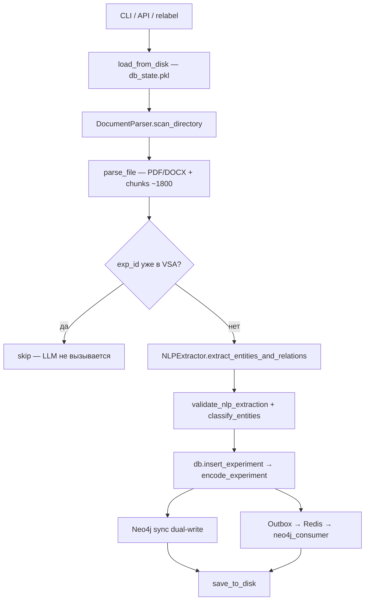

# Ingestion pipeline

> Путь от PDF/DOCX в корпусе до Experiment в VSA-базе и Neo4j.

**Актуальность:** 2026-07-07 · Primary CLI: `python -m backend.repository.corpus_loader`.

Операторский обзор и 80/20-рекомендации — [topics/ingestion/data_ingestion_overview.md](../topics/ingestion/data_ingestion_overview.md). CLI-инструкции — [INGESTION_LOADER.md](../../INGESTION_LOADER.md).

---

## Общая схема



**Ключевая идея:** эксперимент кодируется как **гиперребро** (единый VSA-вектор), а не набор разрозненных триплетов. Neo4j дополняет VSA для multi-hop обхода (dual storage; векторы не дублируются в граф).

---

## 1. Точки входа

| Entry point | Файл | Назначение |
|-------------|------|------------|
| **Primary CLI** | `backend/repository/corpus_loader.py` | Скачивание архива (опционально), scan, full pipeline |
| **Relabel CLI** | `backend/repository/corpus_relabel_loader.py` | Re-run NLP на существующих chunks; overwrite VSA; `ingestion_reports/` |
| **API bulk** | `backend/routers/ingestion.py` → `POST /api/ingest-corpus` | Фоновая ingest `data/` (max 15 files); Administrator |
| **API single** | `backend/routers/experiments.py` → `POST /api/ingest` | Ручной JSON experiment (без парсинга документов) |
| **API status** | `GET /api/ingest-status` | Статус фоновой задачи + async graph sync metrics |
| **Neo4j worker** | `backend/workers/neo4j_consumer.py` | Redis Stream → Neo4j (async mode) |
| **Backfill CLI** | `backend/repository/migration.py` | Sync существующих VSA experiments в Neo4j |
| **Outbox recovery** | `backend/repository/replay_outbox.py` | Requeue dead-letter outbox rows |
| **App startup** | `backend/app.py` → `lifespan()` | Neo4j indexes + outbox schema |

Типичные команды:

```bash
PYTHONPATH=. uv run python -m backend.repository.corpus_loader --mode test
PYTHONPATH=. uv run python -m backend.repository.corpus_relabel_loader --mode test --skip-files 10
PYTHONPATH=. uv run python -m backend.repository.migration --via-outbox
PYTHONPATH=. uv run python -m backend.workers.neo4j_consumer
```

Global singleton для API: `pipeline = IngestionPipeline(db, concurrency_limit=6)` в конце `ingestion.py`. CLI loader создаёт отдельный экземпляр `HSMEVectorDatabase`, чтобы не трогать in-memory API state.

---

## 2. Загрузка БД и сканирование корпуса

### Persist load

Перед ingest загружается существующее состояние:

- **Путь:** `.local/db_state.pkl` (override: `HSME_DATABASE_FILE` / `--db-file`)
- **Формат:** pickle `{ codebook, experiments, vector_store, audit_logs }`

### Scan

**Модуль:** `backend/services/document_parser.py`

`DocumentParser.scan_directory(base_dir)` обходит корпус:

| Режим | Каталоги |
|-------|----------|
| test | `Обзоры`, `Статьи`, `Доклады` (до 15 файлов) |
| prod | + всё под `Источники информации` |

**Источники данных:**

- Яндекс.Диск (prod) — скачивается через `--archive-url` в `.cache/hsme_corpus_loader/`
- `data/` — полный корпус после распаковки
- `test_data/` — урезанный корпус для разработки

---

## 3. Парсинг документа и чанкинг

`DocumentParser.parse_file(file_path)`:

| Формат | Библиотека |
|--------|------------|
| `.docx` | python-docx |
| `.pdf` | PyMuPDF |

**Метаданные:** title, code (нормализация `ОИП-9-2023` → `ОИП-09-2023`), year, authors, section headers.

**Чанкинг (ChunkNorris-style, `chunk_version=cn_v1`):** section-aware границы по заголовкам; soft ≈1800 / hard ≈2400; oversized tables делятся по строкам с **повтором header rows**; code-like blocks пропускаются. Подробности — [Stage 4.1](../stages.md) / [topochunker.md](../topics/architecture/topochunker.md).

**Выход:**

```python
{
  "filename": "...",
  "file_slug": "...",
  "title": "...",
  "code": "...",
  "year": 2023,
  "authors": ["..."],
  "chunk_version": "cn_v1",
  "chunks": [{
    "index": 0,
    "text": "...",
    "section": "...",
    "section_path": ["..."],
    "page": 1,
    "content_type": "text",  # or "table"
    "chunk_version": "cn_v1",
    "source_block_id": "...",
  }]
}
```

**Experiment ID** — `make_experiment_id()`:

```python
def make_experiment_id(doc_meta, chunk_index, chunk=None) -> str:
    version = resolve_chunk_version(doc_meta, chunk)  # default cn_v1
    code = doc_meta.get("code") or "N/A"
    if code != "N/A":
        return f"EXP-{code}-{version}-{chunk_index:02d}"
    slug = doc_meta.get("file_slug") or slugify_filename(doc_meta.get("filename", "unknown"))
    return f"EXP-{slug}-{version}-{chunk_index:02d}"
```

**Skip на уровне файла:** если все chunk IDs уже в `db.experiments`, файл пропускается целиком (LLM не вызывается).

---

## 4. Идемпотентность

```142:145:backend/services/ingestion.py
        exp_id = make_experiment_id(doc_meta, chunk["index"])
        if exp_id in self.db.experiments:
            self._record_chunk_outcome(doc_meta, chunk, "skipped", exp_id)
            return "skipped"
```

| Сценарий | Поведение |
|----------|-----------|
| Обычный ingest | Skip если ID уже есть |
| Relabel loader | Удаляет existing experiment, re-processes; при failure — restore (`restored` status) |

---

## 5. NLP extraction (LLM)

**Модуль:** `backend/services/nlp_extractor.py`  
**Промпт:** `backend/prompts/nlp_extractor.yaml`

`NLPExtractor.extract_entities_and_relations(chunk_text)`:

1. LLM call (до 3 retries; moderation handling; **adaptive** prompts/temperature на `tolerant_drop_all`)
2. `normalize_message_content` → `extract_json_payload` → `parse_llm_json`
3. `validate_nlp_extraction(..., strict=False)` — tolerant mode + **safe relation aliases**
4. `_enrich_numeric_properties()` — regex для pH, °C, А/м² и т.д.

Перед LLM `process_chunk` применяет **low-signal prefilter** (`is_low_signal_chunk`): слишком короткие / presentation / low-domain фрагменты → `empty` без вызова модели.

Yandex models (`gpt://...`) получают `response_format: {"type": "json_object"}` — это **не** Pydantic structured output. Pydantic (`validate_nlp_extraction`, `strict=False`) валидирует JSON **после** ответа: invalid relations/entities дропаются; если entities не осталось — `validation_failed`.

После успешного NLP — **domain quality gate**: Publication/Expert-only extraction не пишется как `ok` experiment (`empty` / `weak_domain_evidence`).

Диагностика пишется в `chunk_outcomes` и `ingestion_reports/{run_id}/summary.json` → `validation_summary`:
- `failure_class`: `parse_error` | `schema_error` | `tolerant_drop_all` | `moderation` | `empty`
- `dropped_entities` / `dropped_relations`, `clean_json_preview`, `error_messages`
- `skip_reason` / `low_signal_reason` для prefilter и quality gate

**Статусы chunk при ошибках:**

| Статус | Причина |
|--------|---------|
| `moderation` | LLM refusal (safety) |
| `validation_failed` | JSON/schema fail после 3 попыток (часто `tolerant_drop_all` = пустой `entities`) |
| `empty` | Prefilter / нет domain evidence / нет entities после extraction |

Подробности LLM — [llm-call-sites.md §1](./llm-call-sites.md#1-extract_entities_and_relations--ingestion-nlp).

---

## 6. Сборка Experiment

После успешного NLP:

```161:198:backend/services/ingestion.py
            inputs, processes, outputs = self.classify_entities(res["entities"])
            // ...
            publication_title = doc_meta["title"]
            inputs.append(Entity(type="Publication", value=publication_title))
            for auth in doc_meta["authors"]:
                if auth != "Не указан":
                    processes.append(Entity(type="Expert", value=auth))

            geography = self.guess_geography(text, doc_meta["filename"])
            // ...
            experiment = Experiment(
                id=exp_id,
                name=exp_name,
                input_entities=inputs,
                process_entities=processes,
                output_entities=outputs,
                relations=relations,
                evidence=[doc_meta["filename"]],
                confidence=0.95,
                year=doc_meta["year"],
                geography=geography,
                source_type=doc_meta["source_type"],
                is_sensitive=chunk_is_sensitive(text, skip_reason),
            )
```

| Функция | Назначение |
|---------|------------|
| `classify_entities()` | Flat entities → input/process/output roles |
| `guess_geography()` | Heuristic RU vs Global |
| `chunk_is_sensitive()` | Флаг uranium/plutonium content |

**Concurrency:** semaphore (default 6–8 parallel chunks per file). OpenRouter auto-reduces to 2 in corpus_loader.

---

## 7. VSA encoding

**Модуль:** `backend/repository/database.py`  
**Math:** `backend/core/vsa.py` → `BipolarVSA` (dim=10 000)

```python
db.insert_experiment(experiment, auto_save=False)
  → encode_experiment(experiment)
  → vector_store[exp_id] = hypervector
```

**Encoding model:**

- Entity: `bind(Role:{type}, filler_vector)`
- Relation: `bind(bind(permute(V_source), V_relation_type), V_target)`
- Experiment vector: `bundle(all bindings)`

**Важно:** это **не neural embeddings**. Поиск — symbolic VSA similarity, не cosine по dense vectors.

Numeric Property interpolation в `get_entity_vector()` поддерживает interval search (pH ranges, temperatures).

---

## 8. Neo4j dual-write

### Sync mode (default)

```234:238:backend/services/ingestion.py
                else:
                    neo_start = time.perf_counter()
                    try:
                        async with _get_neo4j_write_semaphore():
                            await neo4j_graph.insert_experiment_async(experiment)
```

`Neo4jGraphRepository.insert_experiment_async()` — Cypher MERGE: Experiment node, typed entity nodes, semantic edges, EVIDENCE_FROM.

Kill switch: `USE_NEO4J=false` или `--no-neo4j`.

### Async mode (Stage 3)

`USE_ASYNC_GRAPH_SYNC=true`:

```
graph_sync_service.enqueue_experiment_upsert(experiment)
  → SQLite outbox (.local/graph_sync_outbox.db)
  → Redis Stream (hsme:graph_sync)
  → neo4j_consumer worker
  → insert_experiment_async()
```

| Статус | Значение |
|--------|----------|
| `graph_sync_failed` | Enqueue failed + `ASYNC_GRAPH_SYNC_REQUIRED=true` |
| `graph_sync_deferred` | Enqueue failed, VSA saved, Neo4j pending |

**VSA-first:** experiment всегда пишется в pickle; Neo4j — eventual consistency в async mode.

---

## 9. Persist и отчёты

| Артефакт | Путь | Содержание |
|----------|------|------------|
| VSA DB | `.local/db_state.pkl` | experiments + vector_store + codebook |
| Audit log | `.local/audit_logs.jsonl` | append-only actions |
| Ingestion report | `ingestion_reports/{run_id}/summary.json` | counts, chunk_outcomes |
| Cache | `.cache/hsme_corpus_loader/` | скачанные zip-архивы |

`save_to_disk(db_filepath, run_in_background=True)` — один раз после обработки всех chunks файла.

**Chunk outcome statuses** (полный список):

```
ok, skipped, restored, validation_failed, moderation, empty,
graph_sync_failed, graph_sync_deferred
```

---

## 10. Что ingestion *не* включает

| Исключение | Пояснение |
|------------|-----------|
| `POST /api/ingest` | Bypass document parsing; ожидает готовый Experiment JSON |
| Search/query parsing | Отдельный pipeline — [retrieval-to-answer.md](./retrieval-to-answer.md) |
| Seeding | `backend/repository/seeding.py` — demo data при первом запуске, не production path |
| Dense embeddings | Нет embedding models; только VSA hypervectors |

---

## Полная цепочка (condensed)

```
corpus_loader.main / POST /api/ingest-corpus
└── IngestionPipeline.ingest_directory
    └── ingest_file (per file)
        ├── DocumentParser.parse_file
        └── process_chunk (concurrent, semaphore)
            ├── make_experiment_id → skip if exists
            ├── NLPExtractor.extract_entities_and_relations  [LLM]
            ├── classify_entities + guess_geography
            ├── Experiment model
            ├── db.insert_experiment → encode_experiment     [VSA]
            ├── neo4j_graph.insert_experiment_async          [sync Neo4j]
            │   OR graph_sync_service.enqueue_experiment_upsert [async Neo4j]
            └── chunk_outcome recorded
        └── save_to_disk
```

---

## Навигация по связанным файлам

### Оператор и аналитика

| Файл | Описание |
|------|----------|
| [INGESTION_LOADER.md](../../INGESTION_LOADER.md) | CLI, async sync, recovery |
| [topics/ingestion/](../topics/ingestion/) | Аналитика, relabel report |
| [topics/ingestion/stage4_relabel_analysis.md](../topics/ingestion/stage4_relabel_analysis.md) | Stage 4 relabel analysis |

### Backend modules

| Файл | Роль |
|------|------|
| [backend/services/ingestion.py](../../backend/services/ingestion.py) | Orchestrator |
| [backend/services/document_parser.py](../../backend/services/document_parser.py) | Parse + chunk |
| [backend/services/nlp_extractor.py](../../backend/services/nlp_extractor.py) | LLM extraction |
| [backend/repository/database.py](../../backend/repository/database.py) | VSA encode/store |
| [backend/repository/neo4j_graph.py](../../backend/repository/neo4j_graph.py) | Graph dual-write |
| [backend/services/graph_sync.py](../../backend/services/graph_sync.py) | Async outbox relay |
| [backend/repository/ingestion_outbox.py](../../backend/repository/ingestion_outbox.py) | SQLite outbox |
| [backend/workers/neo4j_consumer.py](../../backend/workers/neo4j_consumer.py) | Redis consumer |
| [backend/core/config.py](../../backend/core/config.py) | `USE_NEO4J`, `USE_ASYNC_GRAPH_SYNC` |
| [backend/prompts/nlp_extractor.yaml](../../backend/prompts/nlp_extractor.yaml) | Extraction prompt |

### Tests

| Файл | Покрытие |
|------|----------|
| [tests/test_corpus_loader.py](../../tests/test_corpus_loader.py) | Loader CLI |
| [tests/test_ingestion_neo4j.py](../../tests/test_ingestion_neo4j.py) | Dual-write |
| [tests/test_ingestion_outbox.py](../../tests/test_ingestion_outbox.py) | Outbox enqueue |
| [tests/test_graph_sync.py](../../tests/test_graph_sync.py) | Async sync E2E |
| [tests/test_nlp_extractor.py](../../tests/test_nlp_extractor.py) | LLM parsing |

### Связанные пайплайны

| Файл | Связь |
|------|-------|
| [retrieval-to-answer.md](./retrieval-to-answer.md) | Search по indexed experiments |
| [llm-call-sites.md](./llm-call-sites.md) | NLP LLM call details |
| [navigations/backend.md](../navigations/backend.md) | Полная карта backend |
