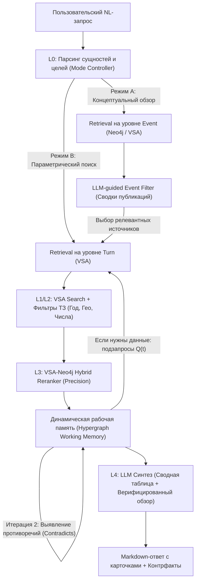

# Анализ технологических разрывов (Gap Analysis) архитектуры памяти HSME

> Сравнение текущей реализации HyperGraph Research Memory Engine с передовыми исследованиями (HGMem, HiGMem, H-Mem) и проектирование целевой архитектуры под задачи хакатона «Научный клубок».

**Актуальность:** 2026-07-07  
**Базовый документ теории:** `[hypergraph-memory-literature.md](./hypergraph-memory-literature.md)`  
**Спецификация задачи хакатона:** `[HACKATHON_TASK_2_SCIENTIFIC_TANGLE.md](../HACKATHON_TASK_2_SCIENTIFIC_TANGLE.md)`  
**Актуальные пайплайны проекта:** `[ingestion-pipeline.md](./ingestion-pipeline.md)`, `[retrieval-to-answer.md](./retrieval-to-answer.md)`

---

## 1. Введение: Специфика R&D металлургии vs Общие ИИ-агенты

Большинство академических исследований в области систем памяти ИИ-агентов (таких как HiGMem, H-Mem) тестируются на диалоговых бенчмарках (например, LoCoMo, DialSim), где основными вызовами являются:
* Длинный контекст чата (многодневные логи).
* Вытеснение старой информации (memory eviction).
* Временная динамика диалога (кто, когда и что сказал).

В горно-металлургических R&D (кейс «Научный клубок») требования к системе памяти кардинально отличаются:
1. **Стабильность и неизменность фактов:** Химическая формула реакции кучного выщелачивания или параметры обессоливания воды из отчёта 2018 года не теряют своей актуальности со временем. Память не должна "забывать" или вытеснять старые опыты.
2. **Многопараметрическая строгость:** Ошибки в концентрациях (например, сульфаты $\ge 300\text{ мг/л}$) или температурах недопустимы. Необходим строгий параметрический поиск, а не просто семантическое "облако смыслов".
3. **Междисциплинарный синтез и выявление противоречий:** Система должна не просто цитировать куски текста, а сопоставлять разные эксперименты, находить конфликты в выводах (например, когда при одинаковом расходе католита у разных авторов получается разный выход никеля) и формировать целостные "карты знаний".

Ниже представлен детальный Gap-анализ, показывающий, каких именно компонентов не хватает текущей версии HSME для перехода от пассивного структурированного поиска к полноценной динамической рабочей памяти уровня HGMem/HiGMem, адаптированной под эти специфические требования.

---

## 2. Анализ разрывов (Gaps) по ключевым осям

### Gap A: Эволюция и динамический синтез памяти (Memory Evolving Gap)

#### 1. Теоретический базис (HGMem)
HGMem предлагает динамическую эволюцию памяти в процессе сессии рассуждения. Когда модель находит новые факты, она не просто дописывает их в буфер, а выполняет операции над гиперрёбрами гиперграфа:
* **Insertion:** Добавление новых сущностей.
* **Update:** Обновление весов и свойств существующих рёбер.
* **Merging:** Слияние нескольких гиперрёбер в абстрактную структуру более высокого порядка.

#### 2. Текущая реализация HSME
В HSME процессы построения памяти статические:
* Гиперграфовая структура экспериментов кодируется с помощью векторно-символической архитектуры (VSA) на этапе инжеста (`ingestion-pipeline.md`) и сохраняется в `.local/db_state.pkl`.
* Neo4j используется как статическое зеркало для визуализации и multi-hop обхода (`backend/repository/neo4j_graph.py`).
* На этапе ответа (`retrieval-to-answer.md`) модель получает статический срез топ-K экспериментов и не производит никаких операций динамического слияния или обновления структуры памяти в реальном времени.

#### 3. Адаптация под хакатон и решение
Для составления автоматических литературных обзоров и выявления зон противоречий (требование ТЗ) HSME необходима **динамическая рабочая память на этапе синтеза ответа (L4)**.

* **Решение (Dynamic Merging & Contradiction Detection):** 
  При получении топ-K кандидатов из VSA, L4-модель должна выполнять итеративный проход, имитирующий операции HGMem:
  * *Итерация 1 (Merge):* Слияние схожих экспериментов по одинаковым процессам и материалам в "обобщённые технологические профили" (например, объединение пяти опытов электроэкстракции при разных скоростях потока).
  * *Итерация 2 (Update/Contradiction):* Выявление нестыковок в результатах этих опытов. Если в одном эксперименте скорость потока $v = 1.2\text{ м/с}$ дала выход металла $95\%$, а в другом при тех же условиях — $85\%$, система должна динамически создать ребро типа `CONTRADICTS` прямо в контексте текущего ответа.

---

### Gap B: Итеративная локально-глобальная навигация (Multi-step Adaptive Retrieval Gap)

#### 1. Теоретический базис (HGMem)
HGMem реализует адаптивный поиск (Adaptive Evidence Retrieval), сочетая локальное исследование (Local Investigation — углубление в детали известных сущностей) и глобальное исследование (Global Exploration — поиск новых концептов в смежных областях графа). Это управляется через генерацию подзапросов $Q^{(t)}$ на каждом шаге $t$.

#### 2. Текущая реализация HSME
retrieval-пайплайн HSME является **однопроходным (single-pass)**:
* Пользовательский запрос парсится в плоский список сущностей в L0 (`parse_query_to_entities`).
* Выполняется единственный VSA-поиск в L1 (`db.search`).
* Результат обогащается графом Neo4j в L3 (`expand_graph_context`) и отдаётся в L4.
* Если запрос сложный и требует междисциплинарного поиска (например, "связать режим кучного выщелачивания в холодном климате с выходом металла"), модель может упустить важные детали, так как не имеет возможности сделать "второй шаг" за дополнительными фактами.

#### 3. Адаптация под хакатон и решение
* **Решение (Iterative Sub-Query Loop):**
  Для глубокой аналитики необходимо разделить пайплайн на $T$ шагов рассуждения:
  * *Шаг 1 (Глобальный):* Поиск по базовым технологиям и процессам (например, "кучное выщелачивание").
  * *Шаг 2 (Локальный):* На основе извлечённых на Шаге 1 конкретных веществ и параметров (например, "техногенный гипс", "температура полива $5^\circ\text{C}$") генерируются точечные подзапросы $Q^{(2)}$ для извлечения точных числовых показателей и конкретных публикаций/экспертов из базы.

---

### Gap C: Иерархическое сжатие контекста и Precision (HiGMem Hierarchical Routing Gap)

#### 1. Теоретический базис (HiGMem)
HiGMem вводит двухуровневую иерархию памяти (Event Layer и Turn Layer). retrieval-алгоритм сначала извлекает Event-сводки (концептуальный уровень), а затем использует LLM как "маршрутизатор" (LLM-Guided Filter), чтобы предсказать, какие именно детальные Turn-факты (числа, формулы) из связанных узлов действительно заслуживают прочтения. Это сокращает объем контекста в 10 раз и исключает попадание шума в генератор.

#### 2. Текущая реализация HSME
В HSME отсутствует иерархическое управление извлечением данных:
* База данных оперирует плоским списком экспериментов (`Experiment`).
* Хотя метаданные публикации (Publication) и авторов (Expert) привязаны к эксперименту, они извлекаются вместе с ним и не служат семантическими якорями (semantic anchors) для фильтрации перед детальным поиском.
* Это приводит к перегрузке контекста на этапе L4-синтеза (Precision@10 составляет 0.15, так как VSA возвращает много семантически похожих, но избыточных опытов из одного и того же отчёта).

#### 3. Адаптация под хакатон и решение
* **Решение (Hierarchical Event-Turn Routing):**
  Необходимо адаптировать концепцию HiGMem, введя двухуровневую фильтрацию на основе типа запроса (через интеллектуальный "Mode Controller" в L0):
  * *Уровень событий (Event Level):* Научные публикации, ГОСТы, патенты, концептуальные разделы отчётов.
  * *Уровень фактов (Turn Level):* Конкретные строки экспериментов, протоколы опытов, числовые замеры.

  Если пользователь задает концептуальный запрос (например, "Какие методы обессоливания применяются в России?"), Mode Controller переключает поиск в **Режим событий**, извлекая только обобщённые сводки публикаций (Event Summaries). Если запрос параметрический (с числовыми диапазонами), система спускается в **Режим фактов** (Turn Level), используя VSA-индексы для извлечения точных параметров химических реакций.

---

## 3. Целевая архитектура памяти HSME (Target Architecture)

Ниже представлена схема целевого RAG-пайплайна HSME, устраняющего выявленные разрывы за счёт интеграции динамической гиперграфовой памяти (HGMem) и иерархического роутинга (HiGMem).

---

## 4. Дорожная карта (Backlog) реализации

Дорожная карта структурирована по уровням сложности и приоритету для обеспечения стабильного развития системы без нарушения текущей работоспособности VSA-движка.

### Этап 1: Оптимизация контекста и умный Rerank (MVP — Краткосрочный приоритет)
* **Цель:** Повысить Precision@5 с 0.15 до 0.40 и устранить замусоривание L4-контекста.
* **Задачи:**
  1. Реализовать гибридную формулу скоринга (Rule-based Reranker) поверх базовой VSA-близости, учитывающую соответствие единиц измерения, географический приоритет и статус верификации источника.
  2. Добавить `Structured Fact Extraction` перед генерацией связного Markdown-текста на уровне L4, заставив LLM сначала выделить ключевые сущности в JSON.
  3. Внедрить "No-Evidence Path" для корректной обработки пробелов в знаниях (Gaps) без генерации галлюцинаций.

### Этап 2: Иерархический роутинг (Среднесрочный приоритет)
* **Цель:** Внедрить архитектуру Event-Turn для работы со сверхкрупными базами отчётов.
* **Задачи:**
  1. Разделить сущности в Neo4j и VSA на два логических слоя: `Event` (метаданные публикации, аннотация, авторы) и `Turn` (конкретные эксперименты с числовыми параметрами).
  2. Доработать L0-парсер (`query_parse.py`), добавив классификацию целей запроса (Концептуальный / Параметрический).
  3. Написать LLM-guided фильтр, который по извлеченным Event-сводкам публикаций отсекает нерелевантные группы дочерних экспериментов перед вызовом VSA-поиска по деталям.

### Этап 3: Динамическая эволюция рабочей памяти (Долгосрочный приоритет)
* **Цель:** Обеспечить итеративный синтез сложных междисциплинарных обзоров.
* **Задачи:**
  1. Реализовать механизм итеративной генерации подзапросов $Q^{(t)}$ во внутреннем цикле L4-синтеза.
  2. Создать модуль `Dynamic Memory Evolving`, способный в оперативной памяти выполнять слияние (Merge) схожих экспериментов в сводные таблицы и автоматически генерировать ребра противоречий (`CONTRADICTS`) между отчетами разных исследовательских групп.
