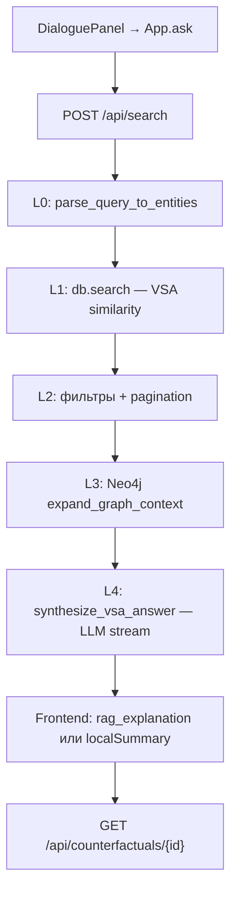

# Пайплайн ответа: retrieval → synthesis

> Путь от NL-запроса пользователя в чате до Markdown-ответа с карточками экспериментов.

**Актуальность:** 2026-07-07 · Основной endpoint: `POST /api/search`.

---

## Общая схема



HSME — **гибридный retrieval**, а не классический chunk-RAG. LLM получает структурированные эксперименты, контрфакты и графовый контекст, а не сырые фрагменты PDF.

| Слой | Что происходит | Модули |
|------|----------------|--------|
| **L0** | NL-запрос → сущности | `query_parse.py` |
| **L1** | VSA retrieval по сходству | `database.py` → `search()` |
| **L2** | Top-K + фильтры (география, год) | `search.py`, `SearchQuery` |
| **L3** | Neo4j paths, gaps, counterfactuals | `neo4j_graph.py`, `database.py` |
| **L4** | LLM-синтез ответа с цитатами | `search.py` → `synthesize_vsa_answer()` |

---

## 1. Точки входа

### Frontend

Пользователь вводит запрос в `DialoguePanel` → вызывается `App.ask(q)`:

```220:275:frontend/components/App.tsx
  const ask = useCallback(
    async (q: string) => {
      // ...
      const { data, live: searchLive } = await searchQuery(user, q, {
        geography,
      });
      // ...
      const restricted =
        user.role === "Researcher" || user.role === "External Partner";
      const rag = data.rag_explanation;
      const markdown =
        rag && !restricted
          ? rag
          : localSummary(shown, restricted);
      // ...
      if (shown.length > 0 && !restricted) {
        const cf = await fetchCounterfactuals(user, shown[0].experiment.id);
        // ...
      }
    },
    [user, geography, selectedDocs, localSummary],
  );
```

HTTP-вызов — `searchQuery()` в `frontend/lib/api.ts`:

```96:110:frontend/lib/api.ts
    const res = await fetch(`${BACKEND_BASE}/api/search`, {
      method: "POST",
      headers: getHeaders(user),
      body: JSON.stringify({
        query,
        geography: options.geography || undefined,
        paged: true,
        limit: 10,
      }),
    });
```

Заголовки авторизации: `X-User-Name`, `X-User-Role` (см. `getHeaders()`).

### Backend

Основной обработчик — `search_experiments()` в `backend/routers/search.py`:

```215:221:backend/routers/search.py
@router.post("/search")
async def search_experiments(query: SearchQuery, session: UserSession = Depends(get_user_session)):
    """Performs VSA semantic search with support for metadata filters and pagination."""
    try:
        entities = query.entities
        if query.query and not entities:
            entities = await parse_query_to_entities(query.query)
```

Роутер подключён в `backend/app.py`. OpenAPI: `/docs` → `POST /api/search`.

### Offline mirror

Eval-раннер `backend/evaluation/runners/run_e2e_eval.py` повторяет тот же pipeline (L0→L4) для бенчмарков, вызывая те же функции напрямую или через API.

---

## 2. L0 — парсинг запроса

**Модуль:** `backend/services/query_parse.py`  
**Промпт:** `backend/prompts/search_parse_query.yaml`

Если клиент передал только `query` (NL-текст) без `entities`, backend вызывает `parse_query_to_entities()`:

1. Загрузка промпта через `load_prompt("search_parse_query")`.
2. LLM-вызов через `NLPExtractor().client.chat.completions.create()` (temperature 0.1, max_tokens 2500).
3. Из ответа извлекается JSON-массив `[{type, value}, ...]` (regex или markdown fences).
4. Строится `List[Entity]` с типами: Material, Process, Equipment, Property, Facility.
5. При любой ошибке — fallback на `parse_query_local_sync()` (regex/heuristics без сети).

**Ранний выход:** если entities пусты → `{ total: 0, results: [] }`.

Подробности LLM-вызова — [llm-call-sites.md §2](./llm-call-sites.md#2-parse_query_to_entities--l0-парсинг-запроса).

---

## 3. L1 — VSA retrieval

**Модуль:** `backend/repository/database.py`  
**Математика:** `backend/core/vsa.py` → `BipolarVSA` (dim=10 000)

```255:269:backend/repository/database.py
    def search(self, query_entities: List[Entity], limit: int = 5,
               year_start: Optional[int] = None, year_end: Optional[int] = None,
               geography: Optional[str] = None, source_type: Optional[str] = None,
               exclude_sensitive: bool = False) -> List[Tuple[Experiment, float]]:
        """Searches the database using VSA binding query, supporting relational metadata filters."""
        if not query_entities:
            return []

        bindings = []
        for entity in query_entities:
            role_vector = self.get_or_create_vector(f"Role:{entity.type}")
            filler_vector = self.get_entity_vector(entity)
            bindings.append(self.vsa.bind(role_vector, filler_vector))

        query_vector = self.vsa.bundle(bindings)
```

Алгоритм:

1. Для каждой сущности запроса: `bind(Role:{type}, entity_vector)`.
2. Bundle всех bindings → `query_vector`.
3. Итерация по `vector_store`; фильтрация по sensitivity, year, geography, source_type.
4. `vsa.similarity(query_vector, exp_vector)` → сортировка по убыванию.

В `/api/search` retrieval вызывается с `limit=999999`, затем результаты нарезаются для пагинации.

**Роль External Partner:** `exclude_sensitive=True` — чувствительные эксперименты (уран, плутоний) исключаются.

Audit: `db.log_action(..., action="SEARCH", ...)`.

---

## 4. L2 — фильтрация и пагинация

**Модель запроса:** `SearchQuery` в `backend/core/models.py`

Поддерживаемые фильтры:

- `year_start`, `year_end` — диапазон годов эксперимента
- `geography` — RU / Global
- `source_type` — тип источника (Обзоры, Статьи, …)
- `skip`, `limit`, `paged` — пагинация

После полного VSA-поиска:

```257:257:backend/routers/search.py
        sliced = formatted_results[query.skip : query.skip + query.limit]
```

Ответ при `paged=True`:

```287:291:backend/routers/search.py
            result_dict = {
                "total": len(formatted_results),
                "results": sliced,
                "vsa_latency_ms": round(vsa_latency_ms, 2),
                "neo4j_latency_ms": round(neo4j_latency_ms, 2),
            }
```

---

## 5. L3 — обогащение контекста

### Neo4j graph enrichment

Если Neo4j настроен (`USE_NEO4J=true`) и есть результаты:

```262:264:backend/routers/search.py
        if neo4j_graph.is_configured and sliced:
            exp_ids = [item["experiment"].id for item in sliced]
            graph_context = await neo4j_graph.expand_graph_context(exp_ids)
```

`expand_graph_context()` возвращает experts, publications, contradictions, multi-hop paths. Статус обогащения — `graph_enrichment_status`:

| Статус | Значение |
|--------|----------|
| `ok` | Данные получены |
| `empty` | Neo4j доступен, но paths пусты |
| `sync_pending` | Async graph sync отстаёт (outbox lag) |
| `error` | Ошибка Neo4j |
| `skipped` | Neo4j выключен или нет результатов |

При `USE_ASYNC_GRAPH_SYNC=true` дополнительно проверяется `ingestion_outbox.get_sync_state()`.

### Counterfactuals и gaps (внутри L4)

В `synthesize_vsa_answer()` до LLM-вызова:

- `db.get_counterfactuals(top_exp.id)` — эксперименты, отличающиеся ровно одним входным параметром
- `db.analyze_gaps(...)` — если релевантных hits < 3, добавляется gap summary

Эти данные не идут отдельным API-вызовом в основном чате — они собираются внутри L4.

---

## 6. L4 — синтез ответа

**Функция:** `synthesize_vsa_answer()` в `backend/routers/search.py`  
**Промпт:** `backend/prompts/search_synthesize.yaml`

### Условия вызова

LLM-синтез выполняется только если:

- `query.query` задан (NL-текст)
- `paged=True`
- роль пользователя — `Administrator` или `Analyst`

```307:317:backend/routers/search.py
            if query.query and session.role in ["Administrator", "Analyst"]:
                rag_ans, llm_ttft_s, llm_ttfa_s = await synthesize_vsa_answer(
                    query.query, sliced, graph_context, entities=entities
                )
                result_dict["rag_explanation"] = rag_ans
                // ...
            elif query.query:
                result_dict["rag_explanation"] = "Ваша роль не позволяет использовать модуль авто-синтеза ответов (LLM Reasoner)."
```

### Что передаётся в промпт

1. Top-2 эксперимента с VSA similarity (%)
2. Counterfactual summary — diff параметров и эффекты на свойства
3. Graph summary — эксперты, публикации, противоречия, paths
4. Gap summary — если область слабо освещена

### LLM-вызов

Streaming через `NLPExtractor().client.chat.completions.create(..., stream=True)`. Ответ дополняется `gap_summary` после завершения stream. Метрики: `llm_ttft_s`, `llm_ttfa_s`.

При ошибке — fallback Markdown с сырыми counterfactuals.

Подробности — [llm-call-sites.md §3](./llm-call-sites.md#3-synthesize_vsa_answer--l4-синтез-ответа).

---

## 7. Frontend post-processing

После получения ответа от `/api/search`:

1. **Фильтр по корпусу** — результаты фильтруются по `selectedDocs` (панель Corpus). Backend возвращает все matches; frontend оставляет только эксперименты с evidence из выбранных документов.
2. **Выбор текста ответа:**
   - Admin/Analyst → `data.rag_explanation` (LLM Markdown)
   - Researcher / External Partner → `localSummary()` — простой bullet-list top-5 (backend RAG игнорируется)
3. **Counterfactuals** — отдельный `GET /api/counterfactuals/{id}` для top-1 результата (второй round-trip). Отображается в `CounterfactualCard`.
4. **Consensus** — client-side `calcConsensus()` по output entity values (не VSA).

---

## 8. Смежные потоки (не основной чат)

| Endpoint | Назначение | LLM |
|----------|------------|-----|
| `GET /api/reason/{experiment_id}` | Причинно-следственный отчёт (Studio) | Да — `analytics_reason.yaml` |
| `POST /api/gaps` | Поиск пробелов в знаниях | Нет — rule-based `db.analyze_gaps()` |
| `POST /api/enrich-gap` | Гипотеза для пробела (Studio) | Да — `gaps_enrich.yaml` |
| `GET /api/graph` | Визуализация графа | Нет — Neo4j или VSA fallback |
| `GET /api/counterfactuals/{id}` | Контрфакты для UI | Нет — `db.get_counterfactuals()` |

---

## 9. Полная цепочка вызовов

```
DialoguePanel.onAsk
└── App.ask
    └── api.searchQuery
        └── POST /api/search
            └── search_experiments                    [search.py]
                ├── get_user_session                  [dependencies.py]
                ├── parse_query_to_entities           [query_parse.py]
                │   ├── load_prompt("search_parse_query")
                │   ├── NLPExtractor.client.chat.completions.create
                │   └── parse_query_local_sync (fallback)
                ├── db.log_action
                ├── db.search                         [database.py]
                │   ├── get_or_create_vector / get_entity_vector
                │   ├── vsa.bind / vsa.bundle
                │   └── vsa.similarity
                ├── neo4j_graph.expand_graph_context  [neo4j_graph.py] (optional)
                ├── ingestion_outbox.get_sync_state   (optional)
                └── synthesize_vsa_answer             [search.py] (Admin/Analyst)
                    ├── db.get_counterfactuals
                    ├── db.analyze_gaps
                    ├── load_prompt("search_synthesize")
                    └── NLPExtractor.client.chat.completions.create (stream)

    └── fetchCounterfactuals (frontend, отдельно)
        └── GET /api/counterfactuals/{id}
            └── db.get_counterfactuals                [analytics.py → database.py]
```

---

## Ключевые design decisions

1. **Два LLM-вызова в search:** L0 (parse) и L4 (synthesize) — retrieval между ними детерминирован (VSA math).
2. **Structured RAG:** LLM получает experiment summaries, counterfactual diffs, graph metadata — не raw PDF.
3. **Hybrid retrieval:** VSA для semantic matching; Neo4j для relational enrichment.
4. **Role-based synthesis:** только Admin/Analyst получают LLM-ответ в search.
5. **Counterfactuals дважды:** внутри `synthesize_vsa_answer` для промпта и отдельно frontend для UI.

---

## Навигация по связанным файлам

### Backend

| Файл | Роль |
|------|------|
| [backend/routers/search.py](../../backend/routers/search.py) | `search_experiments`, `synthesize_vsa_answer` |
| [backend/services/query_parse.py](../../backend/services/query_parse.py) | L0 parse |
| [backend/repository/database.py](../../backend/repository/database.py) | VSA search, counterfactuals, gaps |
| [backend/repository/neo4j_graph.py](../../backend/repository/neo4j_graph.py) | Graph enrichment |
| [backend/core/vsa.py](../../backend/core/vsa.py) | VSA math |
| [backend/core/models.py](../../backend/core/models.py) | `Entity`, `Experiment`, `SearchQuery` |
| [backend/prompts/search_parse_query.yaml](../../backend/prompts/search_parse_query.yaml) | L0 prompt |
| [backend/prompts/search_synthesize.yaml](../../backend/prompts/search_synthesize.yaml) | L4 prompt |

### Frontend

| Файл | Роль |
|------|------|
| [frontend/components/App.tsx](../../frontend/components/App.tsx) | `ask()`, `calcConsensus`, `localSummary` |
| [frontend/components/DialoguePanel.tsx](../../frontend/components/DialoguePanel.tsx) | Chat UI |
| [frontend/lib/api.ts](../../frontend/lib/api.ts) | `searchQuery`, `fetchCounterfactuals` |

### Eval и тематика

| Файл | Роль |
|------|------|
| [backend/evaluation/runners/run_e2e_eval.py](../../backend/evaluation/runners/run_e2e_eval.py) | E2E benchmark mirror |
| [topics/retrieval/deep_research_precision_l4_solution.md](../topics/retrieval/deep_research_precision_l4_solution.md) | Backlog L4 precision |
| [navigations/backend.md](../navigations/backend.md) | Полная карта backend |
| [llm-call-sites.md](./llm-call-sites.md) | Все LLM-вызовы |
| [ingestion-pipeline.md](./ingestion-pipeline.md) | Как наполняется индекс |
