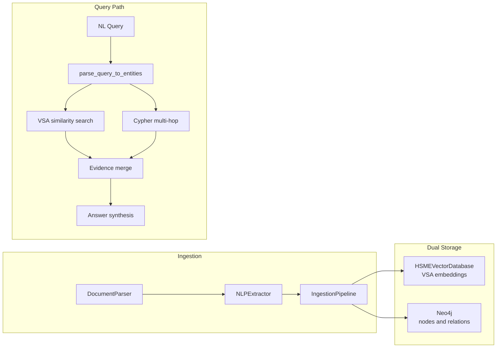
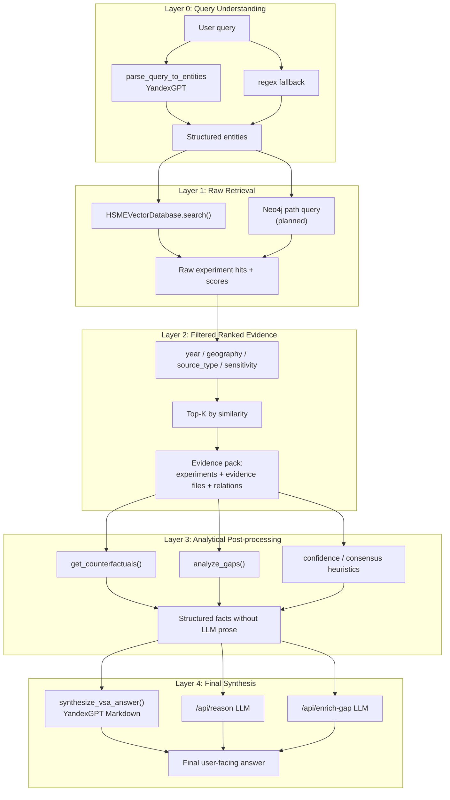
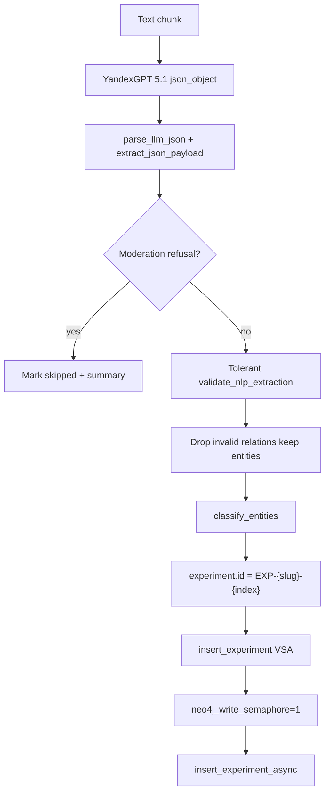
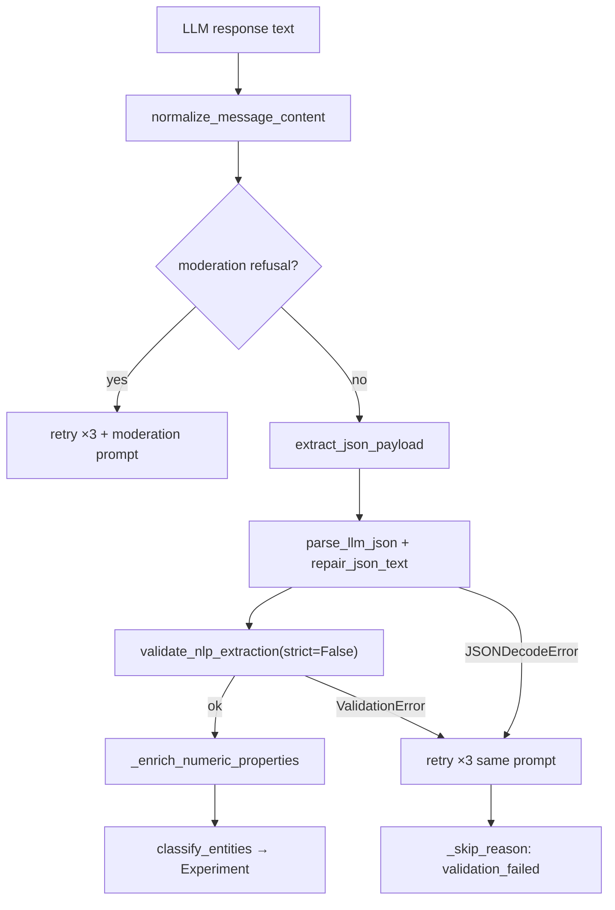
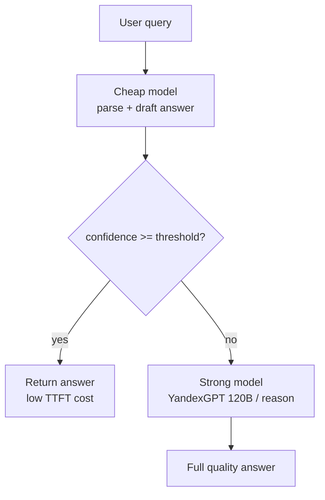

# Stages — фактические доработки в работе

**Проект:** HSME (HyperGraph Research Memory Engine)  
**Кейс:** «Научный клубок», задача 2

Этот документ — рабочий журнал **выбранных и выполняемых** доработок. Он уже уже, чем [GAP_ANALYSIS.md](./topics/gap-analysis/GAP_ANALYSIS.md): там — полный список разрывов с ТЗ, здесь — конкретные треки реализации с решениями и планом работ.

Источники backlog-этапов 6–15: [architecture_review_hsme.md](./topics/architecture/architecture_review_hsme.md), [neo4j_vs_VSA.md](./topics/architecture/neo4j_vs_VSA.md), [neo4j_vs_VSA_fix.md](./topics/architecture/neo4j_vs_VSA_fix.md), [problem.md](./topics/architecture/problem.md), [task.md](./reference/task.md), [HSME_OVERVIEW.md](./reference/HSME_OVERVIEW.md).

---

## Карта stages: зависимости

### ⚡ Независимые — можно брать в работу без других stages

Этапы **не требуют** завершения других stages. Допустимы *soft*-связи (улучшают результат, но не блокируют старт).

| Stage | Статус | Суть | Soft-связь (не блокирует) |
|-------|--------|------|---------------------------|
| **Stage 1** | `done` | Neo4j dual-write | — (корневой инфраструктурный) |
| **Stage 2** | `done` | Eval L0–L4 | Stage 1 → graph_context в E2E |
| **Stage 4** | `in_progress` | Corpus relabel / NLP ingestion | — |
| **Stage 6** | `planned` | VSA RNG, weighted bundling | Stage 2 → regression eval |
| **Stage 7** | `planned` | Debounced pickle, безопасный bootstrap | — |
| **Stage 8** | `planned` | Shared LLM client, lazy DB init | Stage 7 → единый lifecycle БД |
| **Stage 10** | `planned` | RU/EN synonyms | Stage 2 → bilingual eval |
| **Stage 11** | `planned` | Export PDF/MD/JSON-LD | — |
| **Stage 12** | `planned` | CI/CD pipeline | — |
| **Stage 13** | `planned` | Tensor completion gaps | — |
| **Stage 14** | `planned` | Knowledge entropy в UI | — |
| **Stage 15** | `backlog` | Auth beyond demo headers | — |

> **Параллельный старт (рекомендация):** пока идёт Stage 4 — можно параллельно вести **Stage 7 + 8** (persistence/LLM client) и **Stage 12** (CI). **Stage 6** — отдельная ветка VSA-math.

### 🔗 С зависимостями — нужен предшественник

| Stage | Статус | Зависит от | Почему |
|-------|--------|------------|--------|
| **Stage 3** | `done` | Stage 1 | Neo4j dual-write как база async graph sync |
| **Stage 3.1** | `done` | Stage 3 | Residual risks outbox/hybrid search |
| **Stage 5** | `planned` | **Stage 4** | Tolerant validation, moderation, `ingestion_reports/` |
| **Stage 9** | `planned` | **Stage 1** *(soft: Stage 3)* | Neo4j MERGE/outbox; alerts на lag — после async path |
| **Cascade Inference** | `backlog` | **Stage 2** | Пороги confidence калибруются по eval baseline |

---

## Актуальный backlog (2026-07-07)

Единая очередь работ. Детали каждого stage — ниже по документу; **независимые** stages помечены в [карте зависимостей](#-независимые--можно-брать-в-работу-без-других-stages).

### Статус всех stages

| Stage | Статус | Зависимости | Приоритет |
|-------|--------|-------------|-----------|
| [Stage 1](#stage-1-графовая-бд) | `done` | — | — |
| [Stage 2](#stage-2-eval--замер-качества-ответов) | `done` | — *(soft: 1)* | — |
| [Stage 3](#stage-3-асинхронный-ingestion-message-broker) | `done` | Stage 1 | — |
| [Stage 3.1](#stage-31-residual-risks--follow-ups) | `done` | Stage 3 | — |
| [Stage 4](#stage-4-надёжный-corpus-relabel-nlp-ingestion) | **`in_progress`** | **нет** ⚡ | **P0 — довести до `done`** |
| [Stage 5](#stage-5-оптимизация-валидации-json-от-llm-ingestion-nlp) | `planned` | Stage 4 | P1 — сразу после 4 |
| [Stage 6](#stage-6-vsa-rng-и-weighted-bundling) | `planned` | **нет** ⚡ *(soft: 2)* | P2 — VSA-math |
| [Stage 7](#stage-7-debounced-persistence-и-безопасный-bootstrap) | `planned` | **нет** ⚡ | **P1 — параллельно с 4** |
| [Stage 8](#stage-8-shared-llm-client-и-lazy-db-bootstrap) | `planned` | **нет** ⚡ *(soft: 7)* | P1 — параллельно с 7 |
| [Stage 9](#stage-9-neo4j-ops-hardening) | `planned` | Stage 1 *(soft: 3)* | P2 |
| [Stage 10](#stage-10-ruen-synonym-mapping) | `planned` | **нет** ⚡ *(soft: 2)* | P2 — продукт / recall |
| [Stage 11](#stage-11-export-pdfmarkdownjson-ld) | `planned` | **нет** ⚡ | P3 |
| [Stage 12](#stage-12-cicd-и-release-pipeline) | `planned` | **нет** ⚡ | **P1 — параллельно с 4** |
| [Stage 13](#stage-13-tensor-completion-gap-discovery) | `planned` | **нет** ⚡ | P3 — research |
| [Stage 14](#stage-14-knowledge-entropy-в-ui) | `planned` | **нет** ⚡ | P2 — UX |
| [Stage 15](#stage-15-auth-beyond-demo-headers) | `backlog` | **нет** ⚡ | P4 — prod only |
| [Cascade Inference](#каскадная-инференция-cascade-inference) | `backlog` | Stage 2 | P2 — после стабильного eval |

⚡ — [независимый stage](#-независимые--можно-брать-в-работу-без-других-stages), можно стартовать без ожидания других.

### Рекомендуемая очередь

1. **Закрыть Stage 4** — relabel corpus, `ingestion_reports/`, Neo4j deadlock/moderation хвосты.
2. **Stage 5** — только после Stage 4 (validation_failed ~2,4%).
3. **Параллельно с п.1–2 (независимые):**
   - **Stage 7 + 8** — debounced pickle, lazy DB, shared LLM client (architecture_review §2).
   - **Stage 12** — CI (`pytest` + frontend build + optional Neo4j container).
4. **Следующий слой (независимые, по ценности):**
   - **Stage 6** — VSA RNG / weighted bundling.
   - **Stage 10, 14** — bilingual recall и entropy в UI.
   - **Stage 11, 13** — export и tensor gaps (ниже приоритет).
5. **С зависимостями:**
   - **Stage 9** — после стабильного Neo4j path (Stage 1 + желательно 3).
   - **Cascade Inference** — после зафиксированного eval baseline (Stage 2).
6. **Stage 15** — отложить до production hardening (не блокирует demo).

---

## Правила работы с репозиторием

### Python: только через виртуальное окружение (uv)

Все Python-скрипты, тесты и CLI **запускать только через [uv](https://github.com/astral-sh/uv)** — не через системный `python`/`python3` и не через глобальный `pip install`.

| Действие | Команда |
|----------|---------|
| Установка зависимостей | `uv sync` |
| Тесты | `PYTHONPATH=. uv run pytest tests/ -v` |
| API-сервер | `uv run uvicorn backend.main:app --reload --port 8000` |
| Скрипт миграции / backfill | `PYTHONPATH=. uv run python -m backend.repository.migration --dry-run` |
| Eval-раннер (Stage 2+) | `PYTHONPATH=. uv run python backend/evaluation/runners/run_e2e_eval.py` |

**Запрещено:** `python script.py`, `python3 -m pytest`, `pip install` вне venv — это ломает воспроизводимость (версия Python, lockfile, `PYTHONPATH`).

Целевая версия Python — из [`.python-version`](../.python-version) (3.12). Окружение создаётся автоматически при первом `uv sync`.

---

## Эталонная структура этапа

Ниже — **канонический шаблон** описания stage. Stage 1 и Stage 2 ниже в документе зафиксированы как эталон; новые этапы и backlog-пункты оформляются по той же схеме.

### Обязательные секции (каждый активный stage)

```markdown
## Stage N: <Название>

**Статус:** `planned` | `in_progress` | `done`
**Зависимости:** `нет` *(независимый)* | Stage N *(обязательно)* | Stage N *(soft)*
**Закрывает:** GAP §…, TECH_SPEC §…

### Регламент и текущая реализация
| Тип | Документ / модуль | Назначение |
|-----|-------------------|------------|

### Веб-поиск для контекста
**Полезность:** высокая | средняя | низкая
| Когда искать | Темы / запросы |
|--------------|----------------|

### Проверка согласованности с текущим решением
<1–3 предложения: почему этап не ломает текущую архитектуру>

### Входы и выходы
- **Входы:** … (*Регламент:* ссылки на brief / ТЗ)
- **Выходы:** … (*Регламент:* ссылки на TECH_SPEC)

### Идеи для тестов (Happy Path и отрицательные сценарии)
- **Happy Path:** …
- **Отрицательные сценарии:** … (минимум 4 класса: нет конфигурации, таймаут/сеть, плохой payload, деградация инфраструктуры)

### Валидация по automation_brief.md
- **Входы, выходы, побочные эффекты:** …
- **Безопасность и откат:** kill switch, dry-run, идемпотентность

### Чек-лист готовности
- [ ] …

### План для выполнения моделью Composer 2.5 Fast
1. …
```

### Дополнительные секции (по типу этапа)

| Тип этапа | Секции после обязательного блока | Эталон в документе |
|-----------|----------------------------------|--------------------|
| **Инфраструктура / хранилище** | Проблема → Выбранное решение → Целевая архитектура → Модель данных → План внедрения (таблица) → Что разблокирует | [Stage 1](#stage-1-графовая-бд) |
| **Eval / метрики** | Цель → Слои пайплайна (mermaid) → Метрики → Структура артеfact'ов → План внедрения | [Stage 2](#stage-2-eval--замер-качества-ответов) |
| **Backlog / зависимый этап** | **Зависимости** → Описание → Идеи для тестов → Чек-лист → План Composer 2.5 Fast | [Stage 3](#stage-3-асинхронный-ingestion-message-broker), [Stage 5](#stage-5-оптимизация-валидации-json-от-llm-ingestion-nlp), [Stage 6–15](#stage-615-детали-backlog), [Cascade Inference](#каскадная-инференция-cascade-inference) |

### Опциональные секции (когда применимо)

- **Логирование и замер производительности** — если этап добавляет latency-критичный путь (dual-write, гибридный retrieval).
- **План внедрения (таблица # | Задача | Файлы)** — детализация для крупных этапов с 5+ файлами.

### Статусы и сводки документа

| Статус | Значение |
|--------|----------|
| `planned` | Запланировано, проектирование |
| `in_progress` | В работе |
| `done` | Завершено |
| `backlog` | Отложено (низкий приоритет или prod-only) |

**Очередь и зависимости:** [Актуальный backlog](#актуальный-backlog-2026-07-07) · [Карта stages](#карта-stages-зависимости).

В конце документа поддерживаются общие секции: **Связанные документы**, **Сводка: веб-поиск по stages**, **История изменений**.

---

## Stage 1: Графовая БД

**Статус:** `done`  
**Зависимости:** нет *(корневой stage)*  
**Закрывает:** GAP §3.3, §3.4 (частично), TECH_SPEC §3.1, §4 Этап 1

### Регламент и текущая реализация

| Тип | Документ / модуль | Назначение |
|-----|-------------------|------------|
| Контракт входов-выходов | [automation_brief.md](./topics/automation/automation_brief.md) | Шаблон brief: входы, выходы, dry-run, откат, kill switch |
| ТЗ кейса | [HACKATHON_TASK_2_SCIENTIFIC_TANGLE.md](./HACKATHON_TASK_2_SCIENTIFIC_TANGLE.md) | Онтология сущностей, типы связей, multi-hop сценарии |
| Gap-анализ | [GAP_ANALYSIS.md](./topics/gap-analysis/GAP_ANALYSIS.md) §3.3, §3.4 | Разрыв: нет графовой БД, нет graph traversal |
| Техспецификация | [TECH_SPEC.md](../TECH_SPEC.md) §3.1, §4 Этап 1 | План интеграции Neo4j, dual-write |
| Архитектура VSA + Neo4j | [neo4j_vs_VSA.md](./topics/architecture/neo4j_vs_VSA.md), [neo4j_vs_VSA_fix.md](./topics/architecture/neo4j_vs_VSA_fix.md) | Риски конфликтов и принятые паттерны (Map ID, N+1, Outbox) |
| Навигация по коду | [AGENTS.md](./AGENTS.md) | Карта модулей и API |
| Текущее хранилище (VSA) | [backend/repository/database.py](../backend/repository/database.py) | In-memory БД, `search()`, `encode_experiment()` |
| Текущий инжест | [backend/services/ingestion.py](../backend/services/ingestion.py) | Точка dual-write |
| Текущий поиск / граф API | [backend/routers/search.py](../backend/routers/search.py) | `/api/search`, `/api/graph` — место гибридного merge |
| Модели сущностей | [backend/core/models.py](../backend/core/models.py) | Pydantic-модели, ключи для `entity_id` |

### Веб-поиск для контекста

**Полезность:** высокая — перед реализацией и при отладке Cypher/драйвера.

| Когда искать | Темы / запросы |
|--------------|----------------|
| Настройка Neo4j 5.x в Docker | `neo4j 5 docker compose`, auth, volumes, healthcheck |
| Python-драйвер | `neo4j python driver async`, session lifecycle, connection timeout |
| Индексы и constraints | `db.awaitIndexes`, `CREATE CONSTRAINT IF NOT EXISTS`, состояние `POPULATING` |
| Cypher multi-hop | `MATCH path variable length`, `WHERE entity_id IN $ids`, batch lookup |
| Гибрид VSA + Graph | `GraphRAG vector search graph traversal`, semantic filter then graph expand |

### Проверка согласованности с текущим решением
Текущее решение использует in-memory хранилище VSA. Внедрение Neo4j не ломает текущую архитектуру, а дополняет её (Dual Storage). VSA используется для семантического поиска, а Neo4j — для графового обхода (multi-hop) и выявления связей. Это полностью соответствует плану развития в [TECH_SPEC.md](../TECH_SPEC.md).

### Входы и выходы
- **Входы:** 
  - Структурированные сущности и связи, извлекаемые `NLPExtractor` ([backend/services/nlp_extractor.py](../backend/services/nlp_extractor.py)).
  - Поисковые запросы из [backend/routers/search.py](../backend/routers/search.py).
  - *Регламент:* [HACKATHON_TASK_2_SCIENTIFIC_TANGLE.md](./HACKATHON_TASK_2_SCIENTIFIC_TANGLE.md) (требования к извлечению связей), [automation_brief.md](./topics/automation/automation_brief.md) (явное определение входов).
- **Выходы:** 
  - Созданные узлы и рёбра в БД Neo4j (Cypher `MERGE`/`CREATE`).
  - Возвращаемые графовые пути для ответа на запрос.
  - *Регламент:* [TECH_SPEC.md](../TECH_SPEC.md) (ожидаемые выходы этапа 1).

### Идеи для тестов (Happy Path и отрицательные сценарии)
- **Happy Path:**
  - Успешный `dual-write`: при добавлении эксперимента он корректно сохраняется и в VSA, и в Neo4j с правильными связями.
  - Успешный Cypher-запрос: поиск по пути "Материал -> Процесс -> Оборудование -> Результат" возвращает корректный результат.
  - **Защита от N+1:** Пакетный гибридный запрос с передачей массива ID из VSA в Neo4j корректно отрабатывает и возвращает связи.
  - **Map ID Pattern:** Векторы VSA не сохраняются в Neo4j, связь осуществляется строго по `entity_id`.
- **Отрицательные сценарии:**
  - **Отсутствие токена/пароля (Нет конфигурации):** При отсутствии кредов для Neo4j система корректно логирует ошибку и продолжает работу только на VSA без падения.
  - **Искусственный таймаут (Ошибка сети):** При таймауте подключения к Neo4j (>3 сек) запрос откатывается, выдается fallback-ответ (только из VSA).
  - **Пустой payload (Плохой ответ):** Передача эксперимента без связей или с невалидными сущностями не ломает инжест, узлы создаются сиротами или игнорируются, в лог пишется warning.
  - **Таймаут создания индексов:** Если при старте приложения `db.awaitIndexes()` превышает лимит ожидания, система логирует warning, но продолжает работу.

### Логирование и замер производительности
- **Latency VSA vs Neo4j:** Логирование времени выполнения семантического поиска (VSA) отдельно от времени выполнения графового обхода (Neo4j) для гибридного запроса.
- **Overhead инжеста:** Замер времени на синхронную запись в Neo4j при добавлении эксперимента (чтобы оценить необходимость перехода к Stage 3).
- **Размер батча:** Логирование количества `entity_id`, передаваемых из VSA в Neo4j за один запрос, для мониторинга N+1 защиты.

### Валидация по automation_brief.md
- **Входы, выходы, побочные эффекты:** Создание docker volume, запись в Neo4j.
- **Безопасность и откат:** 
  - Feature flag / kill switch для отключения записи и чтения из Neo4j (возврат к легаси VSA).
  - Защита от дублей: использование идемпотентных запросов `MERGE` в Cypher.
  - Dry-run: логирование Cypher-запросов без их выполнения (если включен режим dry-run при миграции).

### Чек-лист готовности
- [x] Brief заполнен полностью (входы/выходы определены).
- [x] Написан скрипт миграции (backfill) с поддержкой `dry-run`.
- [x] При `dry-run` скрипта миграции виден объём затрагиваемых данных (сколько узлов будет создано).
- [x] Есть защита от повторного запуска (идемпотентность через `MERGE`).
- [x] Лог отвечает на инженерные вопросы (успешные записи / ошибки).
- [x] Написаны тесты (Happy path + 4 класса проверок отказов).
- [x] Секреты (пароль Neo4j) не утекают в логи.
- [x] Реализован feature flag (kill switch) для отключения Neo4j.
- [x] Реализован паттерн Map ID (векторы VSA не дублируются в Neo4j).
- [x] Запросы к Neo4j используют пакетную передачу ID (защита от N+1).
- [x] Настроено пре-создание индексов при старте с использованием `awaitIndexes`.
- [x] Добавлено раздельное логирование latency (VSA vs Neo4j) и замер overhead'а инжеста.

### Фактическая проверка (2026-07-04)
- `uv sync` выполнен успешно; локальное окружение `.venv` на Python 3.12.13.
- `pytest-asyncio` зафиксирован в [`pyproject.toml`](../pyproject.toml); async-тесты запускаются штатно через `uv run pytest`.
- `USE_NEO4J=false uv run pytest tests/test_neo4j_graph.py tests/test_ingestion_neo4j.py -v` → `15 passed`.
- `USE_NEO4J=false uv run pytest tests/test_database.py tests/test_api.py -k "get_experiments or ingest_experiment or search or graph_and_statistics" -v` → `6 passed`.
- `USE_NEO4J=false uv run python -m backend.repository.migration --dry-run` → `total=6`, `planned_entities=49`, `planned_relations=28`.
- `docker compose config` проходит успешно.
- Покрытие отказов: kill switch / no creds, timeout insert, bad payload (dangling relations), `awaitIndexes` failure, read-path fallback; dual-write happy path и multi-hop parsing подтверждены mock-тестами.

### Затронутые файлы

| Файл | Статус | Назначение |
|------|--------|------------|
| [`docker-compose.yml`](../docker-compose.yml) | новый | Neo4j 5 Community, volumes, healthcheck |
| [`pyproject.toml`](../pyproject.toml) | изменён | deps: `neo4j`, `pytest-asyncio`; `[tool.pytest.ini_options]` |
| [`uv.lock`](../uv.lock) | изменён | lockfile после `uv sync` |
| [`backend/core/config.py`](../backend/core/config.py) | изменён | `USE_NEO4J`, URI/creds, таймауты, dry-run |
| [`backend/repository/neo4j_graph.py`](../backend/repository/neo4j_graph.py) | новый | async-репозиторий: Map ID, MERGE, batch queries, kill switch |
| [`backend/repository/migration.py`](../backend/repository/migration.py) | новый | backfill VSA → Neo4j, флаг `--dry-run` |
| [`backend/services/ingestion.py`](../backend/services/ingestion.py) | изменён | VSA-first dual-write в `process_chunk` |
| [`backend/routers/search.py`](../backend/routers/search.py) | изменён | гибрид `/api/search`, `/api/graph`, latency logging |
| [`backend/app.py`](../backend/app.py) | изменён | bootstrap индексов Neo4j в lifespan |
| [`tests/test_neo4j_graph.py`](../tests/test_neo4j_graph.py) | новый | unit-тесты repo: happy path + 4 класса отказов |
| [`tests/test_ingestion_neo4j.py`](../tests/test_ingestion_neo4j.py) | новый | dual-write и VSA-first fallback в ingestion |
| [`documentation/stages.md`](./stages.md) | изменён | чек-лист, фактическая проверка, статус `done` |

Не входят в Stage 1, но изменены в той же ветке: [`.gitignore`](../.gitignore) (игнор `documentation/`, `.firecrawl/`).

### План для выполнения моделью Composer 2.5 Fast
1. Обновить `docker-compose.yml` — добавить сервис `neo4j`.
2. Добавить `neo4j` драйвер в `pyproject.toml`.
3. Создать `backend/repository/neo4j_graph.py` (подключение, kill switch).
4. Модифицировать `backend/services/ingestion.py` для dual-write (с `try/except` для отказоустойчивости).
5. Написать тесты в `tests/test_neo4j_graph.py` (happy path, таймаут, нет кредов).
6. Реализовать скрипт миграции существующих данных (с поддержкой `dry-run`).

### Проблема

Сейчас источник истины — in-memory `HSMEVectorDatabase` с персистентностью через `pickle` ([backend/repository/database.py](../backend/repository/database.py)). VSA-поиск не заменяет multi-hop обход связей (3–4 уровня), который требует ТЗ. Масштаб до 1M сущностей и промышленная нагрузка на этом стеке не обеспечены.

### Выбранное решение: Neo4j Community Edition

Из опций, рекомендованных в ТЗ (Neo4j, Amazon Neptune, JanusGraph), выбран **Neo4j Community Edition**.

| Критерий | Neo4j Community | Amazon Neptune | JanusGraph |
|----------|-----------------|----------------|------------|
| Open source | Да | Нет (managed AWS) | Да |
| Простота деплоя | Один Docker-контейнер | Облачный аккаунт, VPC | Cassandra/HBase + Elasticsearch + Gremlin Server |
| Объём данных 5+ ГБ | Да (десятки ГБ на одном инстансе) | Да | Да, но с overhead инфраструктуры |
| Язык запросов | Cypher (упомянут в ТЗ) | openCypher / Gremlin | Gremlin |
| Интеграция с текущим Python/FastAPI стеком | `neo4j` driver, зрелая экосystem | boto3, vendor lock-in | Тяжёлый стек для хакатона |
| Соответствие онтологии кейса | Нативные узлы/рёбра, path queries | Аналогично | Аналогично, но сложнее ops |

**Почему не Neptune:** не open source, зависимость от AWS, избыточно для демо и локального развёртывания жюри.

**Почему не JanusGraph:** open source, но для прототипа требует несколько сервисов; время интеграции не оправдано в рамках хакатона при наличии Neo4j.

### Целевая архитектура (гибрид VSA + Graph)

Neo4j не заменяет VSA — дополняет его:



- **VSA** — быстрый семантический поиск экспериментов-гиперрёбер по сходству параметров.
- **Neo4j** — обход связей `uses_material`, `operates_at_condition`, `produces_output`, `described_in`, `validated_by`, `contradicts`; path queries; эксперты и публикации по теме.

### Модель данных в Neo4j

**Архитектурный паттерн: Map ID**
Векторы VSA (размерность 10 000) **не хранятся** в Neo4j во избежание конфликта типов и падения производительности. Связь между in-memory VSA и дисковым графом осуществляется строго по уникальному строковому свойству `entity_id`.

Узлы (labels из онтологии ТЗ):

- `Material`, `Process`, `Equipment`, `Property`, `Experiment`, `Publication`, `Expert`, `Facility`

Рёбра:

- `USES_MATERIAL`, `OPERATES_AT_CONDITION`, `PRODUCES_OUTPUT`, `DESCRIBED_IN`, `VALIDATED_BY`, `CONTRADICTS`
- `HAS_INPUT`, `HAS_PROCESS`, `HAS_OUTPUT` — связь Experiment → Entity (гиперребро)
- `EVIDENCE_FROM` — Experiment → Publication / document

Свойства узла Experiment: `entity_id` (уникальный ключ для маппинга с VSA), `name`, `year`, `geography`, `confidence`, `is_sensitive`, `updated_at`.

### План внедрения

| # | Задача | Файлы / артеfact |
|---|--------|------------------|
| 1 | Docker Compose: Neo4j 5.x + volume | `docker-compose.yml` (новый) |
| 2 | Зависимость `neo4j` | `pyproject.toml` |
| 3 | Репозиторий графа (пре-создание индексов с `awaitIndexes`, kill switch) | `backend/repository/neo4j_graph.py` (новый) |
| 4 | Синхронный dual-write при ingestion (FastAPI BackgroundTasks или try/except) | `backend/services/ingestion.py`, `database.py` |
| 5 | Cypher-запросы с пакетной передачей ID (защита от N+1) | `backend/repository/neo4j_graph.py` |
| 6 | API: graph traversal поверх `/api/search`, `/api/graph` | `backend/routers/search.py` |
| 7 | Миграция seeding + corpus | `backend/repository/seeding.py`, ingest-corpus |
| 8 | Тесты интеграции (Map ID, N+1 защита, таймауты) | `tests/test_neo4j_graph.py` |

### Что разблокирует этап

- Multi-hop запросы: «материал → процесс → оборудование → результат»
- Явный обход к экспертам и лабораториям по теме запроса
- Рёбра `contradicts` и подсветка противоречий на графе
- Основа для сравнительного анализа RU vs Global и дашбордов руководителя
- Версионирование фактов через `updated_at` + история узлов (backlog внутри этапа)

---

## Stage 2: Eval — замер качества ответов

**Статус:** `done`  
**Зависимости:** нет *(независимый)* · soft: Stage 1 → `graph_context` в E2E  
**Закрывает:** GAP §7.3 (метрики качества), основа для оптимизации пайплайна и cascade inference

### Регламент и текущая реализация

| Тип | Документ / модуль | Назначение |
|-----|-------------------|------------|
| Контракт входов-выходов | [automation_brief.md](./topics/automation/automation_brief.md) | Read-only прогон, изоляция отчётов, критерии успеха |
| Gap-анализ | [GAP_ANALYSIS.md](./topics/gap-analysis/GAP_ANALYSIS.md) §7.3 | Метрики качества и производительности vs ТЗ |
| Техспецификация | [TECH_SPEC.md](../TECH_SPEC.md) §2.4, §2.6 | Текущий пайплайн L0–L4, аналитика |
| ТЗ кейса | [HACKATHON_TASK_2_SCIENTIFIC_TANGLE.md](./HACKATHON_TASK_2_SCIENTIFIC_TANGLE.md) | Примеры эталонных вопросов для golden dataset |
| Навигация по коду | [AGENTS.md](./AGENTS.md) | Карта роутеров и слоёв |
| L0: парсинг запроса | [backend/routers/search.py](../backend/routers/search.py) | `parse_query_to_entities()`, regex fallback |
| L1: retrieval | [backend/repository/database.py](../backend/repository/database.py) | `HSMEVectorDatabase.search()`; после Stage 1 — `neo4j_graph.py` |
| L3: аналитика | [backend/routers/analytics.py](../backend/routers/analytics.py), [backend/routers/gaps.py](../backend/routers/gaps.py) | Контрфакты, пробелы |
| L4: синтез | [backend/routers/search.py](../backend/routers/search.py) | `synthesize_vsa_answer()` |
| Существующие тесты | [tests/test_vsa.py](../tests/test_vsa.py), [tests/test_database.py](../tests/test_database.py) | Базовые паттерны pytest для eval-раннеров |

### Веб-поиск для контекста

**Полезность:** средняя — в основном для выбора метрик и judge-паттернов; код проекта покрывает пайплайн.

| Когда искать | Темы / запросы |
|--------------|----------------|
| Retrieval-метрики | `Precision@K Recall@K MRR RAG evaluation`, golden dataset design |
| Layer-wise eval | `RAG evaluation per layer`, retrieval vs generation metrics |
| LLM latency | `TTFT TTFA measurement streaming OpenAI API`, instrumentation patterns |
| LLM-as-judge | `LLM judge evaluation rubric`, когда rule-based judge недостаточен |
| Neo4j latency (после Stage 1) | Сравнение `vsa_latency_ms` vs `neo4j_latency_ms` из логов Stage 1 |

### Проверка согласованности с текущим решением
Текущее решение генерирует ответы в несколько этапов (NL parsing, VSA retrieval, LLM synthesis). Предложенная многослойная оценка (L0-L4) идеально накладывается на текущую архитектуру и позволит выявить узкие места пайплайна, не требуя рефакторинга основного бизнес-кода.

### Входы и выходы
- **Входы:**
  - Датасет эталонных вопросов (`backend/evaluation/golden/questions.jsonl`).
  - Текущее состояние базы данных (VSA/Neo4j).
  - *Регламент:* [automation_brief.md](./topics/automation/automation_brief.md) (регламент автоматизации).
- **Выходы:**
  - Отчеты о прогонах (`backend/evaluation/reports/{run_id}/summary.json` и `.md`).
  - Логи слоев (layer snapshots).
  - *Регламент:* [TECH_SPEC.md](../TECH_SPEC.md) (замер производительности и точности).

### Идеи для тестов (Happy Path и отрицательные сценарии)
- **Happy Path:**
  - Успешный прогон скрипта `run_e2e_eval.py` по всем golden-вопросам, корректный подсчет Precision, Recall, Success Rate, генерация отчета в `reports/`.
- **Отрицательные сценарии:**
  - **Отсутствие токена/Недоступность LLM (Ошибка сети):** Скрипт эвалюации должен обрабатывать таймаут YandexGPT, помечать тест как "Fail (LLM Timeout)" и продолжать прогон остальных тестов. Убедиться, что время TTFA логируется как ошибка, а не бесконечность.
  - **Пустой payload в эталоне (Плохой ответ):** Если в `questions.jsonl` не указаны `expected_experiment_ids`, скрипт не должен падать с `KeyError`, а должен пропустить метрики Retrieval (L1-L2) и замерять только E2E.
  - **Искусственная деградация:** Прогон по базе, где нет нужных экспериментов, должен корректно показывать Recall = 0.

### Валидация по automation_brief.md
- **Входы, выходы:** Четко разделены (датасет на входе, Markdown/JSON отчет на выходе).
- **Побочные эффекты:** Создание файлов отчетов в локальной директории (изолировано).
- **Безопасность и откат:** 
  - Защита от перезаписи: каждый прогон создает новую папку с `run_id` (timestamp).
  - Откат не требуется, так как скрипт эвалюации работает в режиме read-only (dry-run по определению по отношению к БД).
  - Инструкция по запуску — простая команда (см. Шаг 6 ниже).

### Чек-лист готовности
- [x] Brief заполнен (входы/выходы определены).
- [x] Скрипты запускаются без реального изменения данных (Read-Only).
- [x] Есть изоляция прогонов (timestamp в имени папки отчета - защита от перезаписи).
- [x] Лог/отчет отвечает на инженерные вопросы (Precision, Recall, время, ошибки).
- [x] Реализованы тесты (happy path eval-запуска, отработка таймаутов).
- [x] Обработаны 4 класса проверок (отсутствие файла golden, падение сети к LLM).
- [x] Секреты API-ключей не печатаются в eval-отчет.

### План для выполнения моделью Composer 2.5 Fast
1. Создать структуру папок `evaluation/golden/`, `evaluation/runners/`, `evaluation/reports/`.
2. Создать файл `questions.jsonl` с 3-5 эталонными вопросами.
3. Написать скрипты-раннеры `run_retrieval_eval.py` (L1-L2) и `run_e2e_eval.py` (L0-L4) с защитой от сбоев LLM.
4. Добавить логирование метрик в Markdown-отчет.
5. Интегрировать mock/timeout тесты для `run_e2e_eval.py` (проверка обработки таймаута сети).

### Цель

Скрипты и датасет эталонных вопросов для воспроизводимого прогона: измерять качество **на каждом слое** выдачи ответа, а не только финальный текст.

### Слои выдачи ответа (степень постобработки)

Ответ пользователю собирается каскадом; каждый слой можно оценить отдельно:



#### Описание модулей по слоям

| Слой | Выход | Модули (текущий код) |
|------|-------|----------------------|
| **L0** | `List[Entity]` | `parse_query_to_entities()` — [backend/routers/search.py](../backend/routers/search.py); fallback regex в том же файле; extraction при ingestion — [backend/services/nlp_extractor.py](../backend/services/nlp_extractor.py) |
| **L1** | `(Experiment, score)[]` | `HSMEVectorDatabase.search()` — [backend/repository/database.py](../backend/repository/database.py); после Stage 1 — Cypher в `neo4j_graph.py` |
| **L2** | Top-K experiments + metadata | Фильтры в `search()` и `SearchQuery`; пагинация в [backend/routers/search.py](../backend/routers/search.py) |
| **L3** | Counterfactuals, gaps, confidence summary | `get_counterfactuals()` — database; [backend/routers/analytics.py](../backend/routers/analytics.py); [backend/routers/gaps.py](../backend/routers/gaps.py) |
| **L4** | Markdown / prose answer | `synthesize_vsa_answer()` — search.py; LLM reason/enrich-gap |

**Eval hook:** на каждом слое сохранять snapshot (JSON) для сравнения с эталоном в прогоне.

### Метрики (на каждый оценочный прогон)

#### Retrieval-метрики (L1–L2)

Применимы, когда в golden dataset заданы **релевантные experiment_id** и/или **document_id** для каждого эталонного вопроса.

| Метрика | Формула / смысл | Где считать |
|---------|-----------------|-------------|
| **Precision** | TP / (TP + FP) — доля найденных, которые действительно релевантны | L1 или L2 по полному списку hits |
| **Recall** | TP / (TP + FN) — доля всех релевантных, которые система нашла | L1 или L2 |
| **Precision@K** | Precision среди top-K результатов | L2 (основной) |
| **Recall@K** | Доля релевантных из эталона, попавших в top-K | L2 (основной) |

Рекомендуемые K: `3`, `5`, `10` (согласованы с default `limit=5` в `SearchQuery`).

#### End-to-end метрики (L4 и полный пайплайн)

| Метрика | Смысл | Как измерять |
|---------|-------|--------------|
| **Success Rate** | Доля эталонных задач, решённых успешно без вмешательства человека | Judge: rule-based (наличие ключевых сущностей/источников в ответе) + опционально LLM-as-judge; порог pass/fail на прогон |
| **Time to First Token (TTFT)** | Время до первого токена сгенерированного ответа | Streaming LLM call в `synthesize_vsa_answer` / reason; фиксация timestamp первого chunk; **единицы: секунды** (`llm_ttft_s`) |
| **Time to Full Answer (TTFA)** | Полное время генерации ответа | От начала LLM-вызова до последнего токена; **единицы: секунды** (`llm_ttfa_s`) |

**Success Rate — базовая интерпретация:** если агент решает только 60% эталонных вопросов, 40% потребуют ручной доработки; метрика — главный индикатор готовности к демо.

#### Дополнительные диагностические метрики (рекомендуется)

| Метрика | Слой | Назначение |
|---------|------|------------|
| Entity parse accuracy | L0 | Сравнение извлечённых entities с golden |
| MRR (Mean Reciprocal Rank) | L2 | Позиция первого релевантного эксперимента |
| Retrieval latency | L1 | ms до получения raw hits |
| E2E latency | L0→L4 | ms до финального ответа (без streaming) |

### Структура eval (планируемые артеfact'ы)

```
backend/evaluation/
├── golden/
│   ├── questions.jsonl      # id, query, expected_experiment_ids, expected_keywords, geography, ...
│   ├── coverage_matrix.json # pre-flight coverage vs seed corpus
│   └── README.md
├── runners/
│   ├── run_retrieval_eval.py   # L1–L2: P, R, P@K, R@K, MRR
│   ├── run_e2e_eval.py         # L0–L4: Success Rate, TTFT, TTFA
│   ├── layer_snapshots.py      # сохранение JSON по слоям
│   ├── query_parse.py          # local regex parse + optional LLM
│   └── common.py               # golden load, report dirs, redaction
├── judges/
│   ├── rule_judge.py           # ключевые слова, source ids
│   └── llm_judge.py            # опционально
└── reports/
    └── {run_id}/
        ├── summary.json
        ├── summary.md
        └── snapshots/{q_id}/L0..L4.json
```

Пример записи golden question:

```json
{
  "id": "q001",
  "query": "Какие методы обессоливания воды подходят при сульфатах 200–300 мг/л?",
  "expected_experiment_ids": ["exp-012", "exp-034"],
  "expected_evidence_keywords": ["обессоливание", "сульфат"],
  "geography": null,
  "success_criteria": {
    "min_recall_at_5": 0.5,
    "required_keywords_in_answer": ["обессоливание"]
  }
}
```

### План внедрения eval

| # | Задача |
|---|--------|
| 1 | Сформировать 15–25 эталонных вопросов из примеров ТЗ + корпуса кейса |
| 2 | Разметить `expected_experiment_ids` / keywords (полуавтомат + ручная верификация) |
| 3 | `run_retrieval_eval.py` — прогон L1–L2, отчёт P/R/P@K/R@K |
| 4 | Instrumentation TTFT/TTFA в LLM-вызовах |
| 5 | `run_e2e_eval.py` — Success Rate + latency |
| 6 | CI или manual script: `PYTHONPATH=. uv run python backend/evaluation/runners/run_e2e_eval.py` |

### Фактическая проверка (2026-07-04)
- Golden dataset: **11 вопросов** (q001–q011), включая deterministic / easy / off-topic / multi-hop (q011).
- `PYTHONPATH=. uv run pytest tests/test_eval.py tests/test_api.py -v` → **22 passed** (после hardening).
- `PYTHONPATH=. uv run python backend/evaluation/runners/run_retrieval_eval.py` → отчёт в `backend/evaluation/reports/{run_id}/`.
- `PYTHONPATH=. uv run python backend/evaluation/runners/run_e2e_eval.py --no-llm` → L0–L3 snapshots; L4 judge skipped (`answer_judging: skipped_dry_run`).
- TTFT/TTFA в секундах: поля `llm_ttft_s` / `llm_ttfa_s` в `/api/search` и E2E-отчётах.
- Промпты вынесены в `backend/prompts/*.yaml`, загрузка через `backend/core/prompts.py`.
- Hardening: `pyyaml` + `httpx2` (dev) в lockfile; секреты через `resolve_llm_settings()`; тесты пишут отчёты в `tmp_path`.
- **RAP closure (2026-07-05):** риски #1–#3 закрыты — единый L0-парсер, `graph_context` в E2E, режим `--via-api`.
- `PYTHONPATH=. uv run pytest tests/test_query_parse.py tests/test_eval.py -v` → RAP-тесты (parser parity, graph_context, via-api smoke).

### Идеи для тестов RAP (Happy Path и отрицательные сценарии)

- **Happy Path (L0):** `parse_query_local_sync()` в сервисе и eval-wrapper возвращают идентичные сущности для «извлечение меди при pH 2.0».
- **Отрицательные (L0):** LLM timeout → regex fallback без падения; мусорный запрос → `[]`.
- **Happy Path (graph_context):** при `neo4j_graph.is_configured=True` mock `expand_graph_context` передаётся в `synthesize_vsa_answer`.
- **Отрицательные (graph_context):** при `is_configured=False` — `graph_context=None`, eval завершается.
- **Happy Path (--via-api):** `run_e2e_eval --via-api --no-llm` → `via_api=True`, retrieved_ids из JSON ответа.
- **Отрицательные (--via-api):** HTTP 500 → error в L4, прогон продолжается; пустой retrieval (q009) без `KeyError`.

### Затронутые файлы (RAP closure)

| Файл | Статус | Назначение |
|------|--------|------------|
| [`backend/services/query_parse.py`](../backend/services/query_parse.py) | новый | Единый L0: LLM parse + regex fallback |
| [`backend/routers/search.py`](../backend/routers/search.py) | изменён | Импорт `parse_query_to_entities` из сервиса |
| [`backend/evaluation/runners/query_parse.py`](../backend/evaluation/runners/query_parse.py) | изменён | Тонкие eval-обёртки (timeout, sync) |
| [`backend/evaluation/runners/run_e2e_eval.py`](../backend/evaluation/runners/run_e2e_eval.py) | изменён | `graph_context`, `--via-api`, docstring |
| [`tests/test_query_parse.py`](../tests/test_query_parse.py) | новый | Parser parity, LLM fallback, API smoke |
| [`tests/test_eval.py`](../tests/test_eval.py) | изменён | graph_context, via-api happy/error paths |
| [`documentation/stages.md`](./stages.md) | изменён | RAP таблица #1–#3 → Сделано |

### План для выполнения моделью Composer 2.5 Fast (RAP closure)

1. Создать `backend/services/query_parse.py` — перенести `parse_query_local_sync` + `parse_query_to_entities`.
2. В `search.py` удалить inline fallback, импортировать из сервиса.
3. Упростить `evaluation/runners/query_parse.py` до re-export + timeout wrappers.
4. В `run_e2e_eval.py`: перед L4 вызвать `neo4j_graph.expand_graph_context(exp_ids)`; передать в `synthesize_vsa_answer`.
5. Добавить `--via-api` + `_run_question_via_api()` через `httpx.ASGITransport(app)`.
6. Тесты: `tests/test_query_parse.py` + расширить `tests/test_eval.py` (4 класса отказов).
7. Обновить RAP-таблицу и «Затронутые файлы» в этом документе.

### Затронутые файлы

| Файл | Статус | Назначение |
|------|--------|------------|
| [`backend/evaluation/__init__.py`](../backend/evaluation/__init__.py) | новый | пакет eval |
| [`backend/evaluation/metrics.py`](../backend/evaluation/metrics.py) | новый | Precision, Recall, P@K, R@K, MRR |
| [`backend/evaluation/README.md`](../backend/evaluation/README.md) | новый | quick start раннеров |
| [`backend/evaluation/golden/questions.jsonl`](../backend/evaluation/golden/questions.jsonl) | новый | 11 эталонных вопросов |
| [`backend/evaluation/golden/coverage_matrix.json`](../backend/evaluation/golden/coverage_matrix.json) | новый | pre-flight coverage vs seed |
| [`backend/evaluation/golden/README.md`](../backend/evaluation/golden/README.md) | новый | схема golden dataset |
| [`backend/evaluation/judges/rule_judge.py`](../backend/evaluation/judges/rule_judge.py) | новый | rule-based Success Rate |
| [`backend/evaluation/judges/llm_judge.py`](../backend/evaluation/judges/llm_judge.py) | новый | опциональный LLM-as-judge |
| [`backend/evaluation/runners/common.py`](../backend/evaluation/runners/common.py) | новый | load golden, report dirs, redaction |
| [`backend/evaluation/runners/layer_snapshots.py`](../backend/evaluation/runners/layer_snapshots.py) | новый | JSON-снапшоты L0–L4 |
| [`backend/evaluation/runners/query_parse.py`](../backend/evaluation/runners/query_parse.py) | изменён | eval-обёртки; re-export из `services/query_parse` |
| [`backend/evaluation/runners/run_retrieval_eval.py`](../backend/evaluation/runners/run_retrieval_eval.py) | новый | L1–L2 retrieval eval |
| [`backend/evaluation/runners/run_e2e_eval.py`](../backend/evaluation/runners/run_e2e_eval.py) | изменён | L0–L4 E2E eval; `--via-api`, `graph_context` |
| [`backend/services/query_parse.py`](../backend/services/query_parse.py) | новый | Единый L0: LLM parse + regex fallback (RAP #3) |
| [`backend/evaluation/reports/.gitkeep`](../backend/evaluation/reports/.gitkeep) | новый | placeholder для отчётов |
| [`backend/core/prompts.py`](../backend/core/prompts.py) | новый | `load_prompt()` из YAML |
| [`backend/prompts/nlp_extractor.yaml`](../backend/prompts/nlp_extractor.yaml) | новый | промпт ingestion NLP |
| [`backend/prompts/search_parse_query.yaml`](../backend/prompts/search_parse_query.yaml) | новый | L0 parse query |
| [`backend/prompts/search_synthesize.yaml`](../backend/prompts/search_synthesize.yaml) | новый | L4 synthesize answer |
| [`backend/prompts/analytics_reason.yaml`](../backend/prompts/analytics_reason.yaml) | новый | causal reasoning |
| [`backend/prompts/gaps_enrich.yaml`](../backend/prompts/gaps_enrich.yaml) | новый | gap hypothesis |
| [`backend/prompts/llm_judge.yaml`](../backend/prompts/llm_judge.yaml) | новый | LLM-as-judge rubric |
| [`backend/routers/search.py`](../backend/routers/search.py) | изменён | streaming TTFT/TTFA (`_s`), YAML prompts, `/api/search` |
| [`backend/routers/analytics.py`](../backend/routers/analytics.py) | изменён | промпт из YAML |
| [`backend/routers/gaps.py`](../backend/routers/gaps.py) | изменён | промпт из YAML |
| [`backend/services/nlp_extractor.py`](../backend/services/nlp_extractor.py) | изменён | промпт из YAML; LLM creds via `resolve_llm_settings()` |
| [`backend/core/config.py`](../backend/core/config.py) | изменён | `resolve_llm_settings()` без дублирования |
| [`backend/evaluation/runners/common.py`](../backend/evaluation/runners/common.py) | изменён | `resolve_report_dir()`, `run_metadata` в summary |
| [`backend/evaluation/runners/run_e2e_eval.py`](../backend/evaluation/runners/run_e2e_eval.py) | изменён | dry-run, `graph_context`, `--via-api` |
| [`backend/evaluation/runners/run_retrieval_eval.py`](../backend/evaluation/runners/run_retrieval_eval.py) | изменён | optional `report_dir` |
| [`tests/test_eval.py`](../tests/test_eval.py) | изменён | RAP: graph_context, via-api paths |
| [`tests/test_query_parse.py`](../tests/test_query_parse.py) | новый | parser parity, LLM fallback (RAP #3) |
| [`tests/test_api.py`](../tests/test_api.py) | изменён | проверка `llm_ttft_s` / `llm_ttfa_s` |
| [`pyproject.toml`](../pyproject.toml) | изменён | `pyyaml`, dev `httpx2`, pytest `filterwarnings` |
| [`.gitignore`](../.gitignore) | изменён | `scripts/`, `backend/evaluation/reports/*/`, `test_eval_db_state.pkl` |
| [`documentation/stages.md`](./stages.md) | изменён | статус `done`, затронутые файлы, риски |

### Метод оценки архитектурного риска (RAP)

Оценка каждого риска по трём шкалам **1–5**:

| Ось | Смысл |
|-----|--------|
| **S — Severity** | Насколько риск искажает метрики, ломает reproducibility или несёт security impact |
| **L — Likelihood** | Как часто проявляется в обычной разработке / прогонах |
| **F — Fix safety** | Насколько локален и безопасен фикс (`5` = конфиг / малый patch без смены API-контракта) |

Правила:
- **Exposure** = `S × L`
- **Делать сразу**: `Exposure ≥ 12` и `F ≥ 4`
- **Планировать отдельно**: `Exposure ≥ 12`, но `F ≤ 3`
- **Документировать / отложить**: ниже порога

| # | Риск | S | L | F | Exposure | Действие |
|---|------|---|---|---|----------|----------|
| 5 | `pyyaml` не в lockfile | 3 | 4 | 5 | 12 | **Сделано** — `uv add pyyaml` |
| 6 | Hardcoded API key | 5 | 4 | 4 | 20 | **Сделано** — env via `resolve_llm_settings()` |
| 7 | Report pollution | 2 | 5 | 5 | 10 | **Сделано** — `.gitignore` + `tmp_path` в тестах |
| 8 | Rule-judge на `--no-llm` | 3 | 4 | 4 | 12 | **Сделано** — `answer_judging=skipped_dry_run` |
| 1 | Eval ≠ HTTP path | 4 | 4 | 2 | 16 | **Сделано** — `--via-api` + ASGITransport smoke |
| 2 | `graph_context=None` | 4 | 3 | 3 | 12 | **Сделано** — `expand_graph_context` в E2E pipeline |
| 3 | L0 parser drift | 4 | 5 | 3 | 20 | **Сделано** — `backend/services/query_parse.py` |
| 4 | Router coupling | 3 | 3 | 2 | 9 | Отложить |
| 9 | L3 snapshot урезан | 2 | 2 | 3 | 4 | Документировать |
| 10 | Unit mismatch ms/s | 2 | 3 | 5 | 6 | Документировать |

### Политика `backend/evaluation/reports/`

В репозитории (и в baseline-истории) сохраняем **только полноценные operator-run прогоны**:
- CLI-запуск с auto `run_id` (`YYYYMMDDTHHMMSSZ`);
- E2E: `use_llm=True` (без `--no-llm`);
- retrieval baseline — отдельный timestamped прогон при необходимости.

**Не сохраняем как артефакты:** `test-*`, `manual-*`, pytest side effects — тесты пишут во `tmp_path`.

**Полный E2E baseline:**
```bash
PYTHONPATH=. uv run python backend/evaluation/runners/run_e2e_eval.py
```

**Retrieval baseline (опционально):**
```bash
PYTHONPATH=. uv run python backend/evaluation/runners/run_retrieval_eval.py
```

**Dry-run (только L0–L3, без answer-quality метрик):**
```bash
PYTHONPATH=. uv run python backend/evaluation/runners/run_e2e_eval.py --no-llm
```

**HTTP smoke (via-api, logical L4 через `/api/search`):**
```bash
PYTHONPATH=. uv run python backend/evaluation/runners/run_e2e_eval.py --via-api --no-llm
```

### Warnings в test stack

| Класс | Источник | Решение |
|-------|----------|---------|
| `StarletteDeprecationWarning` (`httpx` → `httpx2`) | `fastapi.testclient` в `tests/test_api.py` | **`httpx2`** в `[dependency-groups] dev` — warning уходит без suppress |
| `SwigPyPacked` / `SwigPyObject` / `swigvarlink` | `pymupdf` через import chain `backend.app` | **pytest `filterwarnings`** в `pyproject.toml` (upstream noise; lazy-import `fitz` — отдельный шаг при необходимости) |

### Архитектурные заметки и риски (первичный обзор)

| # | Риск / странность | Почему важно | Рекомендация |
|---|-------------------|--------------|--------------|
| 1 | **E2E eval обходит HTTP-слой** — default path = logical pipeline | RBAC/pagination не покрыты default eval | **Закрыто частично:** `--via-api` smoke |
| 2 | **`graph_context=None` в E2E** | Eval L4 не совпадал с prod hybrid path | **Закрыто:** `expand_graph_context` в E2E pipeline |
| 3 | **Дублирование L0-парсера** | Drift eval vs API | **Закрыто:** `backend/services/query_parse.py` |
| 4 | **Eval импортирует из router** — `from backend.routers.search import synthesize_vsa_answer` | Router ↔ eval coupling; усложняет рефакторинг L4 | Перенести синтез в `backend/services/` |
| 5 | **`pyyaml` не в `pyproject.toml`** | dep не зафиксирован | **Закрыто:** `uv add pyyaml` |
| 6 | **Hardcoded API key** | Секрет в коде | **Закрыто:** `resolve_llm_settings()` |
| 7 | **Отчёты eval в репозитории** | Раздувание git | **Закрыто:** `.gitignore` + `tmp_path` |
| 8 | **Rule-judge на `--no-llm`** | Ложный низкий Success Rate | **Закрыто:** `answer_judging=skipped_dry_run` |
| 9 | **L3 в eval урезан** — только `get_counterfactuals(top1)`, без gaps/reason/enrich-gap | Слой L3 в mermaid шире, чем фактический snapshot | Расширить L3 snapshot или сузить описание слоя в доке |
| 10 | **Смешение единиц latency** — E2E/VSA в ms, TTFT/TTFA в s | Путаница в отчётах и Stage 3 cascade | Единый convention или явные суффиксы в summary.md (уже частично сделано) |

---

## Stage 4: Надёжный corpus relabel (NLP ingestion)

**Статус:** `in_progress`  
**Зависимости:** **нет** *(независимый stage)*  
**Закрывает:** GAP §3.1 (качество инжеста), TECH_SPEC §4 Этап 1 (corpus → VSA + Neo4j), операционные ошибки прогона `relabel-resume.log` (2026-07-05)

### Регламент и текущая реализация

| Тип | Документ / модуль | Назначение |
|-----|-------------------|------------|
| Контракт входов-выходов | [automation_brief.md](./topics/automation/automation_brief.md) | Идемпотентность, откат VSA, kill switch Neo4j |
| Loader / relabel CLI | [backend/repository/corpus_relabel_loader.py](../backend/repository/corpus_relabel_loader.py) | YandexGPT 5.1 relabel, `--skip-files`, `--clear-neo4j` |
| Ingestion pipeline | [backend/services/ingestion.py](../backend/services/ingestion.py) | `make_experiment_id`, tolerant ingest, Neo4j write semaphore |
| NLP extraction | [backend/services/nlp_extractor.py](../backend/services/nlp_extractor.py) | JSON mode, `parse_llm_json`, retry ×3 |
| Pydantic-схемы | [backend/core/nlp_schemas.py](../backend/core/nlp_schemas.py) | `validate_nlp_extraction`, типы entity/relation |
| Промпт extraction | [backend/prompts/nlp_extractor.yaml](../backend/prompts/nlp_extractor.yaml) | Контракт JSON для LLM |
| Neo4j dual-write | [backend/repository/neo4j_graph.py](../backend/repository/neo4j_graph.py) | MERGE узлов, deadlock при параллелизме |
| Лог прогона (источник анализа) | [logs/relabel/relabel-resume.log](../logs/relabel/relabel-resume.log) | Resume `--skip-files 10`, 5 журналов, 550 чанков |
| Документация loader | [INGESTION_LOADER.md](../INGESTION_LOADER.md) | CLI, test/prod, resume |

### Анализ `relabel-resume.log` (2026-07-05)

**Команда:** `corpus_relabel_loader --skip-files 10` (без `--clear-neo4j`), test mode, файлы #11–#15, **550 чанков**.

**Итог прогона:** `Re-label complete. Skipped 10 file(s). Processed 5 files (550 chunks). Total DB size: 140.`

| Метрика | Значение | Доля от 550 чанков |
|---------|----------|-------------------|
| HTTP 200 (LLM) | 594 | — |
| Neo4j ingest ok | 507 | **92,2%** |
| VSA restored (relabel не удался) | 27 событий / **22 уникальных `EXP-RAW-*`** | **4,9%** |
| Pydantic validation warnings (все попытки) | 55 | — |
| Финальный провал после 3 попыток (validation) | **13** чанков | **2,4%** |
| Yandex moderation refusal (не JSON) | **1** чанк (`EXP-RAW-102`) | **0,2%** |
| Neo4j `DeadlockDetected` (auto-retry OK) | **9** | latency +0,8–1,0 s на транзакцию |
| ERROR / crash | 0 | — |

#### Классы ошибок

| # | Класс | Симптом в логе | Корневая причина | Затронутые ID (примеры) |
|---|-------|----------------|------------------|-------------------------|
| **E1** | **Коллизия `EXP-RAW-*`** | Один `EXP-RAW-03` перезаписывается разными PDF; resume «восстанавливает» чужие данные | `code=N/A` → ID только по номеру чанка, без slug файла | Все журналы с `code=N/A` |
| **E2** | **Pydantic validation** | `failed validation: N; preview='{"entities": [...'` — JSON выглядит валидным, но relations/типы не проходят схему | Строгая схема `ExtractedRelation` / обрезанный JSON / тип relation вне whitelist | `EXP-RAW-00`, `27`, `32`, `36`, `55`, `57`, `76`, `93`, … |
| **E3** | **Moderation refusal** | `preview='Я не могу обсуждать эту тему...'` → JSONDecodeError | YandexGPT отказ вместо JSON (чувствительная тематика: U/Pu, UF6) | `EXP-RAW-102` |
| **E4** | **Пустой extraction → restore** | `Re-label produced no experiment for …; restored previous VSA record` | После E2/E3 ingestion возвращает `{}`; backup из VSA | 22 уникальных ID |
| **E5** | **Neo4j deadlock** | `Transaction.DeadlockDetected` на shared NODE при `concurrency=3` | Параллельный MERGE Publication/Material | транзакции 8268/8269, 8693/8694, 8804/8805 |
| **E6** | **Наблюдаемость лога** | Строки `Indexing [Журнал] …` только в **конце** файла (1673–1677) | `print()` в stdout буферизуется; `logging` — нет | операционный шум, сложный разбор прогона |

#### Типичные validation-failures по полю `N` (число ошибок Pydantic)

| N ошибок | Частота в логе | Вероятная причина |
|----------|----------------|-------------------|
| 1 | 23 строки | 1 invalid relation type или endpoint |
| 2 | 15 | 2 relations / entity type |
| 3 | 14 | relations + обрезанный массив |
| 4–7 | 3 | большой чанк, много invalid relations |

### Веб-поиск для контекста

**Полезность:** средняя — для structured output Yandex и Neo4j concurrency.

| Когда искать | Темы / запросы |
|--------------|----------------|
| Yandex structured output | `YandexGPT json_schema response_format`, `json_object mode chat completions` |
| Moderation / refusals | `YandexGPT safety refusal academic text extraction`, retry strategies |
| Neo4j ingest | `Neo4j deadlock MERGE concurrent transactions`, serialize writes pattern |
| Partial validation | `Pydantic model_validate lenient drop invalid items`, `TypeAdapter` partial accept |

### Проверка согласованности с текущим решением

Stage 4 **не меняет** архитектуру VSA + Neo4j dual-write (Stage 1) и **не требует** async broker (Stage 3 уже `done`). Исправления локальны: ID экспериментов, tolerant validation, сериализация Neo4j-записей, отчёт прогона. Eval (Stage 2) выигрывает от стабильного corpus без коллизий `EXP-RAW-*`.

### Входы и выходы

- **Входы:**
  - Корпус `test_data/` (15 файлов / 1411 чанков в test mode).
  - Существующий `db_state.pkl` и Neo4j-граф (incremental relabel, без `--clear-neo4j`).
  - Логи прогона (`logs/relabel/relabel-resume.log`, последующие `relabel*.log`).
  - *Регламент:* [automation_brief.md](./topics/automation/automation_brief.md), [INGESTION_LOADER.md](../INGESTION_LOADER.md).
- **Выходы:**
  - Уникальные `experiment.id` per (file, chunk) — без перезаписи между PDF.
  - Success rate Neo4j ingest **≥ 97%** на test batch (цель: ≤ 15 restored / 550 чанков).
  - `ingestion_reports/{run_id}/summary.json` — failed chunks, причины (validation / moderation / empty).
  - *Регламент:* [TECH_SPEC.md](../TECH_SPEC.md) §4 (corpus ingestion).

### Идеи для тестов (Happy Path и отрицательные сценарии)

- **Happy Path:**
  - Два PDF с `code=N/A` и одинаковым `chunk.index` → **разные** `experiment.id`, оба в VSA и Neo4j.
  - LLM возвращает entities + 1 invalid relation → ingestion сохраняет entities, invalid relation отбрасывается с WARNING, Neo4j ingest ok.
  - Resume `--skip-files N` + полный relabel оставшихся файлов → summary.json совпадает с числом Neo4j ok.
- **Отрицательные сценарии:**
  - **Moderation refusal:** mock LLM возвращает «Я не могу обсуждать…» → chunk помечен `skipped_reason=moderation`, VSA restore или пустой stub с флагом `is_sensitive`.
  - **Validation all retries fail:** после 3 попыток — запись в summary, `restored previous VSA record` только если backup с **того же** file slug.
  - **Neo4j deadlock:** mock driver бросает `DeadlockDetected` 2× → retry успешен; при 3× — WARNING, VSA ok, Neo4j skipped без падения пайплайна.
  - **Concurrency:** `concurrency=3` на 10 чанков с общим Publication → 0 deadlocks при `neo4j_write_semaphore=1`.

### Валидация по automation_brief.md

- **Побочные эффекты:** relabel перезаписывает VSA/Neo4j для обработанных чанков; `--clear-neo4j` — destructive (отдельный флаг, не по умолчанию).
- **Идемпотентность:** повторный relabel того же `(file_slug, chunk)` перезаписывает тот же ID, не соседний PDF.
- **Откат:** backup VSA per chunk только в рамках **того же** experiment id; manifest failed chunks для ручного re-run.
- **Kill switch:** `USE_NEO4J=false` / `--no-neo4j` — VSA-only relabel без graph writes.

### Выбранное решение (целевое)



| Проблема | Решение | Приоритет |
|----------|---------|-----------|
| E1 Коллизия ID | `file_slug` из basename PDF в `experiment.id` (`EXP-CM0115-03`) | **P0** |
| E2 Validation | Partial accept: entities always; relations filter invalid; log dropped count | **P0** |
| E3 Moderation | Detect refusal regex; retry с neutral system prompt; flag `is_sensitive` | **P1** |
| E4 Restore | Restore backup только если `previous.id == exp_id` (после E1 автоматически) | **P0** |
| E5 Deadlock | `asyncio.Semaphore(1)` на Neo4j write **или** `--concurrency 1` для graph phase | **P1** |
| E6 Logging | `logger.info("Indexing …")` вместо `print`; flush; end-of-run summary | **P2** |

### План внедрения

| # | Задача | Файлы |
|---|--------|-------|
| 1 | **`experiment_id` с slug файла** — `slugify(basename)` + chunk index; миграция lookup в eval | `ingestion.py`, `corpus_relabel_loader.py`, `document_parser.py`, `tests/test_ingestion_ids.py` |
| 2 | **Tolerant validation** — `validate_nlp_extraction(..., strict=False)`: skip bad relations, coerce entity types | `nlp_schemas.py`, `nlp_extractor.py`, `tests/test_nlp_schemas.py` |
| 3 | **Moderation handler** — detect non-JSON refusal; optional retry; `skipped_chunks` in stats | `nlp_extractor.py`, `ingestion.py` |
| 4 | **Neo4j write serialization** — semaphore in `ingestion.process_chunk` or `neo4j_graph` | `ingestion.py` / `neo4j_graph.py`, `tests/test_neo4j_graph.py` |
| 5 | **Ingest manifest** — `ingestion_reports/{timestamp}/summary.json`: ok / restored / skipped / failed | `corpus_relabel_loader.py` |
| 6 | **Logging** — replace `print(Indexing…)` → logger; document resume in `INGESTION_LOADER.md` | `ingestion.py`, `INGESTION_LOADER.md` |
| 7 | **Re-run failed chunks** — `--only-experiment-ids` или `--retry-failed` из manifest | `corpus_relabel_loader.py` |

### Чек-лист готовности

- [x] Два журнала с `code=N/A` не перезаписывают эксперименты друг друга (unit test).
- [ ] Success rate relabel test batch ≥ 97% (≤ 15 restored на 550 чанков) — требует прогона с Yandex creds.
- [x] Moderation refusal не приводит к silent restore чужого EXP-RAW (detect + `is_sensitive`, scoped id).
- [x] 0 Neo4j deadlocks при default concurrency=3 (module-level write `Semaphore(1)`).
- [x] `summary.json` после прогона: counts ok / restored / skipped / validation_failed.
- [x] `relabel-resume.log`-style анализ воспроизводим через `ingestion_reports/*/summary.json`.
- [x] Тесты: `test_nlp_schemas`, `test_corpus_relabel_loader`, `test_ingestion_ids`, `test_ingestion_neo4j`.

### План для выполнения моделью Composer 2.5 Fast

1. Добавить `make_experiment_id(doc_meta, chunk_index)` с `file_slug` в `ingestion.py`; обновить relabel/loader dry-run.
2. Расширить `validate_nlp_extraction` tolerant-режимом (filter relations, keep entities).
3. В `nlp_extractor`: detect moderation text до `json.loads`; отдельный WARNING `moderation_refusal`.
4. Обернуть `neo4j_graph.insert_experiment_async` в module-level `Semaphore(1)`.
5. Собрать stats в `ingest_directory` → JSON manifest в `corpus_relabel_loader`.
6. Прогнать `corpus_relabel_loader --skip-files 10 --dry-run`, затем полный resume; сравнить с baseline `relabel-resume.log`.

### Что разблокирует этап

- Корректный multi-file corpus в VSA/Neo4j для eval retrieval (Stage 2 golden hits по `experiment_id`).
- Безопасный full prod relabel без `--clear-neo4j` и без silent data loss.
- Обоснованный переход к Stage 3 (async Neo4j) — после стабилизации success rate и ID.

---

## Stage 5: Оптимизация валидации JSON от LLM (ingestion NLP)

**Статус:** `planned`  
**Зависимости:** **Stage 4** *(обязательно)*  
**Закрывает:** GAP §3.1 (качество инжеста), хвост `validation_failed` после Stage 4 (~2,4% чанков в `relabel-resume.log`), TECH_SPEC §4 Этап 1 (structured extraction)

### Регламент и текущая реализация

| Тип | Документ / модуль | Назначение |
|-----|-------------------|------------|
| Цепочка LLM → JSON | [backend/services/nlp_extractor.py](../backend/services/nlp_extractor.py) | `extract_json_payload` → `parse_llm_json` → `validate_nlp_extraction(..., strict=False)` |
| Pydantic-схемы | [backend/core/nlp_schemas.py](../backend/core/nlp_schemas.py) | `ExtractedEntity`, `ExtractedRelation`, `_validate_tolerant` |
| Промпт контракт JSON | [backend/prompts/nlp_extractor.yaml](../backend/prompts/nlp_extractor.yaml) | Whitelist типов entity/relation, пример JSON |
| Точка применения | [backend/services/ingestion.py](../backend/services/ingestion.py) | `process_chunk` → статусы `validation_failed` / `empty` / `ok` |
| Отчёты прогона | `ingestion_reports/{run_id}/summary.json` | `chunk_outcomes`, counts по статусам |
| Анализ ingestion | [data_ingestion_overview.md](./topics/ingestion/data_ingestion_overview.md), [data_ingestion_overview_answer.md](./topics/ingestion/data_ingestion_overview_answer.md) | Baseline метрик, 80/20 по validation fail |
| Тесты | [tests/test_nlp_extractor.py](../tests/test_nlp_extractor.py), [tests/test_nlp_schemas.py](../tests/test_nlp_schemas.py) | parse/repair, tolerant drop, retry |

#### Текущая цепочка валидации (факт)



**Что уже сделано (Stage 4):**
- Tolerant mode: invalid relations отбрасываются, valid entities сохраняются.
- Частичный успех **не** триггерит retry (`test_extract_partial_validation_no_retry`).
- `json_object` для Yandex GPT (`response_format`).
- Лёгкий repair: smart quotes, trailing comma, `json.loads(strict=False)`.
- Moderation detect + отдельный system prompt.

**Что остаётся проблемой:**
- **~2,4%** чанков — финальный `validation_failed` после 3 одинаковых retry (нет valid entities после tolerant filter).
- Retry **не адаптивный**: та же температура (0.1), тот же промпт — модель повторяет ту же ошибку.
- `json_object` не гарантирует соответствие Pydantic-схеме (типы relation вне whitelist, обрезанный JSON).
- В `summary.json` нет детализации **почему** упал чанк (dropped count, класс ошибки parse vs schema).
- Пустые/короткие чанки всё ещё идут в LLM без pre-filter.

### Веб-поиск для контекста

**Полезность:** средняя — structured output API и JSON repair паттерны.

| Когда искать | Темы / запросы |
|--------------|----------------|
| Yandex structured output | `YandexGPT json_schema response_format`, `Pydantic model_json_schema` export |
| JSON repair | `LLM truncated JSON recovery`, `json-repair python`, bracket balancing |
| Retry strategies | `LLM structured output retry with error feedback`, temperature escalation |
| Validation metrics | `partial schema validation drop invalid items logging`, ingestion observability |

### Проверка согласованности с текущим решением

Stage 5 **расширяет** Stage 4, не меняя архитектуру VSA + Neo4j и контракт `Experiment`. Оптимизации локализованы в `nlp_extractor.py`, `nlp_schemas.py` и расширении `summary.json`. Eval (Stage 2) и relabel (Stage 4) выигрывают от снижения `validation_failed` без смены онтологии или промпт-онтологии целиком.

### Входы и выходы

- **Входы:**
  - Raw LLM response (text / json_object).
  - `ingestion_reports/*/summary.json` и логи с `failed validation: N`.
  - Baseline: 13/550 чанков `validation_failed` в `relabel-resume.log`.
  - *Регламент:* [automation_brief.md](./topics/automation/automation_brief.md), [INGESTION_LOADER.md](../INGESTION_LOADER.md).
- **Выходы:**
  - `validation_failed` **< 1%** на test batch (550 чанков).
  - Расширенный manifest: per-chunk `validation_detail` (parse_error / schema_drop / moderation / empty).
  - Опционально: `json_schema` в API-запросе (если поддерживается провайдером).
  - Меньше бесполезных LLM-retry (−1–2% вызовов за счёт pre-filter и no-retry-on-partial).
  - *Регламент:* [TECH_SPEC.md](../TECH_SPEC.md) §4 (corpus ingestion quality).

### Идеи для тестов (Happy Path и отрицательные сценарии)

- **Happy Path:**
  - LLM возвращает 2 entities + 1 invalid relation → **1 LLM call**, entities сохранены, relations=[], status `ok`.
  - Validation fail на попытке 1 → retry с `temperature=0.5` + hint в user prompt → успех на попытке 2.
  - Truncated JSON `{"entities": [{"type": "Material", "value": "Ni"` → `repair_truncated_json` восстанавливает → tolerant validate ok.
  - Чанк < 50 символов → skip без LLM, status `empty`, 0 HTTP calls.
- **Отрицательные сценарии:**
  - **Нет конфигурации LLM:** ingestion продолжается с пустым extractor / mock — validation path не падает.
  - **Плохой payload:** все entities invalid type → 3 adaptive retry → `validation_failed`, detail в summary.
  - **Обрезанный JSON не восстанавливается:** `JSONDecodeError` → retry → manifest `parse_error`.
  - **json_schema не поддерживается провайдером:** fallback на `json_object` без изменения поведения (feature flag).

### Валидация по automation_brief.md

- **Побочные эффекты:** только NLP-слой; VSA/Neo4j write не меняется.
- **Идемпотентность:** повторный прогон с тем же chunk даёт тот же результат при фиксированном seed/temperature policy.
- **Откат:** feature flags `NLP_JSON_SCHEMA=0`, `NLP_SMART_RETRY=0` → поведение Stage 4.
- **Kill switch:** `NLP_SKIP_SHORT_CHUNKS=0` отключает pre-filter.

### Выбранное решение (целевое)

| # | Оптимизация | Описание | Приоритет | Effort |
|---|-------------|----------|-----------|--------|
| **V1** | **Adaptive retry** | При `ValidationError` / `JSONDecodeError`: эскалация temperature (0.1 → 0.4 → 0.7), append hint «верни только JSON, типы relation из whitelist» | **P0** | S |
| **V2** | **Validation observability** | В `chunk_outcomes`: `dropped_entities`, `dropped_relations`, `failure_class` (`parse` / `schema` / `moderation` / `empty`) | **P0** | S |
| **V3** | **Pre-chunk filter** | Пропуск LLM для чанков `< N` символов или без букв/цифр | **P1** | S |
| **V4** | **json_schema mode** | Экспорт `NLPExtractionResult.model_json_schema()` в `response_format` (Yandex); fallback `json_object` | **P1** | M |
| **V5** | **Relation alias map** | Маппинг частых ошибок LLM (`related_to`, `depends_on`, `contains`) → ближайший whitelist или silent drop с lower log level | **P1** | S |
| **V6** | **Truncated JSON repair** | Balance `{`/`}`, закрытие незавершённого массива entities перед `json.loads` | **P2** | M |
| **V7** | **Analyze failed manifest** | CLI/script: агрегация `validation_failed` из `ingestion_reports/` для tuning порогов | **P2** | S |

**Целевые метрики (test batch 550 чанков):**

| Метрика | Stage 4 baseline | Stage 5 target |
|---------|------------------|----------------|
| `validation_failed` | 13 (2,4%) | **≤ 5 (<1%)** |
| LLM calls (все попытки) | ~594 на 550 чанков | **−1–2%** (pre-filter + меньше blind retry) |
| Pydantic warnings в логе | 55 | без роста; детализация в summary |

### План внедрения

| # | Задача | Файлы |
|---|--------|-------|
| 1 | **Adaptive retry policy** — temperature + validation hint per attempt | `nlp_extractor.py`, `nlp_extractor.yaml` (optional `user_retry` template) |
| 2 | **Validation detail in outcomes** — extend `_record_chunk_outcome` / summary | `ingestion.py`, `corpus_relabel_loader.py`, `nlp_schemas.py` |
| 3 | **Pre-chunk filter** — `len(text.strip()) < MIN_CHUNK_CHARS` → skip | `ingestion.py`, `tests/test_ingestion.py` |
| 4 | **json_schema response_format** — flag + Pydantic schema export | `nlp_extractor.py`, `nlp_schemas.py`, `config.py` |
| 5 | **Relation alias map** — `_RELATION_ALIASES` before strict lookup | `nlp_schemas.py`, `tests/test_nlp_schemas.py` |
| 6 | **Truncated JSON repair** — `repair_truncated_json()` after `repair_json_text` | `nlp_extractor.py`, `tests/test_nlp_extractor.py` |
| 7 | **Analysis script** — `scripts/analyze_validation_failures.py` | `scripts/`, `documentation/stages.md` |

### Чек-лист готовности

- [ ] Adaptive retry: attempt 2 использует другую temperature / hint (unit test).
- [ ] `validation_failed` ≤ 1% на повторном прогоне `--skip-files 10` test batch.
- [ ] `summary.json` содержит `failure_class` и drop counts для failed chunks.
- [ ] Pre-chunk filter не режет валидные короткие таблицы/формулы (regression на golden chunks).
- [ ] `json_schema` за feature flag; fallback проверен на Gemini / OpenRouter.
- [ ] Тесты: parse repair, alias map, adaptive retry, summary fields (+4 класса отказов).

### План для выполнения моделью Composer 2.5 Fast

1. Добавить `_retry_policy(attempt)` в `nlp_extractor.py` (temperature, optional user suffix с whitelist типов).
2. Расширить `_validate_tolerant` return: `{entities, relations, dropped_entities, dropped_relations}`.
3. Прокинуть validation detail в `IngestionPipeline._record_chunk_outcome` и `ingest_directory` summary.
4. Реализовать `MIN_CHUNK_CHARS` pre-filter в `process_chunk` до LLM call.
5. (Опционально) `NLP_JSON_SCHEMA=1` → `response_format={"type": "json_schema", "json_schema": {...}}`.
6. Добавить `_RELATION_ALIASES` и `repair_truncated_json`; покрыть тестами.
7. Прогнать `corpus_relabel_loader --skip-files 10`, сравнить counts с baseline Stage 4.

### Что разблокирует этап

- Стабильный corpus **≥99%** ingest success без ручного разбора `relabel*.log`.
- Обоснованный tuning промпта по данным `failure_class`, а не по grep логов.
- Меньший LLM-budget при prod relabel (pre-filter + targeted retry).
- Предпосылка для Stage 3 async ingestion — когда validation path перестанет быть источником restore.

---

## Stage 6–15: Детали backlog

Этапы ниже — прямое следствие аудита, risk analysis и GAP из reference-документов. **Статус и приоритет** — в [Актуальном backlog](#актуальный-backlog-2026-07-07); **независимые** stages помечены ⚡.

### Сводка по темам

| Тема | Этап | Статус | Зависимости | Источник |
|------|------|--------|-------------|----------|
| VSA-math / encoding | [Stage 6](#stage-6-vsa-rng-и-weighted-bundling) ⚡ | `planned` | нет *(soft: 2)* | architecture_review §1.3, §4.1–4.2; problem.md |
| Persistence / lifecycle | [Stage 7](#stage-7-debounced-persistence-и-безопасный-bootstrap) ⚡ | `planned` | нет | architecture_review §2.1–2.3, §2.5 |
| Backend performance | [Stage 8](#stage-8-shared-llm-client-и-lazy-db-bootstrap) ⚡ | `planned` | нет *(soft: 7)* | architecture_review §2.2, §2.4 |
| Dual storage ops | [Stage 9](#stage-9-neo4j-ops-hardening) | `planned` | Stage 1 *(soft: 3)* | neo4j_vs_VSA §4; neo4j_vs_VSA_fix §4–5 |
| ТЗ: мультиязычность | [Stage 10](#stage-10-ruen-synonym-mapping) ⚡ | `planned` | нет *(soft: 2)* | task.md §2.1; GAP §2.2 |
| ТЗ: экспорт | [Stage 11](#stage-11-export-pdfmarkdownjson-ld) ⚡ | `planned` | нет | task.md доп. пожелания; HSME_OVERVIEW ❌ |
| DevOps | [Stage 12](#stage-12-cicd-и-release-pipeline) ⚡ | `planned` | нет | HSME_OVERVIEW ❌ |
| Analytics vision | [Stage 13](#stage-13-tensor-completion-gap-discovery) ⚡ | `planned` | нет | problem.md (Tensor Completion) |
| UX analytics | [Stage 14](#stage-14-knowledge-entropy-в-ui) ⚡ | `planned` | нет | problem.md; HSME_OVERVIEW §5 |
| Security (prod) | [Stage 15](#stage-15-auth-beyond-demo-headers) ⚡ | `backlog` | нет | architecture_review §3; task.md §3 |

**Уже закрыто (не выносится в отдельный stage):** architecture_review §1.1 walrus в `experiments.py` — исправлено; §1.2 `save_to_disk` в `log_action` — заменено на append в `.local/audit_logs.jsonl`.

---

### Stage 6: VSA RNG и weighted bundling

**Статус:** `planned`  
**Зависимости:** **нет** ⚡ *(независимый)* · soft: Stage 2 → regression eval  
**Закрывает:** architecture_review §1.3, §4.1–4.2; качество retrieval (связано с Stage 2 Precision)

**Проблема:** `np.random.seed()` в `BipolarVSA.__init__` задаёт **глобальный** RNG → concurrent `generate_vector()` могут коллизировать. Bundling без весов «размывает» эксперименты с разным числом сущностей; Material/Process не приоритизированы.

**Выходы:**
- `np.random.Generator` (`self.rng`) вместо глобального seed.
- Weighted bundling: Material/Process ×2 при `encode_experiment()`.
- Тесты: orthogonality under concurrency; regression retrieval на golden subset.

**Файлы:** `backend/core/vsa.py`, `backend/repository/database.py` (`encode_experiment`), `tests/test_vsa.py`.

---

### Stage 7: Debounced persistence и безопасный bootstrap

**Статус:** `planned`  
**Зависимости:** **нет** ⚡ *(независимый)*  
**Закрывает:** architecture_review §2.1–2.3, §2.5

**Проблема:**
- `insert_experiment(..., auto_save=True)` → полный pickle на **каждый** чанк ingestion (~300 dumps на прогон).
- Import-time side effects в `database.py`: load 341 MB + хрупкий re-seed (`is_sensitive` / `relations`) может **уничтожить** загруженный corpus.
- `_write_lock` есть, но нет защиты `codebook`/`vector_store` при concurrent read/write.

**Выходы:**
- Debounced / batch `save_to_disk` (ingestion flush в конце файла + periodic timer).
- Re-seed только при `not load_from_disk()` или явном `HSME_FORCE_RESEED=1`.
- `threading.RLock` или documented single-worker policy для prod.
- Runtime-артефакты в `.local/` (уже принято в репозитории).

**Файлы:** `backend/repository/database.py`, `backend/services/ingestion.py`, `tests/test_database.py`, `tests/test_ingestion.py`.

---

### Stage 8: Shared LLM client и lazy DB bootstrap

**Статус:** `planned`  
**Зависимости:** **нет** ⚡ *(независимый)* · soft: Stage 7 → единый lifecycle БД  
**Закрывает:** architecture_review §2.2, §2.4

**Проблема:** `NLPExtractor()` создаётся на каждый запрос в `search.py`, `analytics.py`, `gaps.py` → новый HTTP pool. Import `backend.repository.database` всегда читает pickle и может re-seed.

**Выходы:**
- Singleton / FastAPI lifespan dependency для `NLPExtractor`.
- Lazy init БД: `get_db()` вместо module-level load при import (тесты и CLI явно вызывают bootstrap).
- Документировать в [AGENTS.md](./AGENTS.md) / navigations.

**Файлы:** `backend/routers/search.py`, `analytics.py`, `gaps.py`, `backend/app.py` (lifespan), `backend/repository/database.py`.

---

### Stage 9: Neo4j ops hardening

**Статус:** `planned`  
**Зависимости:** **Stage 1** *(обязательно)* · soft: Stage 3 → outbox/lag alerts  
**Закрывает:** neo4j_vs_VSA §4 (спецсимволы в dynamic Cypher); neo4j_vs_VSA_fix §5 operator checklist

**Проблема:** `entity_id` / Map ID с `/`, `#` может ломать Lucene/Cypher; operator checklist (outbox lag, backfill) ручной.

**Выходы:**
- Sanitize / escape `entity_id` при MERGE; тест на problematic IDs.
- `/api/ingest-status` + health: автоматический warning при `outbox_published_not_acked > 0` N минут.
- Документировать recovery в [INGESTION_LOADER.md](../INGESTION_LOADER.md).

**Сознательно не закрываем:** single-transaction VSA+outbox (neo4j_vs_VSA_fix §4) — принятый trade-off Stage 3.1.

**Файлы:** `backend/repository/neo4j_graph.py`, `backend/routers/ingestion.py`, `tests/test_neo4j_graph.py`.

---

### Stage 10: RU/EN synonym mapping

**Статус:** `planned`  
**Зависимости:** **нет** ⚡ *(независимый)* · soft: Stage 2 → bilingual eval  
**Закрывает:** task.md §2.1 (сопоставление синонимов); GAP §2.2; AGENTS «Статус vs ТЗ» ❌

**Проблема:** «электроэкстракция» / `electrowinning`, «ПВП» / `fluidized bed` не сопоставляются → recall падает на bilingual corpus.

**Выходы:**
- Словарь синонимов RU↔EN в `backend/core/` или YAML; нормализация в L0 parse и NLP extractor.
- Golden eval: +2 bilingual questions; Recall@5 не ниже baseline.

**Файлы:** новый `backend/core/synonyms.py`, `query_parse.py`, `nlp_extractor.yaml`, `tests/test_query_parse.py`.

---

### Stage 11: Export (PDF/Markdown/JSON-LD)

**Статус:** `planned`  
**Зависимости:** **нет** ⚡ *(независимый)*  
**Закрывает:** task.md доп. пожелания §131; HSME_OVERVIEW ❌; GAP §6

**Проблема:** Нет экспорта литобзора / ответа / subgraph для презентаций и ТЗ.

**Выходы:**
- `POST /api/export` или Studio panel action: Markdown + JSON-LD; PDF optional (weasyprint / external).
- RBAC: Analyst+; audit log `EXPORT`.

**Файлы:** `backend/routers/` (новый или `analytics.py`), `frontend/components/StudioPanel.tsx`.

---

### Stage 12: CI/CD и release pipeline

**Статус:** `planned`  
**Зависимости:** **нет** ⚡ *(независимый)*  
**Закрывает:** HSME_OVERVIEW ❌ CI/CD

**Выходы:**
- GitHub Actions: `uv sync`, `pytest`, `frontend bun run build`, optional Neo4j service container.
- Docker image publish на tag; smoke `run_e2e_eval.py --no-llm`.

**Файлы:** `.github/workflows/ci.yml`, `docker-compose.yml`.

---

### Stage 13: Tensor completion gap discovery

**Статус:** `planned`  
**Зависимости:** **нет** ⚡ *(независимый)*  
**Закрывает:** problem.md § Tensor Representation / Research Gap Discovery (vision)

**Проблема:** Текущий gap analysis — декартова сетка + VSA extrapolation; vision описывает **tensor factorization** для latent gaps.

**Выходы:**
- Prototype: sparse tensor Material×Process×Condition → rank-k completion (scikit-learn / custom).
- Сравнение с `analyze_gaps()` на seed corpus; метрика «найденных пробелов», не дублирующих grid.

**Файлы:** `backend/repository/database.py` или `backend/services/gap_tensor.py`, `tests/test_gaps.py`.

---

### Stage 14: Knowledge entropy в UI

**Статус:** `planned`  
**Зависимости:** **нет** ⚡ *(независимый)*  
**Закрывает:** problem.md § Knowledge Entropy; HSME_OVERVIEW §5 (согласованность)

**Проблема:** Backend считает confidence, но UI не показывает **энтропию/противоречия** явно (5 экспериментов → 620 vs 710 MPa).

**Выходы:**
- API field `knowledge_entropy` / `contradiction_count` в `/api/search`.
- DialoguePanel: шкала согласованности + список conflicting experiment IDs.

**Файлы:** `backend/routers/search.py`, `frontend/components/DialoguePanel.tsx`.

---

### Stage 15: Auth beyond demo headers

**Статус:** `backlog`  
**Зависимости:** **нет** ⚡ *(независимый)*  
**Закрывает:** architecture_review §3.1–3.2; task.md §3 (ИБ)

**Проблема:** `X-User-Role` задаётся клиентом; CORS `*`. Для demo OK, для prod — нет.

**Выходы (минимум):**
- JWT или session cookie; roles server-side.
- CORS whitelist через env; документ «demo mode» в TECH_SPEC.

**Не блокирует хакathon demo** — низкий приоритет до production hardening.

---

## Закрытые stages и inference backlog

> Статус и приоритет активных работ — в [Актуальном backlog](#актуальный-backlog-2026-07-07).

### Stage 3: Асинхронный Ingestion (Message Broker)

**Статус:** `done`  
**Зависимости:** **Stage 1** *(обязательно)*

#### Регламент и текущая реализация

| Тип | Документ / модуль | Назначение |
|-----|-------------------|------------|
| Контракт входов-выходов | [automation_brief.md](./topics/automation/automation_brief.md) | Побочные эффекты брокера, откат, гарантия доставки |
| Архитектурное решение | [neo4j_vs_VSA_fix.md](./topics/architecture/neo4j_vs_VSA_fix.md) §2 | Transactional Outbox + Redis Streams, VSA-first |
| Техспецификация | [TECH_SPEC.md](../TECH_SPEC.md) §4 Этап 1 | Dual-write как предпосылка |
| Outbox | [backend/repository/ingestion_outbox.py](../backend/repository/ingestion_outbox.py) | SQLite durable queue, метрики lag/dead-letter |
| Relay / enqueue | [backend/services/graph_sync.py](../backend/services/graph_sync.py) | Enqueue + publish pending batch |
| Redis transport | [backend/services/redis_streams.py](../backend/services/redis_streams.py) | XADD, XREADGROUP, XAUTOCLAIM/XCLAIM, XACK |
| Ingestion hook | [backend/services/ingestion.py](../backend/services/ingestion.py) | VSA-first, async enqueue под feature flag |
| Worker | [backend/workers/neo4j_consumer.py](../backend/workers/neo4j_consumer.py) | Reclaim pending → read new → Neo4j write → ack |
| Replay CLI | [backend/repository/replay_outbox.py](../backend/repository/replay_outbox.py) | Requeue dead-letters / relay pending |
| Ops | [INGESTION_LOADER.md](../INGESTION_LOADER.md) §Async graph sync | Smoke-run, shared outbox, recovery |
| Compose | [docker-compose.yml](../docker-compose.yml) | `redis`, `neo4j`, `neo4j-worker` (worker-only demo) |

#### Описание
Перевод dual-write на паттерн Transactional Outbox + Redis Streams для гарантии доставки и отвязки скорости VSA от дисковых операций Neo4j. VSA работает синхронно (микросекунды), а Neo4j обновляется консьюмером в фоне (eventual consistency). Feature flag `USE_ASYNC_GRAPH_SYNC=false` по умолчанию сохраняет синхронный путь Stage 1.

#### Идеи для тестов
- **Happy Path:** Событие создания эксперимента публикуется в Redis Stream и успешно потребляется фоновым воркером, обновляя Neo4j.
- **Отрицательные сценарии:**
  - **Падение воркера:** Воркер перезапускается и reclaim-ит pending-сообщения до XACK (гарантия at-least-once).
  - **Strict broker mode:** При `ASYNC_GRAPH_SYNC_REQUIRED=true` ошибка enqueue/relay не маскируется статусом `ok`.
  - **Bad payload:** Corrupted stream payload → controlled failure + ack (dead-letter path в outbox).
  - **Недоступность Redis:** non-strict — defer в outbox; strict — fail-fast до caller-а.

#### Чек-лист готовности
- [x] SQLite outbox с lifecycle `pending → published → acked / dead_letter`
- [x] Relay pending → Redis Streams (`XADD`)
- [x] Отдельный Neo4j worker (`backend/workers/neo4j_consumer.py`)
- [x] Reclaim pending (`XAUTOCLAIM` / fallback `XPENDING`+`XCLAIM`) перед чтением новых
- [x] Strict mode fail-fast (`ASYNC_GRAPH_SYNC_REQUIRED`)
- [x] `/api/ingest-status` с `outbox_pending`, `outbox_published_not_acked`, `outbox_dead_letter`
- [x] Replay CLI для dead-letter / pending
- [x] Unit + integration smoke тесты (`tests/test_graph_sync.py`, `tests/test_ingestion_outbox.py`)
- [x] Ops-документация: shared `OUTBOX_DB_PATH`, recovery smoke-run

#### Фактическая проверка (2026-07-06)

```bash
USE_NEO4J=false USE_ASYNC_GRAPH_SYNC=false PYTHONPATH=. uv run pytest \
  tests/test_ingestion_outbox.py tests/test_graph_sync.py tests/test_ingestion_neo4j.py \
  tests/test_security.py::test_ingest_status_includes_queue_metrics -v
```

Покрытые failure classes:
| Класс | Проверка |
|-------|----------|
| Strict broker down | `test_strict_mode_process_chunk_raises_on_enqueue_failure` |
| Worker crash / reclaim | `test_worker_recovery_reclaims_published_not_acked` |
| Bad stream payload | `test_bad_payload_marks_failed_and_acks` |
| Relay publish batch | `test_graph_sync_publish_pending_batch` |
| Real Redis smoke (optional) | `test_redis_integration_publish_reclaim_ack` (`@pytest.mark.integration`, skip без Redis) |

Manual smoke-run — см. [INGESTION_LOADER.md](../INGESTION_LOADER.md) §Recovery smoke-run.

#### План для выполнения моделью Composer 2.5 Fast
Закрыто в closure-итерации: strict fail-fast, pending reclaim, ops/docs sync, focused tests.

#### Stage 3.1: Residual risks & follow-ups

**Статус:** `done`  
**Зависимости:** **Stage 3** *(обязательно)*

| Доработка | Файлы | Риск |
|-----------|-------|------|
| `graph_sync_deferred` в non-strict mode | `ingestion.py` | Silent success при broker failure |
| `graph_enrichment_status` / lag hint | `search.py`, `ingestion_outbox.py` | Hybrid read skew без сигнала |
| Auto `requeue_stale_published` в worker | `neo4j_consumer.py`, `config.py` | Зависший `published_not_acked` |
| VSA→outbox backfill CLI | `migration.py --via-outbox` | Orphan после crash VSA→outbox |
| Auto resync после `--clear-neo4j` | `corpus_relabel_loader.py` | Skip-after-wipe drift |
| Risk notes в docs | `topics/architecture/neo4j_vs_VSA.md`, `topics/architecture/neo4j_vs_VSA_fix.md` | Ops/doc drift |

**Сознательно не закрыто:** атомарность VSA+outbox, E2E Redis→Neo4j integration test, CI infra tests, HTTP 503 при Redis down.

**Проверка Stage 3.1:**

```bash
USE_NEO4J=false PYTHONPATH=. uv run pytest \
  tests/test_ingestion_outbox.py tests/test_graph_sync.py -v -k \
  "deferred or sync_state or backfill or stale or enrichment"
```

### Каскадная инференция (Cascade Inference)

**Статус:** `backlog`  
**Зависимости:** **Stage 2** *(обязательно)* — Success Rate, TTFT, TTFA и confidence на слоях

#### Регламент и текущая реализация

| Тип | Документ / модуль | Назначение |
|-----|-------------------|------------|
| Контракт входов-выходов | [automation_brief.md](./topics/automation/automation_brief.md) | Kill switch, логирование маршрутизации, откат к strong-only |
| Техспецификация | [TECH_SPEC.md](../TECH_SPEC.md) §2.4 | Гибридный parse: regex → YandexGPT (прототип каскада на L0) |
| Baseline метрик | Stage 2 → `backend/evaluation/reports/` | Пороги confidence калибруются по eval-прогонам |
| L0 каскад (уже есть) | [backend/routers/search.py](../backend/routers/search.py) | `parse_query_to_entities()` + regex fallback |
| L4 каскад (цель) | [backend/routers/search.py](../backend/routers/search.py) | `synthesize_vsa_answer()` — точка роутинга cheap/strong |
| Gap enrich | [backend/routers/gaps.py](../backend/routers/gaps.py) | VSA-only vs LLM enrich |
| Конфигурация | [backend/core/config.py](../backend/core/config.py) | Пороги confidence, feature flags |

#### Веб-поиск для контекста

**Полезность:** средняя — для калибровки порогов и обзора паттернов; основная логика уже в коде.

| Когда искать | Темы / запросы |
|--------------|----------------|
| Cascade inference | `cascade LLM inference cheap strong model routing`, confidence threshold |
| Cost/latency tradeoff | `TTFT optimization model routing RAG`, when to escalate |
| Confidence calibration | `confidence score calibration retrieval RAG`, threshold tuning on eval set |

#### Проверка согласованности с текущим решением
Концепт каскадной инференции ложится на гибридный подход к парсингу в `search.py` (Regex fallback -> YandexGPT). Расширение этого подхода на synthesis-слой согласуется с архитектурой и позволяет оптимизировать TTFT.

#### Входы и выходы
- **Входы:** Результаты Retrieval, метрика `confidence`. Регламент: [automation_brief.md](./topics/automation/automation_brief.md) (условия переключения).
- **Выходы:** Ответ пользователю, флаг использованной модели (cheap/strong).

#### Идеи для тестов
- **Happy Path:** При высокой confidence возвращается быстрый ответ; при низкой — происходит эскалация к 120B.
- **Отрицательные сценарии:** 
  - Cheap model падает/возвращает пустой payload -> автоматическая эскалация к Strong.
  - Strong model падает -> Graceful degradation с извинением.

#### Валидация по automation_brief.md
- **Откат:** Использование kill switch для отключения каскада и принудительной маршрутизации на Strong model.
- **Логирование:** В логах должно быть видно, какая модель ответила, чтобы мониторить долю эскалаций.

#### Чек-лист готовности
- [ ] Настроен feature flag для каскада.
- [ ] Логи показывают маршрутизацию запросов (cheap vs strong).
- [ ] Отработаны отказы обеих моделей.

#### План для выполнения моделью Composer 2.5 Fast
1. Добавить конфиг-пороги в `backend/core/config.py`.
2. Модифицировать логику роутинга в `synthesize_vsa_answer`.
3. Добавить kill-switch.
4. Написать юнит-тесты на fallback.

**Идея:** начинать с дешёвой/быстрой модели; если уверенность достаточна — вернуть ответ сразу; иначе эскалировать на более сильную модель.



**Точки каскада в HSME:**

| Шаг | Cheap | Strong |
|-----|-------|--------|
| L0 parse | regex fallback | YandexGPT entity parse |
| L4 synthesis | шаблон + StructuredFacts (L3) | `synthesize_vsa_answer()` |
| Gap enrich | VSA extrapolation only | `/api/enrich-gap` LLM |

**Пороги confidence:** калибровать по eval-прогонам (Stage 2); без baseline eval каскад может ухудшить Success Rate ради экономии latency.

---

## Связанные документы

- [GAP_ANALYSIS.md](./topics/gap-analysis/GAP_ANALYSIS.md) — полный gap-анализ с ТЗ
- [architecture_review_hsme.md](./topics/architecture/architecture_review_hsme.md) — аудит багов и архитектуры (2026-07-04)
- [neo4j_vs_VSA.md](./topics/architecture/neo4j_vs_VSA.md), [neo4j_vs_VSA_fix.md](./topics/architecture/neo4j_vs_VSA_fix.md) — dual storage risks & mitigations
- [problem.md](./topics/architecture/problem.md) — vision: tensor gaps, knowledge entropy
- [task.md](./reference/task.md), [HSME_OVERVIEW.md](./reference/HSME_OVERVIEW.md) — ТЗ и продуктовый статус
- [TECH_SPEC.md](../TECH_SPEC.md) — техспецификация, §4 план Neo4j
- [AGENTS.md](./AGENTS.md) — навигация по кодовой базе
- [HACKATHON_TASK_2_SCIENTIFIC_TANGLE.md](./HACKATHON_TASK_2_SCIENTIFIC_TANGLE.md) — ТЗ кейса

---

## Сводка: веб-поиск по stages

| Stage | Полезность веб-поиска | Когда особенно нужен |
|-------|----------------------|----------------------|
| Stage 1: Графовая БД | **Высокая** | Docker Neo4j, Cypher multi-hop, `awaitIndexes`, batch ID lookup |
| Stage 2: Eval | **Средняя** | Метрики RAG (P@K, MRR), LLM-as-judge, instrumentation TTFT/TTFA |
| Stage 4: Corpus relabel | **Средняя** | YandexGPT `json_schema`, Neo4j deadlock patterns, moderation refusals |
| Stage 5: JSON validation | **Средняя** | Pydantic `json_schema`, adaptive retry, truncated JSON repair, ingestion observability |
| Stage 6–9: VSA / persistence / Neo4j ops | **Средняя** | `numpy.random.Generator`, debounced pickle, LLM client pooling, Cypher ID escaping |
| Stage 10–12: Product (synonyms, export, CI) | **Низкая–средняя** | Bilingual ontologies, PDF export libs, GitHub Actions + Docker |
| Stage 13–14: Analytics vision | **Средняя** | Tensor completion, entropy metrics in RAG UI |
| Stage 3: Async Ingestion | **Высокая** | Outbox, Redis Streams, гарантии доставки, выбор воркера |
| Cascade Inference | **Средняя** | Пороги confidence, cost/latency tradeoff после baseline eval |

---

## История изменений

| Дата | Изменение |
|------|-----------|
| 2026-07-04 | Создан документ: Stage 1 Graph DB (Neo4j), Stage 2 Eval, backlog Cascade Inference |
| 2026-07-04 | Добавлены регламентирующие ссылки и пометки полезности веб-поиска по stages |
| 2026-07-04 | Шапка: правило запуска Python только через uv; эталонная структура этапа (Stage 1/2 как образец) |
| 2026-07-04 | Stage 1: выполнена фактическая проверка через `uv`, обновлены чек-боксы и статус до `in_progress` |
| 2026-07-04 | Stage 1: закрыт test-gap — `pytest-asyncio` в deps, +7 тестов, статус `done` |
| 2026-07-04 | Stage 2: реализован eval (`backend/evaluation/`), golden 11 вопросов, TTFT/TTFA в секундах, промпты в YAML; статус `done` |
| 2026-07-05 | Stage 4: анализ `relabel-resume.log`, план hardening NLP relabel (ID slug, tolerant validation, moderation, Neo4j deadlock); статус `planned` |
| 2026-07-05 | Stage 4: реализованы `make_experiment_id`, tolerant validation, moderation handler, Neo4j write semaphore, `ingestion_reports/summary.json`, +49 тестов; статус `in_progress` |
| 2026-07-05 | Stage 5: план оптимизации валидации JSON от LLM (adaptive retry, json_schema, observability, pre-filter); статус `planned` |
| 2026-07-06 | Stage 3: closure — strict fail-fast, pending reclaim (XAUTOCLAIM), ops/docs sync, focused tests; статус `done` |
| 2026-07-06 | Stage 3.1: deferred status, search lag hints, worker stale requeue, VSA→outbox backfill, clear-neo4j resync, risk docs |
| 2026-07-07 | Stage 6–15: backlog из architecture/ и reference/ (VSA, persistence, product GAP, tensor gaps, auth); путь лога → `logs/relabel/` |
| 2026-07-07 | Карта зависимостей (⚡ независимые vs 🔗 с предшественниками), единый [Актуальный backlog](#актуальный-backlog-2026-07-07), поле **Зависимости** у каждого stage |
