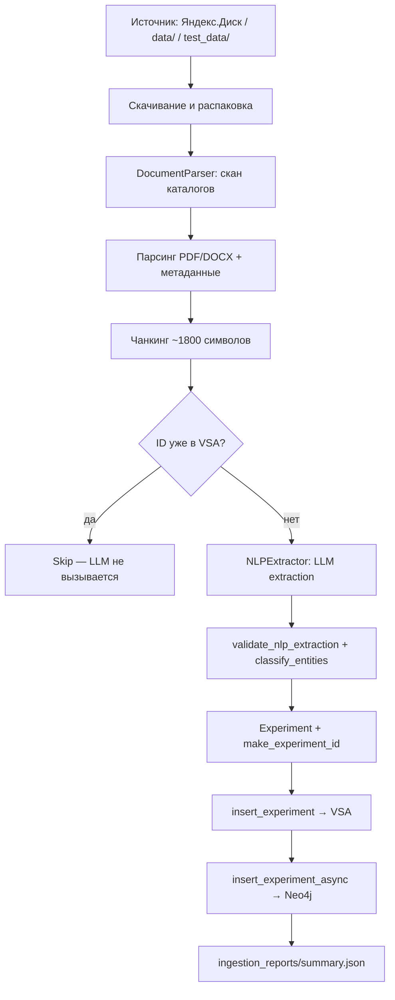

# Загрузка данных в HSME — обзор

> Синтез по [AGENTS.md](../../AGENTS.md), [INGESTION_LOADER.md](../../../INGESTION_LOADER.md), [stages.md](../../stages.md) §Stage 1/4, [stage4_relabel_analysis.md](./stage4_relabel_analysis.md).

---

## 1. Откуда грузятся данные

| Источник | Описание |
|----------|----------|
| **Яндекс.Диск (prod)** | Публичный архив кейса хакатона: [disk.yandex.ru/d/npigiuw4Rbe9Pg](https://disk.yandex.ru/d/npigiuw4Rbe9Pg). Скачивается через `--archive-url`, распаковывается в `.cache/hsme_corpus_loader/`. |
| **`data/` (prod, локально)** | Полный корпус после распаковки. Каталоги: `Обзоры`, `Статьи`, `Доклады` + всё под `Источники информации`. |
| **`test_data/` (test)** | Урезанный корпус для разработки: до 15 файлов из трёх папок (`Обзоры`, `Статьи`, `Доклады`). Можно получить скриптом `scripts/download_yadisk_samples.py`. |
| **Ручной импорт (API)** | `POST /api/ingest` — один эксперимент (Administrator). |
| **Массовый импорт (API)** | `POST /api/ingest-corpus` — фоновая задача; статус — `GET /api/ingest-status`. |
| **Демо-данные** | `backend/repository/seeding.py` — seed при первом запуске. |

**Форматы входных файлов:** PDF и DOCX (сканирование каталогов — `DocumentParser`).

---

## 2. Куда грузятся данные

| Хранилище | Путь / артефакт | Что пишется |
|-----------|-----------------|-------------|
| **VSA-база (primary)** | `db_state.pkl` (pickle, in-memory + persist) | Эксперименты как гиперрёбра: VSA-векторы, сущности, связи, метаданные (`year`, `geography`, `is_sensitive`). |
| **Neo4j (dual-write)** | Docker: `localhost:7474` / `bolt://localhost:7687` | Узлы онтологии (`Material`, `Process`, `Equipment`, …) и рёбра (`USES_MATERIAL`, `PRODUCES_OUTPUT`, …). Векторы VSA **не** дублируются — связь по `entity_id` (Map ID). |
| **Отчёты прогона** | `ingestion_reports/{run_id}/summary.json` | Статистика: `ok` / `restored` / `skipped` / `validation_failed` / `moderation` / `empty`, `chunk_outcomes`. |
| **Кэш loader'а** | `.cache/hsme_corpus_loader/` | Скачанные zip-архивы. |

**Kill switch:** `USE_NEO4J=false` или `--no-neo4j` — только VSA, без графа.

---

## 3. Этапы загрузки данных



### Детализация по шагам

| # | Этап | Модуль | Что происходит |
|---|------|--------|----------------|
| 0 | **Точка входа** | `corpus_loader.py`, `corpus_relabel_loader.py`, `routers/ingestion.py` | CLI или API запускает пайплайн. |
| 1 | **Загрузка архива** | `corpus_loader.py` | Yandex Public API → zip → `.cache/hsme_corpus_loader/`. |
| 2 | **Сканирование** | `document_parser.py` | Обход `Обзоры` / `Статьи` / `Доклады` (+ `Источники информации` в prod). |
| 3 | **Парсинг документа** | `document_parser.py` | PDF (PyMuPDF) / DOCX (python-docx): title, code, year, authors, section headers. |
| 4 | **Чанкинг** | `document_parser.py` | ChunkNorris-style (`cn_v1`): секции + soft/hard limits; tables с header-repeat; code skip. |
| 5 | **Идемпотентность** | `ingestion.py` → `make_experiment_id()` | `EXP-{code}-{index}` или `EXP-{file_slug}-{index}`. Существующий ID → skip до LLM. |
| 6 | **LLM-разметка** | `nlp_extractor.py` + `prompts/nlp_extractor.yaml` | Извлечение entities + relations (OpenRouter / YandexGPT, 3 retry). |
| 7 | **Нормализация** | `nlp_schemas.py`, `ingestion.py` | Pydantic-валидация, tolerant mode (invalid relations отбрасываются), `classify_entities` → inputs/processes/outputs. |
| 8 | **Сборка Experiment** | `ingestion.py` | Добавление Publication, Expert; `guess_geography`; флаг `is_sensitive`. |
| 9 | **Dual-write** | `database.py` + `neo4j_graph.py` | VSA-first; Neo4j через `Semaphore(1)` при параллельном LLM. |
| 10 | **Manifest** | `corpus_relabel_loader.py` | `ingestion_reports/{run_id}/summary.json`. |

### Режимы test vs prod

| | **test** | **prod** |
|---|----------|----------|
| Папка | `test_data/` | `data/` |
| Каталоги | 3 папки | 3 + `Источники информации` |
| Лимит файлов | 15 | без лимита |
| Чанков (ориентир) | ~1411 | полный корпус |

### Точки входа (CLI)

```bash
# Первичный инжест
PYTHONPATH=. uv run python -m backend.repository.corpus_loader --mode test

# Повторная разметка (YandexGPT 5.1)
PYTHONPATH=. uv run python -m backend.repository.corpus_relabel_loader \
  --mode test --skip-files 10

# Backfill VSA → Neo4j
PYTHONPATH=. uv run python -m backend.repository.migration --dry-run
```

---

## 4. Обзор проблем

> **Рекомендации по каждой проблеме:** [data_ingestion_overview_summary.md](./data_ingestion_overview_summary.md) (выжимка из [answer](./data_ingestion_overview_answer.md)).

### 4.1. Долгая загрузка — факторы

| Фактор | Влияние | Детали |
|--------|---------|--------|
| **LLM на каждый чанк** | Основной bottleneck | Один HTTP-запрос на чанк; при 550 чанках — сотни вызовов. Retry ×3 при validation fail. |
| **Объём корпуса** | Линейный рост | Test: 15 файлов / ~1411 чанков; prod — полный архив с Яндекс.Диска (multi-GB). |
| **Concurrency vs rate limit** | Задержки / throttling | Default `--concurrency 6`; для OpenRouter автоснижение до 2. Relabel: `concurrency=3`. |
| **Синхронный Neo4j dual-write** | +0,8–1,0 s на deadlock-retry | `Semaphore(1)` сериализует graph writes; при `concurrency>1` — `DeadlockDetected` на shared nodes (Publication/Material). |
| **Скачивание архива** | Разовая, но тяжёлая | Multi-GB zip с Яндекс.Диска; timeout read до 3600 s. |
| **Validation failures** | ×3 LLM-попытки впустую | ~2,4% чанков — финальный провал после 3 попыток (baseline relabel-resume.log). |
| **Отсутствие async broker** | Архитектурный потолок | Stage 3 (backlog): Outbox + Redis Streams — VSA sync, Neo4j eventual consistency. |

**Ориентир из прогона relabel (550 чанков, 5 журналов):**
- Neo4j ingest ok: **92,2%** (507/550)
- VSA restored (relabel failed): **4,9%** (22 уникальных ID)
- Validation fail после 3 попыток: **2,4%**
- Moderation refusal: **0,2%**

### 4.2. Этапы нормализации данных

#### A. Обработка сырых документов (`DocumentParser`)

| Операция | PDF | DOCX |
|----------|-----|------|
| Извлечение текста | PyMuPDF (`fitz`) | python-docx |
| Метаданные | code из имени/PDF, year из filename, title из первых абзацев | code из таблиц/заголовков, authors по ключевым словам |
| Нормализация code | `normalize_code()`: дефисы, `CM-1-2020` → `CM-01-2020` | то же |
| `file_slug` | slug из basename (для ID без code) | то же |
| Чанкинг | ~1800 символов, по страницам | ~1800 символов, по параграфам |
| Fallback code | `code=N/A` → ID через slug | то же |

#### B. LLM-разметка (`NLPExtractor`)

| Аспект | Значение |
|--------|----------|
| Провайдеры | OpenRouter (dev), Yandex Cloud / YandexGPT 5.1 (relabel) |
| Промпт | `backend/prompts/nlp_extractor.yaml` |
| Режим | `json_object` / structured output |
| Retry | 3 попытки при validation error |
| Выход | `{entities: [...], relations: [...]}` |

**Онтология сущностей:** Material, Process, Equipment, Property, Experiment, Publication, Expert, Facility.

**Типы связей (схема):** `uses_material`, `operates_at_condition`, `produces_output`, `described_in`, `validated_by`, `contradicts`, `located_at`.

#### C. Пост-обработка extraction (`IngestionPipeline`)

1. **Tolerant validation** — entities сохраняются; invalid relations отбрасываются с WARNING.
2. **Moderation detection** — отказ YandexGPT («Я не могу обсуждать…») → `status=moderation`, `is_sensitive`.
3. **`classify_entities`** — эвристики: Material/Facility → input/output; Process/Equipment → process; Property → по ключевым словам.
4. **Обогащение** — Publication (title), Expert (authors), geography (guess из текста/filename).
5. **Sensitivity flag** — regex U/Pu/UF6/uranium/plutonium.

#### D. Corpus relabel (Stage 4, `in_progress`)

Повторный NLP-инжест с перезаписью VSA + Neo4j. Отличия от первичного loader:

- Принудительная переразметка существующих ID (backup + restore при провале).
- Resume: `--skip-files N`, `--clear-neo4j` (destructive).
- Цель: success rate ≥ 97%, уникальные ID per (file, chunk).

---

## 5. Классы ошибок (Stage 4)

| ID | Проблема | Симптом | Статус fix |
|----|----------|---------|------------|
| **E1** | Коллизия `EXP-RAW-*` | Разные PDF → один experiment ID | ✅ `make_experiment_id` + `file_slug` |
| **E2** | Strict Pydantic validation | JSON выглядит OK, но relations не проходят схему | ✅ tolerant validation |
| **E3** | Moderation refusal | Не-JSON ответ LLM | ✅ detect + `is_sensitive` |
| **E4** | Пустой extraction → restore | Backup из VSA при провале relabel | ✅ scoped restore |
| **E5** | Neo4j deadlock | Параллельный MERGE shared nodes | ✅ `Semaphore(1)` |
| **E6** | Буферизация логов | `print()` вместо logger | 🔄 в работе |

---

## 6. Связанные модули

| Модуль | Роль |
|--------|------|
| `backend/repository/corpus_loader.py` | CLI первичного инжеста |
| `backend/repository/corpus_relabel_loader.py` | CLI relabel (YandexGPT) |
| `backend/services/document_parser.py` | Парсинг PDF/DOCX, чанкинг, метаданные |
| `backend/services/nlp_extractor.py` | LLM extraction |
| `backend/services/ingestion.py` | Пайплайн, dual-write, идемпотентность |
| `backend/core/nlp_schemas.py` | Pydantic-схемы entity/relation |
| `backend/repository/database.py` | VSA-хранилище |
| `backend/repository/neo4j_graph.py` | Neo4j MERGE, batch queries |
| `backend/repository/migration.py` | Backfill VSA → Neo4j |

---

## 7. Текущий статус и backlog

| Область | Статус |
|---------|--------|
| VSA + Neo4j dual-write | ✅ Stage 1 `done` |
| Corpus loader CLI | ✅ работает |
| Corpus relabel hardening | 🔄 Stage 4 `in_progress` |
| Async ingestion (Redis/Outbox) | 📋 Stage 3 backlog |
| Cascade inference (cheap→strong LLM) | 📋 backlog |

---

## 8. Диаграмма хранилищ

```
Яндекс.Диск / data/ / test_data/
         │
         ▼
   DocumentParser (PDF/DOCX → chunks)
         │
         ▼
   NLPExtractor (LLM → entities/relations)
         │
         ▼
   IngestionPipeline
         ├──► db_state.pkl (VSA vectors + experiments)
         └──► Neo4j (nodes/edges, Map ID by entity_id)

ingestion_reports/{run_id}/summary.json ← статистика прогона
```

---

*Источники: [AGENTS.md](../../AGENTS.md), [INGESTION_LOADER.md](../../../INGESTION_LOADER.md), [stages.md](../../stages.md), [stage4_relabel_analysis.md](./stage4_relabel_analysis.md).*
