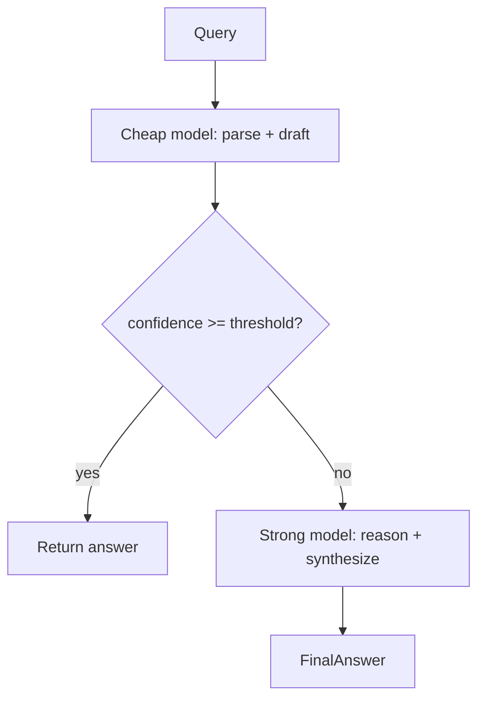

# Deep Research: повышение Precision (L1–L2) и качества L4-синтеза в HSME

## Роль

Ты — research-архитектор RAG/GraphRAG-систем для научно-технических доменов. Нужен глубокий разбор с опорой на современные практики (2024–2026): re-ranking, evidence packing, cascade inference, hybrid retrieval, confidence calibration, eval-driven optimization.

---

## Контекст проекта: HSME (HyperGraph Research Memory Engine)

### Задача (NorNickel AI Hackathon, Task 2 «Научный клубок»)

Построить единую карту R&D-знаний для горно-металлургии: эксперименты, публикации, процессы, материалы, эксперты. Система должна отвечать на сложные запросы вида:

- «Какие методы обессоливания воды подходят при сульфатах/хлоридах 200–300 мг/л?»
- «Решения циркуляции католита при электроэкстракции никеля»
- «Распределение Au/Ag/МПГ между штейном и шлаком за 5 лет»
- «Закачка шахтных вод: технико-экономические показатели»

### Архитектурный принцип (отличие от triple-GraphRAG)

**Эксперимент = гиперребро (hyperedge)**, а не разрозненные triple. Входы, процессы и выходы связаны в одном VSA-векторе (Binary Bipolar MAP, D=10 000, NumPy). Поиск — cosine similarity по bundled query vs experiment vectors (~2 ms).

**Dual storage (Stage 1, реализован):**

- VSA pickle (`db_state.pkl`) — primary, синхронный, микросекунды
- Neo4j — experts, publications, CONTRADICTS, multi-hop paths (подмешивается в prod `/api/search`, но пока не в eval)

### Пайплайн ответа (L0→L4)

| Слой | Что делает | Текущая реализация |
|------|------------|-------------------|
| **L0** | NL query → `List[Entity]` | LLM parse + regex fallback (`search.py`) |
| **L1** | VSA semantic search | `HSMEVectorDatabase.search()` |
| **L2** | Top-K + фильтры (geo, year, pagination) | `SearchQuery` в router |
| **L3** | Counterfactuals, gaps, confidence | `get_counterfactuals()`, analytics, gaps routers |
| **L4** | Markdown/prose answer | `synthesize_vsa_answer()`: берёт **top-2** экспериментов + counterfactuals top-1 + опционально Neo4j graph_context → один streaming LLM-вызов |

Ingestion: PDF/DOCX → NLP extraction (`nlp_extractor.py`) → VSA + Neo4j dual-write. Промпты в YAML (`backend/prompts/*.yaml`).

### Eval-инфраструктура (Stage 2, реализован)

Golden dataset: **11 вопросов** (`questions.jsonl`):

- `canonical` q001–q004, q011 (hackathon + multi-hop)
- `deterministic` q005–q006 (точные числа из seed)
- `easy` q007–q008
- `off_topic` q009–q010
- `coverage_gap` q001, q003, q004 — в корпусе нет эталонных экспериментов

Два раннера:

- `run_retrieval_eval.py` — L1–L2: Precision, Recall, P@K, R@K, MRR
- `run_e2e_eval.py` — L0–L4: Success Rate (rule judge), TTFT/TTFA

**Baseline retrieval** (`20260704T164430Z`, 6/11 вопросов с ground truth):

- Recall@5 = **1.0** (все нужные EXP-* в top-5)
- Recall@3 = **0.89**
- MRR = **0.83**
- Precision@10 = **0.15** (много шума: EXP-RAW-* рядом с seed-опытами)
- Latency = **~2.35 ms**

**Baseline E2E** (`20260704T173550Z`):

- Success Rate = **72.7%** (8/11)
- Mean TTFT = **0.97 s**, TTFA = **11.3 s**
- VSA latency = **~2.6 ms**

**Провалы E2E при хорошем retrieval:**

- q004 — coverage_gap (нет данных в корпусе)
- q007 — `EXP-CU-01` на #1 в retrieval, но L4 не выдал «45» (проблема синтеза)
- q011 — `EXP-HL-01` на #1, но L4 не выдал «Кайерканский» (факт есть в контексте, LLM не извлёк)

**Слабые места retrieval (не полнота, а ранжирование):**

- q002: MRR=0.5 — первым идёт `EXP-RAW-00`, эталонные `EXP-NI-*` ниже
- q006: `EXP-HL-02` выше `EXP-HL-01`

**Известные архитектурные ограничения:**

- E2E eval обходит HTTP (`db.search()` + `synthesize_vsa_answer()` напрямую)
- `graph_context=None` в eval (prod подмешивает Neo4j)
- L0-парсер дублирован (eval regex vs prod LLM)
- L4 берёт фиксированный top-2 без re-ranking
- L3 в eval урезан (только counterfactuals top-1)

---

## Stage 3 (следующий этап, в backlog)

### 3a. Асинхронный Ingestion (Transactional Outbox + Redis Streams)

- VSA пишется синхронно (микросекунды)
- Neo4j обновляется consumer'ом в фоне (eventual consistency)
- Триггер перехода: если dual-write latency при инжесте станет неприемлемой
- Зависит от Stage 1 Neo4j

### 3b. Cascade Inference (backlog, зависит от Stage 2 eval)

Уже есть прототип на L0 (regex → LLM). Цель — расширить на L4:

- Cheap model: быстрый draft answer
- Confidence check → если низкая, эскалация на strong model (120B)
- Kill switch, логирование маршрутизации
- Пороги калибруются по eval baseline (Success Rate, TTFT, TTFA)

---

## Диагноз (наша гипотеза)

1. **Retrieval по полноте — зелёный** (Recall@5=100%). Узкое место — **precision / ranking**, особенно перед L4 (top-2 может содержать шум).
2. **L4 — главный bottleneck качества**: LLM не извлекает факты из уже найденного контекста; на coverage_gap вопросах система должна честно говорить «нет данных».
3. Stage 3 (async ingestion) **не решит** precision/L4 напрямую, но увеличит корпус и Neo4j graph_context.
4. Cascade inference (3b) может помочь TTFT/cost, но **не гарантирует** рост Success Rate без улучшения evidence selection и synthesis.

---

## Запрос

Предложи стратегию **повышения Precision@K (L1–L2) и Success Rate (L4)** для HSME.

### Формат ответа — три уровня сложности

**Уровень 1 — Лёгкий** (1–3 дня, минимальные изменения кода)

- Что именно менять (конкретные техники)
- Ожидаемый прирост метрик (оценка)
- Какие кейсы из golden dataset это починит (q002? q007? q011?)
- Ограничения: «победа только в отдельных кейсах»

**Уровень 2 — Средний** (~1–2 недели, баланс трудозатрат и покрытия)

- Архитектурные изменения (re-ranker? evidence packer? structured L4? confidence gate?)
- Ожидаемое покрытие: ~80% кейсов golden dataset
- Зависимости от Stage 3 (ingestion async, Neo4j enrichment)
- Eval-стратегия: какие новые метрики/пороги ввести
- Риски и trade-offs (latency, cost, complexity)

**Уровень 3 — Сложный / ультимативный** (полноценное решение, высокие трудозатраты)

→ **Раскрой этот уровень максимально подробно** (мы планируем взять его за основу):

Для Уровня 3 нужно:

1. **Целевая архитектура** — схема пайплайна L0→L4 с новыми компонентами (re-ranker, evidence graph, multi-stage synthesis, self-verification, etc.)
2. **Конкретные алгоритмы** — что использовать для re-ranking в VSA+graph гибриде (cross-encoder? LLM rerank? graph-aware scoring? counterfactual-weighted rank?)
3. **L4 redesign** — как перестроить `synthesize_vsa_answer`: multi-step (extract → verify → compose)? structured output (JSON facts → prose)? citation-grounded generation? отдельный «no evidence» path для coverage_gap?
4. **Интеграция с Stage 3** — как async ingestion + Neo4j eventual consistency влияют на precision/L4; нужен ли «stale graph» fallback
5. **Cascade inference** — где именно вставить cheap/strong routing (L0? L4? re-ranker?); как калибровать confidence на нашем eval
6. **Eval extensions** — новые метрики, A/B прототипы, regression gates
7. **Поэтапный rollout** — Phase 1/2/3 с критериями «готово» (целевые числа: Precision@5 > X, Success Rate > Y, TTFA < Z)
8. **Антипаттерны** — чего НЕ делать в нашем контексте (VSA hyperedge, hackathon deadline, маленький golden set)
9. **References** — papers, open-source projects, production patterns (2024–2026), релевантные scientific/enterprise RAG

### Ограничения и контекст принятия решений

- Стек: Python, FastAPI, NumPy VSA, Neo4j, OpenRouter/YandexGPT via OpenAI-compatible API
- Корпус сейчас: seed DB + расширяемый ingestion (PDF/DOCX)
- Hackathon deadline близко — нужен путь «максимум качества при ограниченном времени»
- Нельзя ломать hyperedge-модель (эксперимент как атом знания)
- Eval уже есть — любое решение должно быть измеримо на `questions.jsonl`

### Вопросы, на которые нужно ответить явно

1. Precision 15% при Recall 100% — это норма для top-10 VSA или сигнал к срочному re-ranking?
2. Стоит ли поднимать precision **до** L4 или улучшать L4's robustness к шумному top-K?
3. Для q007/q011 — проблема в промпте, в evidence packing, или в модели?
4. Как обрабатывать coverage_gap (q001/q003/q004) без галлюцинаций?
5. Что из Уровня 3 можно **отрезать** для hackathon MVP, не потеряв 80% эффекта?

Отвечай структурированно, с конкретикой (не общие слова про «улучшить промпт»). Уровень 3 — основной фокус, минимум 60% объёма ответа.
