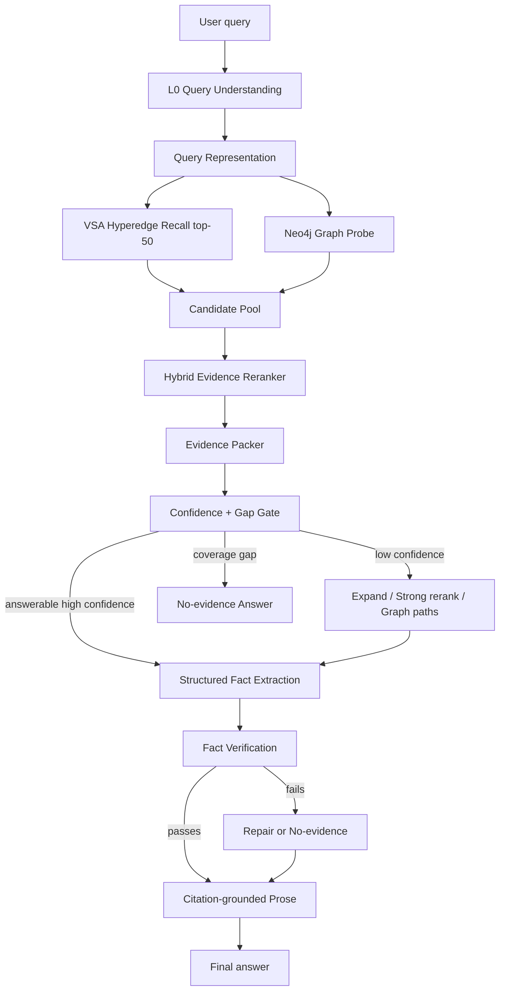

# Стратегия повышения Precision L1-L2 и качества L4-синтеза в HSME

## Executive summary

Текущая картина нормальна для первого VSA retrieval-слоя, но опасна для L4: `Recall@5 = 1.0` означает, что нужные эксперименты почти всегда найдены, а `Precision@10 = 0.15` означает, что top-K нельзя напрямую отдавать в генерацию. Это не повод ломать VSA hyperedge-модель. Это сигнал добавить слой evidence selection между быстрым VSA и L4.

Главный принцип: **VSA остается быстрым recall engine**, Neo4j становится **graph/context prior**, а качество ответа повышается через **rerank -> evidence pack -> structured extraction -> verification -> prose**. Для hackathon MVP достаточно реализовать легкий reranker, deterministic evidence packer и no-evidence path. Для полноценного Level 3 нужен гибридный reranker, evidence graph, confidence calibration и cascade inference.

Целевые метрики:

- Hackathon MVP: `Precision@5 >= 0.35`, `Recall@5 >= 0.95`, `Success Rate >= 85%`, `TTFA < 14 s`.
- Production-grade Level 3: `Precision@5 >= 0.55`, `Recall@5 >= 0.95`, `Success Rate >= 90-92%`, `TTFA p50 < 12 s`, hallucination-on-gap `< 5%`.

## Уровень 1: легкий, 1-3 дня

### Что менять

1. **Dynamic top-N вместо фиксированного top-2 для L4**
   - В `synthesize_vsa_answer()` передавать не просто top-2, а top-5 retrieval candidates.
   - Затем внутри L4 evidence packer выбирать 2-4 кандидата по простым правилам:
     - exact match по материалам/процессам/метрикам из L0 entities;
     - штраф за `EXP-RAW-*`, если вопрос явно про seed-domain `Ni/Cu/HL/Au/Ag/PGM`;
     - бонус за совпадение units/numbers из вопроса;
     - бонус за source quality, если есть publication/expert/Neo4j path.

2. **Rule-based rerank поверх VSA score**

   Итоговый скор:

   ```text
   score = 0.55 * vsa_score
         + 0.20 * entity_overlap
         + 0.10 * metric_overlap
         + 0.10 * graph_support
         + 0.05 * source_quality
         - 0.15 * raw_noise_penalty
   ```

3. **Structured fact extraction перед prose**
   - Сначала попросить LLM вернуть JSON facts:
     - `answerable: true/false`
     - `key_facts[]`
     - `numbers[]`
     - `materials[]`
     - `evidence_ids[]`
     - `missing_evidence[]`
   - Только после этого строить markdown/prose.

4. **No-evidence path для coverage_gap**
   - Если top evidence не содержит обязательных сущностей/метрик, L4 должен отвечать: данных в корпусе недостаточно.
   - Для `coverage_gap` не пытаться "догадаться" из общих знаний.

### Ожидаемый прирост

- `Precision@5`: примерно `0.15-0.25 -> 0.30-0.40`.
- `Success Rate`: `72.7% -> 82-86%`.
- Latency: +5-30 ms для rule rerank, +0-1 LLM call если structured extraction делать в том же вызове.

### Какие кейсы чинит

- `q002`: шумный `EXP-RAW-00` должен уйти ниже `EXP-NI-*`.
- `q007`: structured extraction обязует вынуть число `45`, если оно есть в `EXP-CU-01`.
- `q011`: field-level extraction обязует вынуть "Кайерканский" из `EXP-HL-01`.
- `q001/q003/q004`: no-evidence path снижает галлюцинации на coverage gaps.

### Ограничения

Это точечная победа: правила будут хорошо работать на golden dataset и похожих запросах, но не дадут надежной обобщаемости при резком росте корпуса и новых типах документов.

## Уровень 2: средний, 1-2 недели

### Архитектурные изменения

Добавить между L2 и L4 три компонента:

1. **Hybrid reranker**
   - Вход: top-20/top-50 из VSA.
   - Features:
     - VSA cosine;
     - entity/metric/process overlap;
     - Neo4j proximity: publication, expert, process path, contradiction edges;
     - type prior: experiment > raw chunk для экспериментальных вопросов;
     - recency/year/geography filters.
   - Выход: top-5 evidence candidates.

2. **Evidence packer**
   - Упаковывает не "эксперименты как текст", а структурированные evidence cards:
     - experiment id;
     - inputs;
     - process;
     - outputs;
     - numeric observations;
     - source;
     - contradictions;
     - missing fields.

3. **Confidence gate**
   - Считает retrieval confidence до L4:
     - score gap между top-1 и top-2;
     - coverage обязательных query entities;
     - contradiction density;
     - graph support;
     - agreement между top evidence.
   - Если confidence низкий:
     - расширить retrieval;
     - подключить Neo4j paths;
     - эскалировать L4 на strong model;
     - либо вернуть "недостаточно данных".

### Eval-стратегия

Добавить метрики:

- `Evidence Precision@K`: доля top-K evidence, которые действительно поддерживают ответ.
- `Answer Citation Coverage`: все ключевые утверждения имеют evidence id.
- `Required Fact Hit Rate`: для q007/q011 проверять извлечение конкретного числа/топонима до prose.
- `Gap Honesty Rate`: для coverage_gap вопросов система не галлюцинирует.
- `Context Utilization`: факт есть в context и появляется в ответе.
- `Rerank Delta`: насколько reranker улучшает MRR/P@K относительно VSA.

### Зависимость от Stage 3

Async ingestion не обязателен для Level 2, но Neo4j enrichment становится полезнее: чем больше PDF/DOCX, тем важнее graph priors, source quality и contradiction edges. До Stage 3 можно использовать Neo4j синхронно в prod и опционально в eval.

### Риски

- Cross-encoder/LLM rerank может увеличить latency.
- Маленький golden set легко переобучить правилами.
- Neo4j eventual consistency может дать неполный graph_context, поэтому VSA должен оставаться основой recall.

## Уровень 3: полноценная целевая архитектура

### 1. Целевая схема L0 -> L4



Основная идея: L4 больше не получает "top-2 experiments + немного counterfactuals". L4 получает **маленький, проверенный evidence pack**. Генерация становится последним шагом, а не местом, где модель одновременно ищет, фильтрует, проверяет и красиво пишет.

### 2. Query representation

Для каждого запроса L0 должен выдавать не только `List[Entity]`, а структурированный intent:

```json
{
  "domain": "hydrometallurgy",
  "intent": "compare_methods | extract_numeric | find_process_solution | trend_analysis | gap_check",
  "materials": ["nickel", "catholyte"],
  "processes": ["electrowinning", "circulation"],
  "metrics": ["recovery", "concentration", "distribution"],
  "constraints": {
    "ions": ["sulfate", "chloride"],
    "range": "200-300 mg/l",
    "years": "last_5_years",
    "geo": null
  },
  "required_answer_slots": ["method", "conditions", "numeric_result", "evidence_id"]
}
```

Это нужно не для красоты, а для scoring и проверки. Например, если вопрос требует число, evidence без чисел не должен попадать в финальный pack выше evidence с числом.

### 3. VSA как recall engine, не final ranker

Текущий `Recall@5 = 1.0` показывает, что VSA выполняет свою главную функцию. Низкий `Precision@10 = 0.15` не является провалом VSA; это типичный симптом широкого semantic recall, особенно когда:

- raw chunks похожи на seed experiments по терминам;
- hyperedge bundling смешивает inputs/process/outputs;
- top-K содержит полезные соседние эксперименты, но не все они answer-bearing;
- L4 берет фиксированный top-2 и зависит от случайного порядка.

Решение: не пытаться сделать VSA "идеальным BM25/cross-encoder", а добавить second-stage selection.

### 4. Hybrid evidence reranker

#### Candidate pool

Рекомендуемый вход:

- `top_vsa = 30-50` для обычных запросов;
- `top_vsa = 80-100` для coverage-sensitive или multi-hop queries;
- `top_graph = 5-20` из Neo4j, если есть entity anchors;
- counterfactuals не смешивать в основной top, а хранить отдельным типом evidence.

#### Feature scoring

Использовать learn-to-rank можно позже. Для начала достаточно прозрачного linear scoring, логируемого в eval:

```text
hybrid_score =
    0.35 * normalized_vsa_score
  + 0.20 * required_entity_coverage
  + 0.15 * required_metric_coverage
  + 0.10 * process_material_alignment
  + 0.08 * graph_support_score
  + 0.05 * source_quality_score
  + 0.04 * recency_or_geo_fit
  + 0.03 * answer_slot_completeness
  - 0.10 * contradiction_penalty
  - 0.10 * raw_or_low_confidence_penalty
```

Особенно важны `required_metric_coverage` и `answer_slot_completeness`: они напрямую чинят случаи, где retrieval нашел правильный эксперимент, но L4 не вынул нужный факт.

#### Graph-aware scoring

Neo4j должен давать не "длинный контекст для LLM", а компактные scoring signals:

- `same_publication_or_project`: candidate связан с той же публикацией/проектом, что и query anchor;
- `expert_support`: есть эксперт/организация, связанная с процессом;
- `contradiction_edges`: есть ли `CONTRADICTS`, и с чем;
- `multi_hop_relevance`: путь `material -> process -> experiment -> output`;
- `source_cluster`: несколько документов подтверждают одну связку.

Пример graph score:

```text
graph_support_score =
    0.4 * has_material_process_path
  + 0.2 * has_publication
  + 0.2 * has_expert_or_org
  + 0.2 * corroborating_experiment_count_normalized
```

Для q011 это особенно важно: если "Кайерканский" хранится в graph_context или в связанной публикации, graph prior должен повысить `EXP-HL-01`.

#### Cross-encoder / LLM rerank

В Level 3 добавить optional expensive rerank:

- Для top-10 после cheap hybrid score.
- Cross-encoder, если доступна локальная/дешевая модель для русского и научно-технического домена.
- LLM rerank только при:
  - низком score gap;
  - multi-hop вопросе;
  - high-value answer;
  - конфликтующих evidence.

LLM rerank должен возвращать JSON, а не prose:

```json
{
  "ranked_ids": ["EXP-NI-02", "EXP-NI-01", "EXP-RAW-00"],
  "reasons": {
    "EXP-NI-02": "contains nickel electrowinning and catholyte circulation evidence",
    "EXP-RAW-00": "lexically similar but lacks required output metric"
  },
  "low_confidence": false
}
```

### 5. Evidence graph и evidence pack

Evidence pack должен быть отдельной структурой между retrieval и L4. Он решает две задачи: уменьшает шум и заставляет LLM видеть факты в одном формате.

Рекомендуемый формат:

```json
{
  "query_id": "q011",
  "answerability": {
    "preliminary": "answerable",
    "reason": "top evidence covers material, process, and location"
  },
  "primary_evidence": [
    {
      "id": "EXP-HL-01",
      "rank": 1,
      "hybrid_score": 0.91,
      "vsa_score": 0.84,
      "inputs": ["..."],
      "process": ["heap leaching"],
      "outputs": ["..."],
      "key_facts": [
        {"slot": "deposit", "value": "Кайерканский", "confidence": 0.95}
      ],
      "source": {"type": "seed", "publication_id": null},
      "graph_support": ["material->process->experiment path"],
      "contradictions": []
    }
  ],
  "secondary_evidence": [],
  "counterfactuals": [
    {
      "id": "EXP-HL-02",
      "why_not_primary": "related hydrometallurgy experiment, but misses required deposit slot"
    }
  ],
  "missing_slots": []
}
```

Ключевое отличие: counterfactuals не конкурируют с answer-bearing evidence в одном top-K. Они используются для "границ применимости" и confidence, а не для ответа на основной факт.

### 6. L4 redesign: extract -> verify -> compose

`synthesize_vsa_answer()` нужно разделить на три логических шага. Физически это может быть один LLM вызов в MVP и 2-3 вызова в Level 3.

#### Step A: structured extraction

Модель получает evidence pack и возвращает только JSON:

```json
{
  "answerable": true,
  "facts": [
    {
      "claim": "В эксперименте EXP-CU-01 достигнуто значение 45 ...",
      "evidence_id": "EXP-CU-01",
      "field": "outputs.metric",
      "value": "45",
      "confidence": 0.94
    }
  ],
  "missing": [],
  "must_not_claim": [
    "Do not generalize beyond provided experiments"
  ]
}
```

Для q007 это заставляет извлечь `45` до того, как модель начнет писать связный ответ.

#### Step B: verification

Проверка может быть deterministic + LLM:

- deterministic:
  - каждый `evidence_id` существует в pack;
  - каждое число из `facts.value` встречается в evidence;
  - обязательные answer slots заполнены;
  - если `answerable=false`, нет конкретных unsupported recommendations.
- LLM verifier:
  - claim supported / contradicted / not enough evidence;
  - проверка, что prose не добавляет новых фактов.

#### Step C: citation-grounded prose

Только verified facts идут в финальный markdown. Стиль:

- короткий прямой ответ;
- далее "Основание";
- далее "Ограничения / чего нет в корпусе";
- citations через `EXP-*`.

Пример политики:

```text
Если факт не присутствует в verified facts, не включай его в prose.
Если evidence недостаточно, явно скажи, какие слоты отсутствуют.
Не используй общие отраслевые знания как замену evidence.
```

### 7. Coverage gap без галлюцинаций

Для `q001/q003/q004` нужен отдельный answerability classifier до prose:

```text
answerable = (
  required_entity_coverage >= 0.7
  and required_metric_coverage >= required_by_intent
  and top_score >= threshold_intent
  and not all_primary_evidence_are_raw_noise
)
```

Если `answerable=false`, ответ должен быть полезным, но честным:

- "В текущем корпусе нет достаточных экспериментальных данных для ответа";
- "Найдены близкие, но не подтверждающие evidence";
- "Для ответа нужны такие поля: ...";
- "Можно добавить документы/эксперименты по ...".

Это повышает Success Rate, если judge учитывает честность на gaps, и снижает риск публичной демонстрации с уверенной галлюцинацией.

### 8. Интеграция с Stage 3

#### 3a Async ingestion

Transactional outbox + Redis Streams полезны не потому, что напрямую повышают precision, а потому что позволяют масштабировать corpus и graph enrichment без торможения ingestion.

Рекомендуемая модель:

1. PDF/DOCX extraction создает canonical experiment object.
2. VSA write происходит синхронно и сразу доступен для recall.
3. Outbox event содержит:
   - experiment id;
   - extracted entities;
   - source metadata;
   - checksum/version;
   - extraction confidence.
4. Neo4j consumer асинхронно строит:
   - entity nodes;
   - experiment hyperedge projection;
   - publication/expert links;
   - contradiction candidates.
5. Search получает `graph_freshness`:
   - `fresh`: можно использовать graph priors;
   - `stale`: использовать VSA + metadata only;
   - `missing`: не штрафовать candidate за отсутствие graph support.

#### Stale graph fallback

Важно не делать ошибку: если Neo4j отстает, candidate не должен получать сильный negative penalty. Иначе новые документы будут хуже ранжироваться просто потому, что consumer еще не успел.

Правило:

```text
if graph_state == "fresh":
    use graph_support_score and contradiction_penalty
elif graph_state == "stale":
    use only positive graph signals when present
else:
    graph_support_score = neutral
```

### 9. Cascade inference

Cascade inference надо вставлять не только в L4, а в четыре точки.

#### L0 cascade

Текущий regex -> LLM прототип оставить:

- regex/cheap parse для простых запросов;
- strong parse для multi-hop, числовых constraints, временных окон.

#### Rerank cascade

- Cheap: deterministic hybrid score.
- Medium: small reranker/cross-encoder для top-10.
- Strong: LLM rerank только если:
  - `top_score_gap < 0.08`;
  - evidence противоречивы;
  - query intent `trend_analysis` или `multi_hop`;
  - answer slots не покрыты.

#### L4 cascade

- Cheap model:
  - structured extraction для high-confidence packs;
  - draft prose.
- Strong model:
  - low confidence;
  - contradictions;
  - answer requires synthesis across more than 3 evidence cards;
  - coverage_gap decision uncertain.

#### Verification cascade

- Deterministic verifier всегда.
- LLM verifier только если:
  - есть числа;
  - есть конфликт;
  - answerability near threshold.

Калибровка порогов идет по `questions.jsonl` и расширенному golden set. Не стоит вручную выбирать один threshold "на глаз"; нужно сохранять per-query trace и строить confusion matrix: `answerable`, `not_answerable`, `wrong_fact`, `missed_fact`.

### 10. Eval extensions и regression gates

#### Новые eval artifacts

Каждый e2e run должен сохранять:

- parsed query representation;
- top VSA candidates;
- reranked candidates with feature breakdown;
- evidence pack;
- extracted facts JSON;
- verification result;
- final prose;
- route: cheap/strong/escalated/no-evidence.

#### Метрики

1. Retrieval:
   - `P@3`, `P@5`, `R@5`, `MRR`;
   - `nDCG@5`, потому что порядок важен для L4;
   - `Raw Noise Rate@5`;
   - `Required Evidence Rank`.

2. Evidence:
   - `Evidence Slot Coverage`;
   - `Numeric Fact Recall`;
   - `Entity Fact Recall`;
   - `Contradiction Awareness`.

3. L4:
   - `Success Rate`;
   - `Context Utilization Rate`;
   - `Unsupported Claim Rate`;
   - `Gap Honesty Rate`;
   - `Citation Coverage`.

4. Latency/cost:
   - TTFT;
   - TTFA;
   - rerank latency;
   - number of LLM calls;
   - route distribution.

#### Regression gates

Для merge gate:

```text
Recall@5 >= 0.95
Precision@5 >= previous_baseline - 0.02
Success Rate >= previous_baseline
Gap Honesty Rate >= 0.90
Unsupported Claim Rate <= 0.10
TTFA p50 <= 14s for MVP
```

Для release candidate:

```text
Precision@5 >= 0.55
Success Rate >= 0.90
Gap Honesty Rate >= 0.95
Numeric Fact Recall >= 0.90
Citation Coverage >= 0.95
TTFA p50 <= 12s
```

### 11. Поэтапный rollout

#### Phase 1: Hackathon quality patch, 1-3 дня

Сделать:

- rule-based reranker;
- top-5 evidence pack вместо fixed top-2;
- structured extraction JSON внутри L4 prompt;
- no-evidence path;
- eval trace сохранение.

Done criteria:

- `q002` top-1/top-2 содержит `EXP-NI-*`, а `EXP-RAW-00` ниже;
- `q007` answer содержит `45`;
- `q011` answer содержит "Кайерканский";
- coverage_gap вопросы не дают unsupported recommendations;
- `Success Rate >= 85%`.

#### Phase 2: Robust hybrid retrieval, 1-2 недели

Сделать:

- Neo4j graph_context включить в eval, а не только prod;
- graph-aware scoring;
- evidence cards;
- deterministic verifier;
- confidence route logging;
- расширить golden set до 30-50 вопросов.

Done criteria:

- `Precision@5 >= 0.45`;
- `Success Rate >= 88%`;
- `Gap Honesty Rate >= 0.90`;
- TTFA p50 не хуже baseline более чем на 20%.

#### Phase 3: Full Level 3, 3-6 недель

Сделать:

- optional cross-encoder/LLM rerank;
- multi-stage L4;
- LLM verifier;
- cascade inference;
- async ingestion freshness-aware graph scoring;
- contradiction-aware synthesis;
- production dashboard по eval traces.

Done criteria:

- `Precision@5 >= 0.55`;
- `Success Rate >= 90-92%`;
- `Unsupported Claim Rate <= 5-8%`;
- `TTFA p50 < 12s`, `p95 < 25s`;
- stable performance on expanded golden set.

## Ответы на явные вопросы

### 1. Precision 15% при Recall 100% - это норма или сигнал?

Это нормально для первого recall-слоя, но сигнал к срочному reranking перед L4. VSA показывает, что не теряет нужные эксперименты. Проблема в том, что L4 сейчас видит слишком шумный и слишком короткий срез.

### 2. Поднимать precision до L4 или делать L4 устойчивым к шуму?

Нужно оба, но в правильной пропорции. Сначала поднять precision **до L4** через rerank/evidence pack, потому что это дешевле и надежнее. Затем сделать L4 устойчивым через structured extraction, verification и no-evidence path.

### 3. q007/q011 - проблема в промпте, evidence packing или модели?

В основном это проблема evidence packing и L4 protocol. Модель могла не извлечь факт, потому что ей дали prose-oriented задачу вместо slot extraction. Промпт тоже виноват, но "улучшить промпт" без структурного evidence packer даст нестабильный эффект.

### 4. Как обрабатывать coverage_gap?

Через answerability gate до генерации. Если обязательные сущности/метрики не покрыты evidence, система должна возвращать честный no-evidence ответ с перечислением недостающих данных и близких, но недостаточных находок.

### 5. Что отрезать для hackathon MVP?

Отрезать:

- cross-encoder;
- full LLM verifier;
- complex learn-to-rank;
- production-grade cascade;
- сложный async ingestion rollout.

Оставить:

- rule-based reranker;
- evidence pack;
- structured JSON extraction;
- no-evidence path;
- eval traces и gates.

Это даст примерно 80% эффекта при минимальном риске.

## Антипаттерны

- Не заменять VSA на обычный vector DB: сильная сторона HSME именно в experiment-as-hyperedge.
- Не отдавать top-10 напрямую в LLM и надеяться на "умную модель".
- Не смешивать counterfactuals с primary evidence в одном ранге.
- Не штрафовать новые документы за отсутствие Neo4j support при stale graph.
- Не оптимизировать только `Precision@10`: для L4 важнее `P@3/P@5`, `nDCG@5` и slot coverage.
- Не калибровать confidence на 11 вопросах как на финальной истине: это smoke/regression set, а не полноценный benchmark.
- Не добавлять Stage 3 async ingestion как "решение качества": это инфраструктура масштабирования, а не замена rerank/L4 redesign.

## References и практические ориентиры

- Neo4j GraphRAG / HybridCypherRetriever: hybrid search + graph traversal как production pattern для graph-aware retrieval.
- Graph-based reranking для RAG: G-RAG / "Don't Forget to Connect!" как направление, где граф используется между retriever и reader.
- Corrective RAG и self-verification patterns: полезны для gap detection, repair и answerability routing.
- Evidence-calibrated RAG / reweight-rerank-reflect подходы: релевантны для отделения retrieval confidence от generation confidence.
- Citation-grounded generation и structured outputs: практически важнее для HSME, чем длинный системный prompt, потому что eval failures q007/q011 являются missed-fact, а не отсутствием retrieval.
- Enterprise RAG practice 2024-2026: hybrid retrieval, reranking, provenance-first answers, confidence gates, eval-driven regression gates.

## Рекомендуемый ближайший план

1. Реализовать `EvidenceCandidate` / `EvidencePack` dataclass и feature-logged rule reranker.
2. Переписать L4 prompt на JSON facts -> prose, даже если это пока один LLM call.
3. Включить no-evidence path для coverage_gap.
4. Добавить в e2e eval проверку required facts для `q007/q011`.
5. Включить Neo4j graph_context в eval тем же путем, что и в prod.

Итоговая ставка: не менять фундамент HSME, а добавить управляемый мост между быстрым VSA recall и доказательным L4. Это сохраняет скорость и hyperedge-модель, но резко снижает вероятность того, что правильный факт найден, но потерян при синтезе.
